# Bill Pay MVP — Specification

> **Status**: COMPLETE — all sections filled, reviewed, and approved by the spec owner.
> Sections 5, 8, 10 from the base template are intentionally omitted (see outline approval rationale): 5 (Current Solution) because this is a greenfield build; 8 (Performance) because single-user demo with ≤100 records has no perf requirements; 10 (Monitoring) because the product is local-only with no production environment.
> Template sections 3.1 (Current ERD) and 3.2 (Current Data Flow) are also intentionally omitted for the same greenfield reason — the §3.1 / §3.2 subsections used below re-purpose those slots for domain primer and reference-product analysis respectively.

---

# 1. Introduction

## 1.1 Product vision

Bill Pay is an accounts payable (AP) product for small businesses (5–50 employees,
single entity) that centralizes bill intake, approval, and payment in one place.
The product replaces spreadsheet- and email-based AP workflows with a single
system of record for vendors, bills, and payment history.

The primary pain this MVP addresses:

- **Manual AP is slow and error-prone** (primary) — small finance teams track
  bills across spreadsheets and inboxes, miss due dates, incur late fees, and
  cannot produce an audit trail when asked.
- **Weak spending controls** (secondary) — without enforced approval policies,
  money leaves the account without a documented sign-off.
- **No forward cash-flow visibility** (secondary) — teams cannot see upcoming
  payment obligations without reconstructing them manually.

The MVP resolves #1 end-to-end, enforces a baseline of #2 via a configurable
approval rules engine, and surfaces #3 through a payables dashboard.

## 1.2 MVP scope at a glance

The MVP implements the following core workflows, end-to-end (data model →
backend API → frontend UI → demo data):

1. **Vendor management** — create, list, and view vendors.
2. **Bill intake** — manually create a bill against a vendor with amount, due
   date, and line items.
3. **Approval rules engine** — configurable rules that route bills to
   approvers based on amount thresholds. This is the "complex workflow"
   dimension the product must demonstrate.
4. **Bill approval** — approvers review pending bills and approve or reject.
5. **Mock payment execution** — approved bills can be marked paid; the
   product records a payment record and transitions the bill to `paid`.
6. **Payables dashboard** — forward-looking view of outstanding and upcoming
   bills, grouped by status.

Explicit non-goals are captured in Section 4 (Goal of Study).

## 1.3 Challenge context (constraint)

This specification exists to support a time-boxed coding challenge with the
following hard constraints and evaluation signals. The implementing agent must
factor these into every trade-off.

**Constraints**

- **Time budget**: the implementation must be completed in under 4 hours of
  build time, end-to-end (data model, backend, frontend, seed data, README).
- **Scope**: everything in Section 1.2 must work end-to-end. Anything in
  Section 4's out-of-scope list must not be implemented, even partially.
- **Stack**: Node/Express backend + React frontend + Postgres database (locked
  in Section 6.1).

**Evaluation signals** (from the challenge brief, verbatim)

| Dimension | How this spec optimizes for it |
|---|---|
| Product taste | Scope choices in Section 1.2 mirror Ramp Bill Pay's highest-signal flows; UX patterns specified in Section 6.6 |
| Scope judgment | Section 4 explicitly lists out-of-scope items with rationale |
| UX quality | Section 6.6 specifies screens, empty states, and key interactions |
| Grok of complex workflows | Section 6.4 (Approval Rules Engine) is the centerpiece |
| Simple, robust systems | Section 6.2 (data model), 6.3 (state machine), and 6.5 (API contracts) favor boring, explicit designs over abstraction |
| Raw output | Section 11 (Work Organization) sequences tasks to maximize demonstrable progress per hour |

## 1.4 Out of scope for the Introduction

This section does not define: specific data fields, API endpoints, UI layouts,
or task sequencing. Those live in Sections 6 and 11 respectively.

---

# 2. Open Questions

This specification follows a **minimize-open-questions** policy: every
spec-blocking decision is resolved in its owning section before implementation
starts. Genuinely open items — those dependent on external factors, reviewer
behavior, or intentionally deferred choices — are listed below.

## 2.1 Open items

| # | Question | Owner | Blocks | Default if unresolved |
|---|---|---|---|---|
| OQ-1 | Reviewer's local environment — does the Ashby reviewer have Docker, Node 20+, and no conflicting services on ports 3000 / 5432? | reviewer | README accuracy | Assume yes. README documents Docker Compose as the single supported path, with `.env.example` and a `make seed` shortcut. |
| OQ-2 | Accessibility polish level for the demo — WCAG audit, keyboard navigation, ARIA labels | user / implementer | Section 6.6 polish pass | Baseline only: semantic HTML + shadcn/ui defaults + visible focus rings. No WCAG audit. README explicitly notes accessibility is not covered. |
| OQ-3 | Preferred company persona / brand for seed data to make the demo feel plausible | user | Section 6.8 seed data | Generic persona: "Acme Widgets Co." with 8–10 diverse vendor names drawn from common SMB categories (SaaS, utilities, legal, marketing, office supplies, freight, contractors, hardware). |
| OQ-4 | Should the README include a short screencast / GIF walkthrough of the demo? | user | README deliverable | No — screencast recording / editing eats 30+ minutes of the 4h budget. README is text + 2–3 static screenshots at most, captured only after core functionality is done. |
| OQ-5 | Should the UI support both light and dark themes? | user / implementer | Section 6.6 styling | Light mode only. shadcn/ui supports dark mode but polishing both burns budget with no eval-criteria signal. |

## 2.2 Explicitly resolved (not open)

The following were candidate open questions earlier in the specification
process and are now resolved in the listed sections. Listed here so the
implementer does not spend cycles re-deciding.

| Topic | Resolution | Authoritative section |
|---|---|---|
| Authentication model | Hardcoded user switcher, 4 seeded users (including admin for §6.3.4.1) | §6.1 |
| Approver model | Per-user approval limits | §6.4 |
| Payment methods | `ach`, `check`, `wire`, `card` | §6.2, §6.7 |
| Invoice attachments | Local-disk file upload, no OCR | §6.2, §6.6 |
| Deployment target | Local only (Docker Compose) | §11 |
| Automated tests | None | §11 |
| ORM | Prisma | §6.1 |
| UI styling | Tailwind CSS + shadcn/ui | §6.1, §6.6 |
| Currency | USD only, integer cents | §6.2 |
| Notifications / email | Out of scope | §4 |
| Partial payments / refunds | Out of scope | §4 |
| Multi-entity / multi-tenant | Out of scope (single-tenant) | §4 |
| Multi-currency | Out of scope | §4 |

## 2.3 Deferred design decisions (resolved inline later)

Some design decisions are resolved inside Sections 6.2–6.4 rather than here,
because they are tightly coupled to the data model or state machine that owns
them. They are **not** open questions — the implementer should look them up
where referenced:

- Behavior when multiple approval rules match a bill → §6.4
- Behavior when no approval rule matches a bill → §6.4
- Whether a submitter can approve their own bill → §6.4
- Whether pending bills re-evaluate when rules are edited → §6.4
- Whether bills can be edited after creation → §6.3
- Whether vendors can be deleted while they have bills → §6.2
- Whether bill rejection requires a reason → §6.3

---

# 3. Context

## 3.1 Domain primer

Accounts Payable (AP) is the process by which a company tracks and pays money
it owes to vendors. In a small business (the MVP's target — see §1.1), AP is
typically handled by one or two people in finance, often using spreadsheets
and email. This section gives the implementing agent enough domain grounding
to make non-generic product decisions.

### 3.1.1 Glossary

| Term | Definition |
|---|---|
| **Invoice** | A document from a vendor requesting payment for goods/services delivered. Arrives as PDF email, mailed paper, or a portal download. |
| **Bill** | The record inside the AP system that represents an invoice. One bill per invoice. "Bill" is the internal term; "invoice" is what the vendor calls the same thing. |
| **Vendor** (a.k.a. **payee**) | The party being paid. Has a name, payment instructions (routing/account, mailing address, etc.), and optionally a contact email. |
| **Accounts Payable (AP)** | (1) The business function of paying vendors; (2) the balance-sheet liability representing total unpaid bills. |
| **Approval** | A recorded sign-off by an authorized user, required before a bill becomes payable. Forms the audit trail for spend controls. |
| **Approval limit** | The maximum bill amount a given user is authorized to approve, set per user. A bill that exceeds every approver's limit cannot be approved until either the bill is reduced or a user with a higher limit is assigned. |
| **Due date** | The deadline by which the vendor expects payment. Driven by payment terms (e.g., "Net 30" = 30 days from invoice date). |
| **Aging** | How long a bill has been outstanding relative to its due date. Typically bucketed: current, 1–30 days overdue, 31–60, 61–90, 90+. |
| **Payment rail** (a.k.a. **payment method**) | Technical channel for moving money: ACH (US bank transfer, 1–3 business days), check (paper, 5–10 days), wire (same-day, higher fee), card (virtual card issued to vendor). |
| **Audit trail** | Ordered record of state-changing actions (who, what, when) on a bill. Required for compliance and dispute resolution. |

### 3.1.2 How AP works today in a small business (without tooling)

A typical vendor invoice arrives by email as a PDF attached to a message to
`ap@company.com`, or as a paper invoice scanned by the office manager. The AP
clerk copies the relevant fields — vendor name, amount, due date, invoice
number — into a shared spreadsheet row, files the PDF in a shared drive folder
named `/invoices/2026/vendor-name/`, and marks the row "pending approval."

For approval, the clerk emails the bill summary to their manager (or, for
larger bills, the CFO). The approver replies "approved" in email. The clerk
updates the spreadsheet, then switches to the bank's portal to initiate an
ACH payment, manually retyping the vendor's routing and account numbers from
a separate "vendor master" spreadsheet. After the payment clears, the clerk
updates the spreadsheet row from "pending payment" to "paid" and optionally
saves the bank confirmation PDF to the shared drive.

The common failure modes this produces: missed due dates (late fees), double
payments (bill approved twice by different people), wrong vendor bank details
(fraud or error), and an audit trail that exists only as an email thread
which becomes unfindable when the compliance team asks for it 18 months
later. Bill Pay's MVP is designed to eliminate all four failure modes by
making bill state, approver identity, and payment execution a single system
of record.

## 3.2 Reference product analysis

Ramp Bill Pay is the named reference product (§1.1). The table below maps
Ramp's documented features to MVP in-scope / partial / cut, with a one-line
rationale for each cut. This list is authoritative — if a feature is marked
"cut" here, the implementer must not implement it even if it seems "easy"
during build.

| Ramp feature | MVP status | Rationale (if cut/partial) |
|---|---|---|
| Vendor management (create, list, edit vendors) | **IN** | Core entity. §6.2. |
| Manual bill creation | **IN** | Core flow. §6.2, §6.6. |
| Invoice file upload | **IN** | Local-disk upload only; no OCR. §6.2, §6.6. |
| Bill approval (single approver) | **IN** | Core workflow. §6.3, §6.4. |
| Configurable approval rules (amount-based) | **IN** | Centerpiece of the complex-workflow eval signal. §6.4. |
| Per-user approval limits | **IN** | Primary approver-selection mechanism. §6.4. |
| Payment methods (ACH, check, wire, card) | **IN** | All four, all mocked. §6.2, §6.7. |
| Payment status tracking | **IN** | Part of bill state machine. §6.3. |
| Audit trail (who approved what when) | **IN** | Simple event log on bill. §6.2. |
| Payables dashboard (upcoming, overdue, paid) | **IN** | Key "forward cash-flow visibility" flow (§1.1). §6.6. |
| AI-powered invoice OCR / auto-coding | **CUT** | Cost-benefit fails at 4h: real OCR is hard, mocked OCR is window dressing with no engineering signal. |
| AI-powered approval recommendations | **CUT** | "AI" layer over rules engine adds surface area, not clarity, for this eval. Rules engine alone demonstrates the workflow signal. |
| Multi-layer / multi-approver workflows ("require all", "require any") | **CUT** | Significant complexity (approval graph state). Per-user limits + amount thresholds already demonstrate "complex workflow" signal. |
| Real-time ERP sync (QuickBooks, NetSuite, etc.) | **CUT** | Integration heaviness with zero standalone product value. |
| GL coding / line-item categorization | **CUT** | Demonstrates accounting depth but not "scope judgment"; would force us to model chart of accounts. |
| Purchase order matching (2-way / 3-way) | **CUT** | Requires PO data model and matching logic. Out of scope for a pure AP MVP. |
| Vendor contracts & renewals | **CUT** | Separate product surface from payables. |
| Multi-entity / intercompany bills | **CUT** | Target persona (§1.1) is single-entity SMB. |
| Multi-currency / FX | **CUT** | USD-only per §6.2. |
| Bulk actions (select N bills, approve all) | **CUT** | UX polish; single-bill actions demonstrate the flow clearly. |
| Mobile app | **CUT** | Desktop-only web; no native app. |
| Email / Slack notifications on approval events | **CUT** | Notification infra is plumbing with low eval signal; audit trail on the bill covers the "who approved when" requirement. |
| Reporting / 1099 generation | **CUT** | Tax and reporting are separate surfaces. |

## 3.3 Evaluation criteria mapping

The challenge brief (§1.3) lists six evaluation dimensions. This table
expands each into the concrete spec decisions that serve it, so the
implementing agent can cross-check their choices against what's actually
being measured.

### Product taste

- **Scoped to the three screens a Ramp user actually visits**: Bills list,
  Bill detail (approval view), Vendors list. Dashboard is a convenience
  summary of Bills list. See §6.6.
- **Bill state model (§6.3) matches how a real user thinks about bills**:
  draft → pending approval → approved → paid, with rejected
  as a terminal branch. No exposed "internal processing" states.
- **Approval rules engine is visible and editable in the UI** (not a config
  file), because in a real AP product controls are self-serve for the finance
  team (§6.4, §6.6).
- **Vendor payment details form is segmented by payment method** (ACH fields
  only appear when ACH is selected), because showing all 4 methods' fields
  simultaneously is a common UX failure (§6.6).

### Scope judgment

- **§3.2 lists 13 explicit cuts with rationale** — the agent can point to
  this table during evaluation to demonstrate deliberate scope.
- **§4 (Goal of Study) repeats the out-of-scope list** with boundary-case
  examples (e.g., "approving a bill does NOT email the vendor").
- **§11 (Work Organization) budgets tasks against a 4h cap** with a clear
  "what gets dropped first if over budget" ranking.

### UX quality

- **shadcn/ui + Tailwind** (§6.1) gives a polished baseline without custom
  design work.
- **Empty states specified for every list view** (§6.6): no bills, no
  vendors, no approval rules — each with a primary CTA.
- **Currency rendered as `$1,234.56`** everywhere, with integer-cents
  storage (§6.2) so formatting is consistent and arithmetic is exact.
- **Optimistic UI only on idempotent actions** (approve/reject); loading
  states elsewhere to avoid showing stale data.

### Grok of complex workflows

- **§6.3 Bill lifecycle state machine** is diagrammed with explicit allowed
  transitions per role; illegal transitions return 409 Conflict.
- **§6.4 Approval rules engine** resolves edge cases the agent would
  otherwise guess on: multiple matching rules (all must pass), no matching
  rule (defaults to admin approval required), self-approval (forbidden),
  rule edit during in-flight (does not retroactively apply).
- **Audit log on every state transition** (§6.2) — approver identity,
  timestamp, previous and new state — so the demo shows "who did what when"
  without reviewers having to read the DB.

### Simple, robust systems

- **Single Postgres database** (§6.1) — no redis, no queue, no separate
  cache.
- **Integer cents for money** (§6.2) — no floating-point currency bugs.
- **State machine enforced at the API layer** (§6.5) — invalid transitions
  return 409; frontend cannot put the backend into an inconsistent state.
- **Enum fields over free-text** for payment method, bill status, user role
  — typos impossible.
- **No magic** — approval rules evaluate synchronously on bill submission;
  no background jobs, no eventual consistency.

### Raw output (how much ships)

- **§11 sequences tasks to maximize demoable progress per hour**: data model
  and one end-to-end vertical slice first (vendor create + list), then
  bills, then approvals, then payment execution, then dashboard, then
  polish.
- **Seed data is loaded automatically on `docker compose up`** (§6.8) — no
  manual setup before the demo.
- **README scaffolding is drafted before implementation** (§11) so the
  agent does not rush it at the end.

---

# 4. Goal of Study

## 4.1 Problem statement

Summarized from §1.1: small businesses track AP in spreadsheets and email,
producing late fees, double payments, wrong wire details, and missing audit
trails. The MVP solves this by making bill state, approver identity, and
payment execution a single system of record.

This section defines what "done" means concretely — the set of observable
capabilities, the walkthrough that must succeed end-to-end, the non-functional
quality bar, the operational requirements, and the behavioral boundaries the
system must not cross.

## 4.2 In-scope capability checklist (functional)

The implementation is functionally complete when **every** item below is true.
This is the checklist a reviewer should be able to tick off by using the app.

### Vendors (C-V)
- **C-V1**: A user can create a vendor with name, contact email, and payment details.
- **C-V2**: The vendor create form shows payment-method-specific fields only (ACH → routing + account; check → mailing address; wire → SWIFT + IBAN; card → card brand + last 4).
- **C-V3**: A user can view the list of all vendors.
- **C-V4**: A user can view a vendor's detail page including their bill history.
- **C-V5**: A user can edit a vendor's payment details.

### Bills (C-B)
- **C-B1**: A user can create a bill against an existing vendor with amount, issue date, due date, invoice number, and one or more line items.
- **C-B2**: A user can attach an invoice file (PDF or image) when creating or editing a bill; the file is stored to local disk and viewable later.
- **C-B3**: A user can save a bill as `draft` or submit it directly for approval.
- **C-B4**: A user can view the list of all bills, filterable by status (draft / pending approval / approved / paid / rejected).
- **C-B5**: A user can view a bill's detail page including line items, attached invoice, approval history, and audit trail.
- **C-B6**: A user can edit a bill in `draft` state; bills in later states are read-only except for the allowed state transitions.

### Approvals (C-A)
- **C-A1**: When a bill is submitted for approval, the system evaluates approval rules and records which rule(s) applied and which user(s) must approve.
- **C-A2**: A user whose `max_approval_amount` covers the bill can approve or reject it, provided they are not the bill's creator (no self-approval).
- **C-A3**: Rejecting a bill requires an optional reason; bill moves to `rejected` state (terminal unless cloned).
- **C-A4**: Approving a bill that has no outstanding approvers transitions it to `approved` state.
- **C-A5**: A user can view a bill's approval history: which users approved, when, and under which rule.

### Approval rules (C-R)
- **C-R1**: A user can view the list of approval rules.
- **C-R2**: A user can create an approval rule with an amount threshold (e.g., "bills ≥ $5,000") and a required approver pool.
- **C-R3**: A user can edit or delete an existing rule. Edits do not re-evaluate in-flight bills (see §4.6).
- **C-R4**: The rule editor shows a live preview of which seeded users currently qualify for the rule's approver pool.

### Payments (C-P)
- **C-P1**: A user can mark an `approved` bill as paid, selecting the vendor's stored payment method.
- **C-P2**: The system records a payment record (method, amount, timestamp, bill reference) and transitions the bill to `paid`.
- **C-P3**: The bill's audit trail includes the payment event.

### Dashboard (C-D)
- **C-D1**: The dashboard shows totals for each bill status (pending approval, approved/unpaid, overdue, paid-last-30-days) with counts and summed amounts.
- **C-D2**: The dashboard shows an "overdue bills" list (due date in the past, status not yet `paid`).
- **C-D3**: The dashboard shows an "upcoming (next 7 days)" list.

### User switcher (C-U)
- **C-U1**: The header has a user selector that lets the reviewer switch between 4 seeded users (Submitter, Approver-L1, Approver-L2, Admin) without login.
- **C-U2**: Switching users immediately updates which bills appear in the "pending my approval" view.
- **C-U3**: The current user's role and approval limit are visible in the UI.

## 4.3 Scripted demo walkthrough

The reviewer must be able to complete the following walkthrough end-to-end
without editing the database, restarting the server, or consulting source
code. This walkthrough exercises every capability in §4.2.

1. **Setup**: Clone repo, run `docker compose up`, open `http://localhost:3000`. Seed data is already loaded (see §6.8).
2. **Dashboard glance**: Reviewer lands on the dashboard. Sees status tiles with non-zero counts and an overdue bill pre-seeded.
3. **Create vendor**: Reviewer switches user to **Alice (Submitter)**. Navigates to Vendors → New. Selects ACH method; form shows routing + account fields. Submits. New vendor appears in list.
4. **Create bill (small)**: Reviewer clicks Bills → New. Picks the new vendor. Enters `$1,200`, due date 30 days out, one line item. Attaches a sample PDF. Submits for approval.
5. **Rule evaluation visible**: Reviewer navigates to the bill's detail page. Sees "Pending approval from: Bob (Approver-L1)" with the rule name displayed.
6. **Approve (small)**: Reviewer switches user to **Bob (Approver-L1)**. Approval queue shows the bill. Opens it, approves. Bill moves to `approved` state. Audit log shows Bob's approval with timestamp.
7. **Pay**: Still as Bob (or any user with rights), reviewer clicks "Pay" on the approved bill. Selects ACH. Bill moves to `paid`. Audit log shows payment event.
8. **Create bill (large)**: Reviewer switches back to Alice. Creates a bill for `$15,000`. Submits for approval.
9. **Rule routing**: Bill detail shows two approval requirements (one per matching rule: "Default (all bills)" and "Bills ≥ $10,000"). Both list eligible approvers as "Carol, Dana" (Bob is filtered out by limit).
10. **L1 cannot approve**: Reviewer switches to Bob. Bob sees the bill in the queue but "Approve" is disabled with explanation "Your approval limit is $10,000. This bill requires $15,000."
11. **Approve (large)**: Reviewer switches to **Carol (Approver-L2)**. Clicks Approve once; both matching-rule slots flip to `approved` in one transaction (§6.4.5). Bill moves to `approved`.
12. **Rejection path**: Reviewer (as Alice) creates a third bill and submits. Switches to Bob, rejects with a reason. Bill moves to `rejected`. Audit log shows rejection.
13. **Edit rules**: Reviewer navigates to Approval Rules. Edits a rule's threshold. Saves. Preview shows which users qualify under the new rule.
14. **Overdue view**: Reviewer navigates to dashboard. Confirms overdue bill list reflects what's pre-seeded.

**Optional step 15 — Admin override demo**: Reviewer (as Alice) submits a
bill large enough to require the high-value rule (e.g., $50,000), then
switches to **Dana (Admin)**. Dana approves — even though she is not listed
in either rule's `approver_user_ids` and her `max_approval_amount_cents` is
`0`. Bill transitions to `approved`; the audit timeline entries show
**"Admin override"** badges on the approval events. Pay flow works the same
way: Dana can pay without a limit check. This exercises §6.3.4.1 end-to-end
and is not strictly required for §4.2 capability completeness, but gives the
reviewer concrete confidence in the admin mechanism.

If any step 1–14 fails or requires workarounds, the implementation is not complete.
Step 15 is optional and can be demonstrated by the reviewer at will.

## 4.4 Non-functional quality bar

- **Q-1**: `npm run build` (or equivalent per stack choice in §6.1) completes without TypeScript errors.
- **Q-2**: No ESLint errors under the project's default config (prettier/tsc baseline).
- **Q-3**: During the §4.3 walkthrough, the browser console shows zero `Error`-level messages and zero unhandled promise rejections.
- **Q-4**: All currency values render as `$1,234.56` (comma thousands separator, 2 decimals, no trailing zeros stripped).
- **Q-5**: All dates render in the same human format across the app (recommended: `MMM D, YYYY` e.g. "Apr 17, 2026").
- **Q-6**: Every list view (vendors, bills, rules) has a defined empty state with a primary CTA, not a blank page.
- **Q-7**: Every form has inline validation for required fields and on-submit error display.
- **Q-8**: Any user action that changes server state shows loading feedback; any action that fails shows an error toast or inline error.
- **Q-9**: Page transitions do not produce visible layout shift beyond shadcn/ui defaults.
- **Q-10**: The app is usable at 1280×800 viewport minimum; mobile responsiveness is not required.

## 4.5 Operational quality bar

- **O-1**: `docker compose up` is the single command that starts the full stack (database, migrations, seed data, backend, frontend). No manual steps between clone and reviewer-ready.
- **O-2**: Seed data is loaded automatically on first start. A subsequent `docker compose down -v && docker compose up` resets to the same known state.
- **O-3**: `.env.example` is committed at the repo root, documenting every environment variable with a safe default.
- **O-4**: `README.md` covers: what the product does, the prioritized workflows, what was left out and why (quoting §3.2 cuts), setup instructions (`docker compose up`), and key architecture / data-model decisions (linking or summarizing §6).
- **O-5**: Repo has a `Makefile` (or `package.json` scripts) with at least: `up`, `down`, `seed`, `reset`, `logs`.
- **O-6**: Git history is clean — meaningful commit messages, no `WIP`/`asdf` commits in the submitted branch.
- **O-7**: The repo contains no committed secrets, no `.env`, no `node_modules`, no build artifacts.

## 4.6 Out of scope — behavioral boundaries

The following runtime behaviors are explicitly NOT part of the MVP. The
implementing agent must not infer or add them, even if they seem like
"obvious" extensions of the scoped features.

### Notifications & external communication
- Approving a bill does **not** email the vendor.
- Approving or rejecting a bill does **not** email, Slack, or push-notify the next approver or the submitter. All notifications are in-app only (the bill appears in the approver's queue).
- Creating a vendor does **not** send any welcome email.
- There is **no** SMTP integration, Slack webhook, or any external messaging.

### Payment execution
- Marking a bill paid does **not** move money. No ACH, no Stripe, no Plaid, no banking API.
- There is **no** payment scheduler, no cron, no background worker. Payments happen synchronously when a user clicks "Pay".
- There is **no** payment failure or retry model. Payment always succeeds (mock).
- There are **no** partial payments, no overpayments, no refunds, no payment reversals.

### Data lifecycle
- Deleting a vendor does **not** cascade-delete their bills. Vendors with bills cannot be deleted (return 409 Conflict) — see §6.2.
- Editing an approval rule does **not** re-evaluate bills that are already in flight. Rules apply at submission time; once a bill is pending approval under rule R, editing R does not change the required approver set.
- Deleting an approval rule does **not** retroactively affect approved or paid bills. A rule referenced by any `BillApproval` row **cannot** be deleted (409 `RULE_IN_USE`); the UI must advise the user to deactivate (`is_active = false`) instead — see §6.2.7, §6.4.6 V7.
- The system **always** keeps at least one active approval rule with `min_amount_cents = 0` (default-rule invariant). Any mutation that would leave zero such rules is rejected with 409 `DEFAULT_RULE_REQUIRED` — see §6.4.4.
- There is **no** soft-delete / trash / undo for any entity.
- There is **no** bill edit history / version log.

### Auth & multi-tenancy
- There is **no** login, no password, no session. The user switcher is a dropdown, not an auth flow.
- There is **no** multi-tenancy. All users, vendors, bills, and rules live in a single org.
- Switching users does **not** enforce any permission boundary beyond what §6.4 rules specify. All users can view all data.

### Reporting & export
- There is **no** CSV export, no report generation, no 1099 tax workflow.
- There is **no** full-text search across entities. Bills list supports status filtering only (§6.6); vendors list has no filter.

### Scale & persistence
- There is **no** pagination on list views (seed data is bounded at ~20 bills, ~10 vendors).
- There is **no** caching layer, no redis, no in-memory store beyond Postgres.
- There is **no** multi-region or high-availability concern. Single-node Postgres is sufficient.

---

# 6. Proposed Solution

## 6.1 Tech stack & project structure

### 6.1.1 Stack summary

| Layer | Choice | Version pin | Rationale (cross-ref) |
|---|---|---|---|
| Language | TypeScript | 5.4+ | §3.3 "simple, robust systems"; Prisma + shadcn/ui are TS-first |
| Runtime | Node.js | 20 LTS (pinned in `engines` + Dockerfile) | Current LTS, reproducible |
| Package manager | pnpm via corepack | 9.x | Fast, workspace-native, no global install required for reviewer |
| Monorepo | pnpm workspaces | n/a | End-to-end TS types without build tools heavier than needed |
| Backend framework | Express | 4.x | Locked in Q2 (§2.2); minimal, well-understood |
| ORM | Prisma | 5.x | Locked (§2.2); generated types cross the API/DB boundary cleanly |
| Database | PostgreSQL | 16 | Locked (§2.2); single node via Docker |
| File upload | `multer` | 1.x | Standard Express middleware for multipart form data; files land on local disk |
| Frontend build tool | Vite | 5.x | Fast dev server, no framework overhead |
| Frontend framework | React | 18.x | De-facto standard; shadcn/ui is React-first |
| Styling | Tailwind CSS | 3.x | Locked (§2.2) |
| UI components | shadcn/ui | (copy-in, not npm) | Locked (§2.2); installed via its CLI, code lives in the repo |
| HTTP client (web) | native `fetch` + React Query (TanStack Query) | RQ 5.x | React Query gives caching/invalidation out of the box, saving manual state plumbing |
| Forms (web) | react-hook-form + zod | latest | zod schemas reused between API validation and form validation |
| Validation (api) | zod | latest | Same schemas as frontend; single source of truth |
| Routing (web) | react-router-dom | 6.x | Sufficient for the ~6 screens in §6.6 |
| Date handling | date-fns | 3.x | Lightweight; tree-shakable |

No dependency not listed here should be added. Anything beyond this list is
scope creep — if the agent reaches for it, they must remove it and use what's
already in scope.

### 6.1.2 Repo layout

```
bill-pay-mvp/
├── .env.example
├── .gitignore
├── docker-compose.yml
├── Makefile
├── README.md
├── pnpm-workspace.yaml
├── package.json                       # root: workspace scripts only
├── tsconfig.base.json                 # shared TS config extended by packages
│
├── packages/
│   ├── shared/                        # shared types + zod schemas
│   │   ├── package.json
│   │   ├── tsconfig.json
│   │   └── src/
│   │       ├── index.ts
│   │       ├── enums.ts               # BillStatus, PaymentMethod, UserRole
│   │       └── schemas/               # zod schemas for every DTO
│   │           ├── vendor.ts
│   │           ├── bill.ts
│   │           ├── approval-rule.ts
│   │           └── payment.ts
│   │
│   ├── api/                           # Express backend
│   │   ├── package.json
│   │   ├── tsconfig.json
│   │   ├── Dockerfile
│   │   ├── prisma/
│   │   │   ├── schema.prisma
│   │   │   ├── migrations/
│   │   │   └── seed.ts                # loaded automatically on `docker compose up`
│   │   └── src/
│   │       ├── index.ts               # Express entrypoint
│   │       ├── db.ts                  # Prisma client singleton
│   │       ├── middleware/
│   │       │   ├── current-user.ts    # reads X-User-Id header, injects req.user
│   │       │   ├── error-handler.ts
│   │       │   └── validate.ts        # zod validation helper
│   │       ├── routes/
│   │       │   ├── vendors.ts
│   │       │   ├── bills.ts
│   │       │   ├── approval-rules.ts
│   │       │   ├── payments.ts
│   │       │   ├── users.ts
│   │       │   └── uploads.ts
│   │       ├── services/
│   │       │   ├── approval-engine.ts # §6.4 core logic
│   │       │   ├── bill-state.ts      # §6.3 state-machine guards
│   │       │   └── audit-log.ts       # writes BillEvent rows
│   │       └── uploads/                # runtime file storage (gitignored, docker volume)
│   │
│   └── web/                           # Vite + React frontend
│       ├── package.json
│       ├── tsconfig.json
│       ├── Dockerfile
│       ├── vite.config.ts
│       ├── tailwind.config.ts
│       ├── index.html
│       └── src/
│           ├── main.tsx
│           ├── App.tsx                # router + layout
│           ├── lib/
│           │   ├── api.ts             # fetch wrapper; injects X-User-Id header
│           │   ├── query-client.ts    # React Query config
│           │   └── format.ts          # formatMoney, formatDate (§4.4 Q-4/Q-5)
│           ├── components/
│           │   ├── ui/                # shadcn/ui components (generated)
│           │   ├── user-switcher.tsx
│           │   └── ...
│           ├── pages/
│           │   ├── dashboard.tsx
│           │   ├── vendors/
│           │   ├── bills/
│           │   └── rules/
│           └── hooks/
│               └── use-current-user.ts
```

### 6.1.3 Workspace & scripts

`pnpm-workspace.yaml`:

- `packages/*`

Root `package.json` scripts (thin wrappers that delegate to per-package
scripts via `pnpm --filter <pkg>`):

| Script | Effect |
|---|---|
| `pnpm dev` | runs `api` + `web` concurrently in dev mode (used by `docker compose up`) |
| `pnpm build` | builds all packages (`shared`, `api`, `web`) |
| `pnpm db:migrate` | applies Prisma migrations against `DATABASE_URL` |
| `pnpm db:seed` | runs `packages/api/prisma/seed.ts` |
| `pnpm db:reset` | `prisma migrate reset --force` then re-seeds |
| `pnpm lint` | eslint across all packages |
| `pnpm typecheck` | `tsc --noEmit` across all packages |

### 6.1.4 Makefile targets (O-5 in §4.5)

| Target | Effect |
|---|---|
| `make up` | `docker compose up --build` |
| `make down` | `docker compose down` |
| `make reset` | `docker compose down -v && docker compose up --build` (wipes volumes, reseeds) |
| `make seed` | `docker compose exec api pnpm db:seed` |
| `make logs` | `docker compose logs -f` |

### 6.1.5 Docker architecture

Three services in `docker-compose.yml`:

| Service | Image / build | Purpose | Ports |
|---|---|---|---|
| `db` | `postgres:16-alpine` | Single-node Postgres; named volume `db_data` for persistence | `5432:5432` (bind for developer convenience) |
| `api` | built from `packages/api/Dockerfile` | Express server in dev mode (`pnpm --filter api dev` under `tsx watch`). On container start: waits for `db` healthcheck, runs `prisma migrate deploy`, runs seed **if DB is empty**, starts server. | `4000:4000` |
| `web` | built from `packages/web/Dockerfile` | Vite dev server (`pnpm --filter web dev --host 0.0.0.0`). | `3000:3000` |

Volumes:

- `db_data`: named volume for Postgres data
- `uploads`: named volume mounted at `/app/uploads` in the `api` container for uploaded invoice files
- source-code bind mounts from host into `api` and `web` for live reload during development

Environment variables (documented in `.env.example` — O-3 in §4.5):

| Var | Default | Where used |
|---|---|---|
| `DATABASE_URL` | `postgresql://postgres:postgres@db:5432/billpay` | api |
| `API_PORT` | `4000` | api |
| `WEB_PORT` | `3000` | web |
| `UPLOAD_DIR` | `/app/uploads` | api |
| `VITE_API_URL` | `http://localhost:4000` | web (dev only) |
| `SEED_ON_EMPTY` | `true` | api (guards automatic seeding) |

### 6.1.6 Local-only current-user header

Since auth is out of scope (§4.6), the frontend sends the selected user ID in
an `X-User-Id` header on every API call. The `current-user` middleware on the
API reads this header, loads the user from the DB, and attaches them to
`req.user`. If the header is missing or the user doesn't exist, the API
returns 401. This is local-only — any deployed build must remove it.

### 6.1.7 Project structure diagram

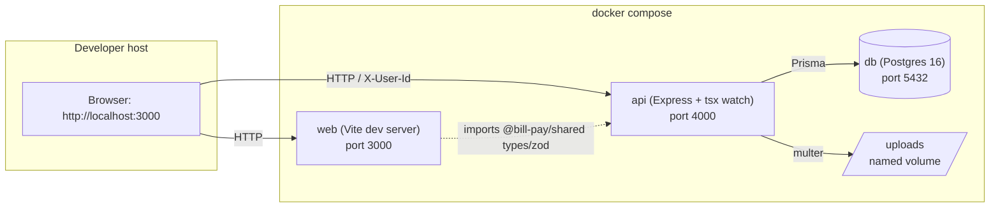

### 6.1.8 Things the agent must NOT add

- No authentication middleware beyond the `X-User-Id` header reader.
- No Redis, no BullMQ, no queue, no cache layer.
- No Storybook, no Chromatic, no visual testing.
- No GraphQL layer on top of REST.
- No tRPC (even though TS types would suggest it — kept out to avoid locking the agent into heavier tooling).
- No CI config (no GitHub Actions, no CircleCI) — this is local only.
- No production Dockerfile for `web` — dev mode only.

## 6.2 Data model

All identifiers are CUIDs (Prisma `@default(cuid())`). All timestamps are
`DateTime` in UTC. All monetary amounts are stored as `Int` (integer cents,
USD); see §3.3 and Q39.

Deferred decision from §2.3 resolved here: **"Whether vendors can be deleted
while they have bills"** — no. Vendors with any bill (regardless of status)
cannot be deleted (409 Conflict); they can be deactivated (`is_active = false`)
to hide them from the new-bill vendor picker without affecting existing bills.

### 6.2.1 Entity overview

| Entity | Purpose | Cardinality notes |
|---|---|---|
| `User` | Submitters, approvers, admin. Drives user switcher, approval eligibility, audit actor. | 3 seeded (§6.8); no runtime creation in MVP |
| `Vendor` | The payee. Holds payment-method-specific details as JSONB. | 8–10 seeded; user can create/edit |
| `Bill` | Core entity. Status + amount + vendor + creator. | Many per vendor |
| `BillLineItem` | Line-item breakdown. `sum(line_items.amount_cents) = bill.amount_cents` enforced at API layer. | 1..N per bill |
| `Attachment` | Uploaded invoice file metadata. 1-to-1 with `Bill` (Q36). | 0..1 per bill |
| `ApprovalRule` | Amount-threshold rule with explicit approver user list (Q40). | Seeded + user-editable |
| `BillApproval` | Snapshot of required approvals per matching rule, frozen at submission (Q37). | 1..N per bill (one per matching rule) |
| `Payment` | Mock payment execution record. 1-to-1 with `Bill`. | 0..1 per bill |
| `BillEvent` | Bill-scoped audit log (Q38). | Many per bill |

### 6.2.2 Enum types

All enums live in `packages/shared/src/enums.ts` and in `schema.prisma`.

| Enum | Values | Used by |
|---|---|---|
| `UserRole` | `submitter`, `approver`, `admin` | `User.role` |
| `PaymentMethod` | `ach`, `check`, `wire`, `card` | `Vendor.payment_method`, `Payment.payment_method` |
| `BillStatus` | `draft`, `pending_approval`, `approved`, `paid`, `rejected` | `Bill.status`. No `scheduled` state — all payments synchronous (§4.6). |
| `ApprovalStatus` | `pending`, `approved`, `rejected`, `cancelled` | `BillApproval.status`. `cancelled` applied when rejection (§6.3.5 T7) or recall (§6.3.5 T8) cascades non-decided approvals. |
| `PaymentStatus` | `completed` | `Payment.status`. Single value — MVP has no failure path (§4.6). Modeled as enum anyway so future failure/refund states can be added without schema churn. |
| `BillEventType` | `created`, `submitted`, `approved`, `rejected`, `recalled`, `paid`, `edited` | `BillEvent.event_type`. `recalled` emitted on §6.3.5 T8. |

### 6.2.3 Entity definitions

#### `User`

| Field | Type | Constraints | Notes |
|---|---|---|---|
| `id` | `String` | PK, CUID | |
| `name` | `String` | NOT NULL | Human-readable display name, e.g. "Alice Submitter" |
| `email` | `String?` | nullable, unique if present | No auth; email is cosmetic |
| `role` | `UserRole` | NOT NULL | Drives admin-override authorization per §6.3.4.1 (approve / reject / pay). Otherwise organizational only — `submitter` and `approver` are cosmetic labels, as authorization is driven by `max_approval_amount_cents` and `BillApproval.eligible_approver_user_ids` |
| `max_approval_amount_cents` | `Int` | NOT NULL, `>= 0`, default `0` | Per-user limit (Q11). `0` means cannot approve anything |
| `is_active` | `Boolean` | default `true` | |
| `created_at` | `DateTime` | NOT NULL, default `now()` | |
| `updated_at` | `DateTime` | NOT NULL, `@updatedAt` | |

Relations: `bills_created` (1..N to `Bill.created_by_user_id`); `approvals_decided` (1..N to `BillApproval.decided_by_user_id`); `payments_initiated` (1..N to `Payment.initiated_by_user_id`); `bill_events_actor` (1..N to `BillEvent.actor_user_id`); `attachments_uploaded` (1..N to `Attachment.uploaded_by_user_id`).

#### `Vendor`

| Field | Type | Constraints | Notes |
|---|---|---|---|
| `id` | `String` | PK, CUID | |
| `name` | `String` | NOT NULL | Displayed in vendor list and bill lists |
| `contact_email` | `String?` | nullable | |
| `payment_method` | `PaymentMethod` | NOT NULL | Determines payload shape of `payment_details` |
| `payment_details` | `Json` | NOT NULL | Discriminated union, shape per §6.2.6. Validated by zod at API layer |
| `is_active` | `Boolean` | default `true` | Hidden from new-bill picker when `false` |
| `created_at` | `DateTime` | | |
| `updated_at` | `DateTime` | `@updatedAt` | |

Relations: `bills` (1..N to `Bill.vendor_id`).

Invariants (enforced at API layer, not DB):
- The shape of `payment_details` must match the zod schema for the current `payment_method`.
- Changing `payment_method` requires replacing `payment_details` atomically.

#### `Bill`

| Field | Type | Constraints | Notes |
|---|---|---|---|
| `id` | `String` | PK, CUID | |
| `vendor_id` | `String` | FK → `Vendor.id`, `onDelete: Restrict` | Cannot delete vendor with bills |
| `invoice_number` | `String` | NOT NULL | Vendor-provided invoice number. Unique per vendor (enforced at API layer) |
| `amount_cents` | `Int` | NOT NULL, `> 0` | Matches sum of line items |
| `issue_date` | `DateTime` | NOT NULL | Date on the invoice |
| `due_date` | `DateTime` | NOT NULL, `>= issue_date` | |
| `status` | `BillStatus` | NOT NULL, default `draft` | State machine governed by §6.3 |
| `rejection_reason` | `String?` | nullable | Non-null only when `status = rejected` (API-enforced) |
| `created_by_user_id` | `String` | FK → `User.id`, `onDelete: Restrict` | The submitter; used for self-approval check (§6.4) |
| `submitted_at` | `DateTime?` | nullable | Set when status first leaves `draft` |
| `created_at` | `DateTime` | | |
| `updated_at` | `DateTime` | `@updatedAt` | |

Indexes:
- `(status, due_date)` for dashboard "overdue" and "upcoming" queries.
- `(created_by_user_id)` for "bills I submitted" view (not in MVP UI but cheap to add).
- `(vendor_id)` for vendor detail page.

Relations: `line_items` (1..N); `attachment` (0..1); `approvals` (1..N `BillApproval`); `payment` (0..1 `Payment`); `events` (1..N `BillEvent`); `creator` (N..1 `User`); `vendor` (N..1 `Vendor`).

#### `BillLineItem`

| Field | Type | Constraints | Notes |
|---|---|---|---|
| `id` | `String` | PK, CUID | |
| `bill_id` | `String` | FK → `Bill.id`, `onDelete: Cascade` | Deleting a bill removes its line items |
| `description` | `String` | NOT NULL | |
| `amount_cents` | `Int` | NOT NULL, `> 0` | |
| `created_at` | `DateTime` | | |

API-enforced invariant: `sum(bill_line_items.amount_cents WHERE bill_id = :id) = bill.amount_cents`.

#### `Attachment`

| Field | Type | Constraints | Notes |
|---|---|---|---|
| `id` | `String` | PK, CUID | |
| `bill_id` | `String` | FK → `Bill.id`, UNIQUE, `onDelete: Cascade` | 1-to-1 (Q36) |
| `original_filename` | `String` | NOT NULL | What the user uploaded (display only) |
| `stored_filename` | `String` | NOT NULL, UNIQUE | `{cuid}.{ext}` on disk under `UPLOAD_DIR` |
| `mime_type` | `String` | NOT NULL | Restricted to `application/pdf`, `image/png`, `image/jpeg` at API layer |
| `size_bytes` | `Int` | NOT NULL, `> 0`, `<= 10_485_760` (10 MB) | Enforced at multer config |
| `uploaded_by_user_id` | `String` | FK → `User.id`, `onDelete: Restrict` | |
| `uploaded_at` | `DateTime` | | |

#### `ApprovalRule`

| Field | Type | Constraints | Notes |
|---|---|---|---|
| `id` | `String` | PK, CUID | |
| `name` | `String` | NOT NULL | Human-readable, e.g. "Bills ≥ $10k" |
| `min_amount_cents` | `Int` | NOT NULL, `>= 0`, default `0` | Rule matches when `bill.amount_cents >= min_amount_cents` |
| `approver_user_ids` | `String[]` | NOT NULL, non-empty | Postgres text array. Users eligible to approve under this rule (Q40) |
| `is_active` | `Boolean` | default `true` | Inactive rules don't participate in matching |
| `created_at` | `DateTime` | | |
| `updated_at` | `DateTime` | `@updatedAt` | |

Notes:
- `approver_user_ids` as a Postgres array (not a join table) for MVP simplicity. No FK integrity at DB level — if a user is somehow deleted, the rule still references the defunct ID; API handles gracefully by filtering inactive/missing users at evaluation time. Since user deletion is out of scope (§4.6), this cannot occur during normal operation.
- Rule semantics (combination when multiple match, behavior when none match) are specified in §6.4.

#### `BillApproval`

Snapshot of required approvals per matching rule, frozen at submission time
(Q37). Edits to a rule after submission do not propagate to rows already
created here (§4.6).

| Field | Type | Constraints | Notes |
|---|---|---|---|
| `id` | `String` | PK, CUID | |
| `bill_id` | `String` | FK → `Bill.id`, `onDelete: Cascade` | |
| `rule_id` | `String` | FK → `ApprovalRule.id`, `onDelete: Restrict` | The rule that spawned this approval requirement |
| `rule_name_snapshot` | `String` | NOT NULL | Copy of `rule.name` at submission — so audit/UI shows the name in effect then, even if rule renamed later |
| `eligible_approver_user_ids` | `String[]` | NOT NULL, non-empty | Frozen snapshot of `rule.approver_user_ids` intersected with "users whose `max_approval_amount_cents >= bill.amount_cents`" |
| `status` | `ApprovalStatus` | NOT NULL, default `pending` | |
| `decided_by_user_id` | `String?` | FK → `User.id`, nullable | Set when a user decides |
| `decided_at` | `DateTime?` | nullable | |
| `rejection_reason` | `String?` | nullable | Non-null only when `status = rejected` |
| `created_at` | `DateTime` | | |

Indexes:
- `(bill_id, status)` for "does this bill have any pending approvals?" queries.

Invariants (API-enforced):
- `decided_by_user_id` must be in `eligible_approver_user_ids`.
- `decided_by_user_id != bill.created_by_user_id` (no self-approval — §6.4).
- `status` only transitions `pending → approved | rejected`; no reopening.

#### `Payment`

| Field | Type | Constraints | Notes |
|---|---|---|---|
| `id` | `String` | PK, CUID | |
| `bill_id` | `String` | FK → `Bill.id`, UNIQUE, `onDelete: Restrict` | 1-to-1 |
| `amount_cents` | `Int` | NOT NULL, `> 0` | Snapshot of `bill.amount_cents` at pay time |
| `payment_method` | `PaymentMethod` | NOT NULL | Snapshot of vendor's method at pay time |
| `payment_details_snapshot` | `Json` | NOT NULL | Frozen copy of `vendor.payment_details` at pay time |
| `status` | `PaymentStatus` | NOT NULL, default `completed` | Only `completed` in MVP |
| `mock_reference` | `String` | NOT NULL | Fabricated-but-realistic ref, e.g. `ACH-20260417-a1b2c3` (§6.7) |
| `initiated_by_user_id` | `String` | FK → `User.id`, `onDelete: Restrict` | |
| `initiated_at` | `DateTime` | NOT NULL, default `now()` | |

Snapshotting `payment_method` and `payment_details_snapshot` ensures that
editing a vendor's payment details after a bill has been paid does not alter
the historical payment record.

#### `BillEvent`

Append-only bill-scoped audit log.

| Field | Type | Constraints | Notes |
|---|---|---|---|
| `id` | `String` | PK, CUID | |
| `bill_id` | `String` | FK → `Bill.id`, `onDelete: Cascade` | |
| `event_type` | `BillEventType` | NOT NULL | |
| `actor_user_id` | `String` | FK → `User.id`, `onDelete: Restrict` | Who performed the action |
| `occurred_at` | `DateTime` | NOT NULL, default `now()` | |
| `payload` | `Json` | NOT NULL, default `{}` | Event-specific context |

Payload shape per `event_type` (JSON, API-enforced):

| Event type | Payload fields |
|---|---|
| `created` | `{ amount_cents, vendor_id }` |
| `submitted` | `{ matched_rule_ids: string[] }` |
| `approved` | `{ rule_id, approval_id, from_status, to_status }` — fires on each individual rule approval AND when bill finally transitions to `approved` |
| `rejected` | `{ rule_id, approval_id, rejection_reason }` |
| `paid` | `{ payment_id, amount_cents, payment_method, mock_reference }` |
| `edited` | `{ changed_fields: string[], previous_values: object }` — only emitted for edits to bills in `draft` status |

Indexes: `(bill_id, occurred_at DESC)` for timeline display.

### 6.2.4 Entity Relationship Diagram

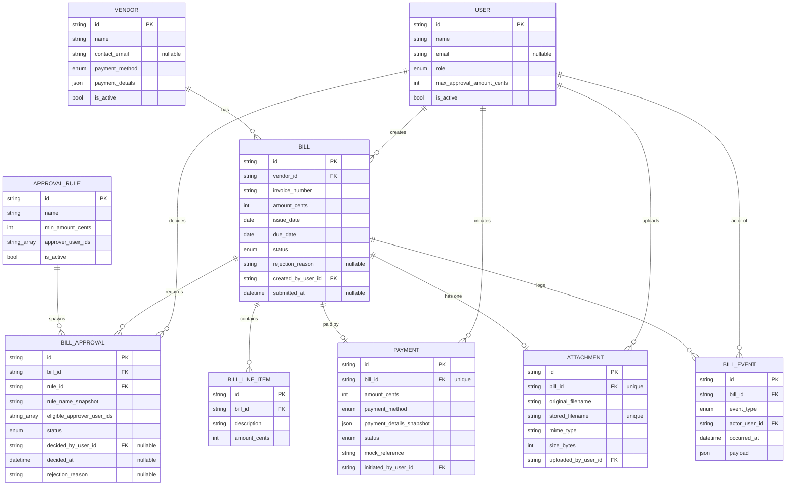

### 6.2.5 Cross-entity invariants

These invariants span multiple entities and are enforced at the API layer
(there are no cross-row CHECK constraints in MVP — Postgres can express some
of these as `EXCLUDE` constraints but doing so burns time and provides
marginal benefit for demo data):

1. `sum(bill_line_items.amount_cents WHERE bill_id = B) = bill[B].amount_cents`.
2. A bill in status `paid` must have exactly one `Payment` row.
3. A bill in status `rejected` must have `rejection_reason` non-null.
4. A bill in status `approved` must have every one of its `BillApproval` rows in status `approved`.
5. A bill transitions to `approved` atomically the moment the last pending `BillApproval` flips to `approved`.
6. `Payment.payment_method == Vendor.payment_method` at the moment `Payment` is created (snapshot); later edits to `Vendor.payment_method` do not retroactively update `Payment.payment_method`.
7. `BillApproval.decided_by_user_id` must be an element of `BillApproval.eligible_approver_user_ids`.
8. `BillApproval.decided_by_user_id != Bill.created_by_user_id` (self-approval prohibition).

### 6.2.6 Vendor `payment_details` — discriminated union shape

The `Vendor.payment_details` JSONB field is validated by a zod discriminated
union keyed on `Vendor.payment_method`. Shapes per method:

| Method | Required fields | Validation |
|---|---|---|
| `ach` | `routing_number` (string, 9 digits, numeric), `account_number` (string, 4–17 digits, numeric), `account_holder_name` (string, 1–100 chars) | Regex-validated; routing_number checksum NOT verified (would require real routing-number table) |
| `check` | `address_line1` (string, 1–100 chars), `address_line2` (string?, 0–100), `city` (string, 1–50), `state` (string, 2 char US state code), `postal_code` (string, US ZIP regex) | US-only for MVP |
| `wire` | `bank_name` (string, 1–100), `swift_code` (string, 8 or 11 chars), `iban` (string, 15–34 chars), `account_holder_name` (string, 1–100) | No checksum validation on IBAN |
| `card` | `card_brand` (enum: `visa`, `mastercard`, `amex`, `discover`), `last_four` (string, exactly 4 digits, numeric) | Cosmetic only — no PAN, CVV, or expiry captured; `last_four` is a display label, not a secret |

The shared `packages/shared/src/schemas/vendor.ts` exports this as a single
zod `discriminatedUnion('method', [...])`. API and web both import it.

### 6.2.7 Deletion & referential integrity policy

| Parent | Child | On parent delete | Rationale |
|---|---|---|---|
| `User` | `Bill.created_by_user_id` | `Restrict` | Cannot delete user who created bills (audit preservation) |
| `User` | `BillApproval.decided_by_user_id` | `Restrict` | Same |
| `User` | `Payment.initiated_by_user_id` | `Restrict` | Same |
| `User` | `Attachment.uploaded_by_user_id` | `Restrict` | Same |
| `User` | `BillEvent.actor_user_id` | `Restrict` | Same |
| `Vendor` | `Bill.vendor_id` | `Restrict` | Deferred-decision resolution from §2.3 |
| `Bill` | `BillLineItem.bill_id` | `Cascade` | Line items have no independent meaning |
| `Bill` | `Attachment.bill_id` | `Cascade` | File record deleted with bill (physical file cleanup is best-effort in MVP) |
| `Bill` | `BillApproval.bill_id` | `Cascade` | |
| `Bill` | `Payment.bill_id` | `Restrict` | If a bill has a payment, deleting is not allowed (audit preservation). In MVP no user flow deletes bills, so this is defensive |
| `Bill` | `BillEvent.bill_id` | `Cascade` | Audit log follows bill |
| `ApprovalRule` | `BillApproval.rule_id` | `Restrict` | Cannot delete a rule with snapshotted approvals — ensures audit trail survives rule deletions. UI should instead mark rules `is_active = false` |

**Explicit MVP behavior on rule deletion**: the API rejects `DELETE` on a rule
if any `BillApproval` references it, returning 409 with a hint to deactivate
instead. See §6.5 API contracts.

### 6.2.8 Known redundancies and why they're intentional

- `BillApproval.rule_name_snapshot` duplicates `ApprovalRule.name` at
  submission time. Redundant on purpose — audit trail accuracy trumps
  normalization (a later rule rename must not change what the historical
  approval shows).
- `Payment.payment_method` + `Payment.payment_details_snapshot` duplicate
  the vendor's data. Same rationale: payment records are immutable facts.
- `Bill.amount_cents` duplicates `sum(bill_line_items.amount_cents)`. Kept
  denormalized for dashboard aggregation performance; kept consistent by API
  on every edit.

## 6.3 Bill lifecycle state machine

The state machine is the single authority on which transitions are legal on a
`Bill`. Every transition is enforced at the API layer; invalid transitions
return **409 Conflict** with a machine-readable error code. The frontend never
assumes a transition is legal — it asks the API and reacts to the response.

### 6.3.1 States

All `BillStatus` values from §6.2.2:

| State | Meaning | Terminal? |
|---|---|---|
| `draft` | Being created/edited by the submitter. Not yet visible to approvers. | No |
| `pending_approval` | Awaiting one or more approval decisions per §6.4. | No |
| `approved` | All required approvals recorded. Ready to pay. | No |
| `paid` | Mock payment executed. Payment record exists. | **Yes** |
| `rejected` | At least one approver rejected. Bill is closed. | **Yes** (but cloneable per §6.3.6) |

`draft` is the only state from which a bill can be deleted (§6.3.4 below).

### 6.3.2 Transition table

| # | From | To | Trigger (user action) | Authorized actor | Notes |
|---|---|---|---|---|---|
| T1 | — | `draft` | Create bill | Any user | New bill starts in `draft` |
| T2 | `draft` | `draft` | Edit bill | Bill creator only | Fields may change; status does not |
| T3 | `draft` | deleted | Delete bill | Bill creator only | Hard delete; cascades line items, attachment, events (Q43) |
| T4 | `draft` | `pending_approval` | Submit for approval | Bill creator only | Triggers §6.4 rule evaluation; creates `BillApproval` rows; sets `submitted_at` |
| T5 | `pending_approval` | `pending_approval` | Approve (individual `BillApproval` flips to `approved`) | Any user in that approval's `eligible_approver_user_ids` except the bill creator; admins override (see §6.3.4.1) | Bill status unchanged until all approvals resolve |
| T6 | `pending_approval` | `approved` | Last pending `BillApproval` flips to `approved` | Same as T5; system applies T6 as atomic side-effect of T5 | No direct user trigger |
| T7 | `pending_approval` | `rejected` | Reject (a `BillApproval` flips to `rejected`) | Any user in that approval's `eligible_approver_user_ids` except the bill creator; admins override (see §6.3.4.1) | Cascades other pending approvals to `cancelled` (§6.3.5) |
| T8 | `pending_approval` | `draft` | Recall | Bill creator only, AND **all** `BillApproval` rows for the bill must still be `pending` | Cancels all pending approvals; clears `submitted_at` (Q44) |
| T9 | `approved` | `paid` | Pay | Any user with `max_approval_amount_cents >= bill.amount_cents`; admins override (see §6.3.4.1) | Creates `Payment` row (§6.7) |
| T10 | `rejected` | `draft` (new bill) | Clone | Any user | Not an in-place transition — creates a **new** bill in `draft` (Q42). Source bill remains in `rejected` |

Any other (from, to) pair is illegal and returns 409.

### 6.3.3 State machine diagram

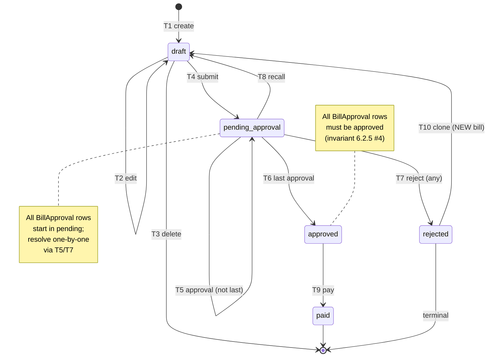

### 6.3.4 Authorization rules per transition

All authorization checks happen at the API layer using the `X-User-Id` header
(§6.1.6) to resolve the current user.

| Transition | Authorization rule | HTTP error on failure |
|---|---|---|
| T1 (create) | User exists and is active | 401 if header missing; 403 if user inactive |
| T2 (edit) | `current_user.id == bill.created_by_user_id` | 403 `NOT_BILL_CREATOR` |
| T3 (delete) | `current_user.id == bill.created_by_user_id` AND `bill.status == draft` | 403 `NOT_BILL_CREATOR` or 409 `ILLEGAL_TRANSITION` |
| T4 (submit) | `current_user.id == bill.created_by_user_id` AND `bill.status == draft` AND submission precondition checks pass (see §6.3.5) | 403, 409, or 400 `SUBMISSION_PRECONDITION_FAILED` |
| T5/T7 (approve / reject) | `current_user.id ∈ approval.eligible_approver_user_ids` AND `approval.status == pending` AND `bill.status == pending_approval` AND (`current_user.id != bill.created_by_user_id` OR `current_user.role == admin`) | 403 `NOT_ELIGIBLE_APPROVER`, 403 `SELF_APPROVAL_FORBIDDEN`, 409 `ALREADY_DECIDED`/`ILLEGAL_TRANSITION` |
| T8 (recall) | `current_user.id == bill.created_by_user_id` AND `bill.status == pending_approval` AND every `BillApproval.status == pending` | 403 `NOT_BILL_CREATOR` or 409 `CANNOT_RECALL_AFTER_DECISION` |
| T9 (pay) | (`current_user.max_approval_amount_cents >= bill.amount_cents` OR `current_user.role == admin`) AND `current_user.is_active` AND `bill.status == approved` | 403 `INSUFFICIENT_PAY_AUTHORITY` or 409 `ILLEGAL_TRANSITION` |
| T10 (clone) | User exists and is active AND `source_bill.status == rejected` | 403 `USER_INACTIVE` or 409 `CAN_ONLY_CLONE_REJECTED` |

### 6.3.4.1 Admin override

Users with `role = admin` hold elevated privileges on a fixed subset of
transitions. Admin powers do **not** apply universally — they are scoped to
the situations below. Outside of this scope, admins behave identically to
regular users.

| Transition | Normal authorization | Admin override | Audit implication |
|---|---|---|---|
| T5 (approve) | user ∈ `approval.eligible_approver_user_ids` AND user ≠ bill creator | Admin can approve any pending `BillApproval` regardless of pool membership. Admin can also approve their own bill (self-approval allowed for admins). | Event payload includes `admin_override: true` |
| T7 (reject) | Same as T5 | Same expansion as T5 | Event payload includes `admin_override: true` |
| T9 (pay) | `user.max_approval_amount_cents >= bill.amount_cents` | Admin can pay any `approved` bill regardless of `max_approval_amount_cents`. | Event payload includes `admin_override: true` |

**Not overridable**:
- T2 (edit draft), T3 (delete draft), T4 (submit), T8 (recall), T10 (clone) all still require `user.id == bill.created_by_user_id`. Admins cannot edit, recall, or submit others' bills. Keeping admin power narrow preserves "system of record" integrity — the submitter stays the submitter.

**Self-approval for admins**: admins may approve bills they themselves created. This is intentional: in a real small business, the admin is often the CFO / owner who both creates and approves high-value bills, and the compliance constraint is about *who* signed off (audit trail), not enforcing segregation of duties.

**Implementation implication for `BillApproval.eligible_approver_user_ids`** (§6.2.3):

- When submission snapshot is computed in T4 (see §6.4), the union of `rule.approver_user_ids` and the set of active admin user IDs is frozen into each `BillApproval.eligible_approver_user_ids`. Admins get pre-baked into every snapshot.
- This keeps the authorization check in T5/T7 uniform (always "is user in `eligible_approver_user_ids`?") and preserves the §4.6 "rule edits don't re-evaluate in-flight bills" semantic — even adding a new admin later does not retroactively grant them override on in-flight bills.

**Interaction with the limit check**: the limit check in §6.3.4 T5/T7 authorization is already baked into the snapshot (only users whose limit covers the bill are included for regular approvers). Admins are added to the snapshot **without** the limit filter, preserving the override.

### 6.3.5 Side effects per transition

Side effects are applied in the same DB transaction as the status change.
Either all succeed or none do.

#### T1 (create → `draft`)
- Create `Bill` row with `status = draft`, `created_by_user_id = current_user.id`, `submitted_at = null`.
- Create `BillLineItem` rows.
- Optionally create `Attachment` row (if file attached).
- Emit `BillEvent` `created` with payload `{ amount_cents, vendor_id }`.

#### T2 (edit `draft`)
- Update `Bill` fields + `BillLineItem` rows atomically (replace all line items in one transaction).
- Validate sum(line_items.amount_cents) == bill.amount_cents (invariant §6.2.5 #1).
- Emit `BillEvent` `edited` with payload `{ changed_fields, previous_values }`.

#### T3 (delete `draft`)
- Hard delete; cascades per §6.2.7.
- **No `BillEvent` emitted** — the event row would be cascade-deleted anyway, and deletion of a never-submitted bill is not auditable in MVP.

#### T4 (submit `draft → pending_approval`)

Preconditions:
1. `bill.status == draft`.
2. ≥ 1 `BillLineItem` exists.
3. `sum(line_items.amount_cents) == bill.amount_cents`.
4. Associated `Vendor.is_active == true`.
5. `bill.amount_cents > 0`.
6. The approval engine (§6.4) returns ≥ 1 `BillApproval` row (i.e., rules match and at least one eligible approver exists per matching rule).

On success:
- Set `bill.status = pending_approval`, `bill.submitted_at = now()`.
- Run approval engine (§6.4) → create N `BillApproval` rows (one per matching rule), each with frozen `rule_name_snapshot` and `eligible_approver_user_ids`.
- Emit `BillEvent` `submitted` with payload `{ matched_rule_ids }`.

#### T5 (individual approval on a `pending_approval` bill)
- Set `BillApproval.status = approved`, `decided_by_user_id = current_user.id`, `decided_at = now()`.
- Emit `BillEvent` `approved` with payload `{ rule_id, approval_id, from_status: pending_approval, to_status: pending_approval }`. If the actor is an admin who was NOT in the rule's original `approver_user_ids`, add `admin_override: true` to the payload.
- Check: is this the last pending `BillApproval` for this bill?
  - If yes → apply T6 in the same transaction.

#### T6 (`pending_approval → approved`)
- Set `bill.status = approved`.
- Emit `BillEvent` `approved` with payload `{ rule_id: null, approval_id: null, from_status: pending_approval, to_status: approved }`. (Separate event from the T5 per-approval event; lets the UI distinguish "individual approval recorded" from "bill fully approved.")

#### T7 (rejection on a `pending_approval` bill)
- Set the target `BillApproval.status = rejected`, `decided_by_user_id = current_user.id`, `decided_at = now()`, `rejection_reason = <user input, nullable>`.
- For every **other** `BillApproval` still in `pending` for the same bill:
  - Set `status = cancelled`, `decided_by_user_id = null`, `decided_at = now()`, `rejection_reason = null`.
- Set `bill.status = rejected`, `bill.rejection_reason = <target approval's rejection_reason, or "rejected by ${user.name}" if null>`.
- Emit one `BillEvent` `rejected` with payload `{ rule_id: <target.rule_id>, approval_id: <target.id>, rejection_reason }`. If the actor is an admin who was NOT in the rule's original `approver_user_ids`, add `admin_override: true` to the payload.
- **Do NOT emit events for the cascaded `cancelled` approvals** — they are not user actions, and the UI can derive the cascade by querying `BillApproval` rows.

#### T8 (recall `pending_approval → draft`)
- For every `BillApproval` (all are currently `pending` per authorization check):
  - Set `status = cancelled`, `decided_by_user_id = null`, `decided_at = now()`, `rejection_reason = null`.
- Set `bill.status = draft`, `bill.submitted_at = null`.
- Emit `BillEvent` `recalled` with payload `{ cancelled_approval_count }`.

#### T9 (pay `approved → paid`)
- Create `Payment` row per §6.7 (amount snapshot, method snapshot, details snapshot, mock reference generated).
- Set `bill.status = paid`.
- Emit `BillEvent` `paid` with payload `{ payment_id, amount_cents, payment_method, mock_reference }`. If the actor used admin override (`user.max_approval_amount_cents < bill.amount_cents` AND `user.role == admin`), add `admin_override: true` to the payload.

#### T10 (clone rejected bill → new `draft`)
- Read source bill.
- Create a new `Bill` row with:
  - New `id`.
  - Same `vendor_id`, `amount_cents`, `issue_date`, `due_date`, `invoice_number` (see note below), and line items (copied).
  - `status = draft`, `submitted_at = null`, `rejection_reason = null`.
  - `created_by_user_id = current_user.id` (not the original creator — whoever clicks Clone now owns the new bill).
- **Invoice number collision handling**: the source bill's `invoice_number` is a vendor-provided string and is unique per vendor (§6.2.3 Bill). Cloning must not duplicate it. The new bill's `invoice_number` is set to `<source.invoice_number>-CLONE-<short_cuid>` to guarantee uniqueness. User can edit it in the draft before resubmitting.
- **Do NOT copy** the attachment file. Instead, the new bill starts with no attachment; user can re-upload. (Copying the file would require DB reference sharing or physical file duplication — both out of scope.)
- **Do NOT copy** any `BillApproval`, `Payment`, or `BillEvent` rows.
- Emit `BillEvent` `created` on the new bill with payload `{ amount_cents, vendor_id, cloned_from_bill_id: <source.id> }`. The `cloned_from_bill_id` field is a free-form payload key — no schema change needed; useful in audit trail to trace provenance.

### 6.3.6 Error responses (summary)

Every non-2xx API response uses the RFC 7807 Problem Details envelope
specified in §6.5.2. The authoritative code table:

| HTTP | Code | When |
|---|---|---|
| 400 | `VALIDATION_ERROR` | Request body / params fail zod validation. `field_issues` populated |
| 400 | `SUBMISSION_PRECONDITION_FAILED` | T4 precondition 2/3/4/5/6 fails; `field_issues[0].path == "preconditions"` and `.message` identifies the failed precondition |
| 401 | `UNAUTHORIZED` | `X-User-Id` header missing or user not found |
| 403 | `USER_INACTIVE` | Current user has `is_active = false` |
| 403 | `NOT_BILL_CREATOR` | Transition requires creator; current user is not the creator |
| 403 | `NOT_ELIGIBLE_APPROVER` | Current user not in `eligible_approver_user_ids` for the approval being decided |
| 403 | `SELF_APPROVAL_FORBIDDEN` | Current user == bill creator on approve/reject AND current user is not admin |
| 403 | `INSUFFICIENT_PAY_AUTHORITY` | T9: current user's `max_approval_amount_cents` < `bill.amount_cents` AND current user is not admin |
| 409 | `ILLEGAL_TRANSITION` | `(from, to)` pair not in §6.3.2 table |
| 409 | `ALREADY_DECIDED` | T5/T7: the specific `BillApproval` is no longer `pending` |
| 409 | `CANNOT_RECALL_AFTER_DECISION` | T8: at least one `BillApproval` is no longer `pending` |
| 409 | `CAN_ONLY_CLONE_REJECTED` | T10: source bill is not in `rejected` |
| 409 | `INVALID_PAYMENT_DETAILS` | T9: vendor's `payment_details` fails zod validation at pay time (§6.7.4). `field_issues` populated with offending `payment_details` fields |
| 409 | `VENDOR_HAS_BILLS` | DELETE `/vendors/:id`: any Bill references this vendor |
| 409 | `DUPLICATE_INVOICE_NUMBER` | POST `/bills` / PATCH `/bills/:id`: `invoice_number` already used for the same vendor |
| 409 | `DEFAULT_RULE_REQUIRED` | V6: mutation would leave zero active rules with `min_amount_cents = 0` (§6.4.4) |
| 409 | `RULE_IN_USE` | V7 / DELETE `/approval-rules/:id`: rule is referenced by at least one `BillApproval` row (§6.4.6) |
| 413 | `FILE_TOO_LARGE` | POST `/uploads`: file exceeds 10 MB |
| 400 | `INVALID_MIME_TYPE` | POST `/uploads`: mime type not in allowlist |

**Response envelope**: RFC 7807 `application/problem+json`, specified in
§6.5.2. Example:

```json
{
  "type": "https://billpay.local/problems/illegal-transition",
  "title": "Illegal state transition",
  "status": 409,
  "detail": "Cannot pay a bill in status 'paid'",
  "instance": "/bills/ckxx123/pay",
  "code": "ILLEGAL_TRANSITION"
}
```

### 6.3.7 Event emission matrix

For §4.2 C-B5 ("audit trail") to hold, the UI timeline must show a coherent
history. The matrix below is the authoritative source for which events fire
per transition.

| Transition | Events emitted |
|---|---|
| T1 (create) | `created` |
| T2 (edit) | `edited` (one per edit; multiple edits produce multiple rows) |
| T3 (delete) | (none — row is gone) |
| T4 (submit) | `submitted` |
| T5 (individual approval, not last) | `approved` (per-approval variant, with rule_id and approval_id) |
| T5+T6 (last approval) | `approved` (per-approval) **and** `approved` (bill-level, rule_id=null) — two events |
| T7 (reject) | `rejected` (single event; cascaded cancels are silent) |
| T8 (recall) | `recalled` |
| T9 (pay) | `paid` |
| T10 (clone) | `created` on the new bill (with `cloned_from_bill_id` in payload); **no event on the source bill** |

The UI distinguishes the two `approved` event variants by the presence of
`rule_id`/`approval_id` in the payload: non-null = per-approval; both null =
bill-level transition to `approved`.

**Admin override flag**: the `approved`, `rejected`, and `paid` events include
`admin_override: true` in their payload when the actor used admin override
(see §6.3.4.1 for the precise trigger conditions). The UI should display a
badge on these events in the bill timeline to make the override visible.

### 6.3.8 Interactions with other sections

- **§6.5** defines the HTTP endpoints that trigger each transition.
- **§6.4** defines how T4 produces `BillApproval` rows (rule matching, pool filtering, admin union).
- **§6.7** defines the `Payment` record produced by T9 and the `INVALID_PAYMENT_DETAILS` precondition.
- **§6.8** seed data includes `user_dana` (admin) to demonstrate admin override.
- **§7** acceptance criteria reference the transition IDs (T1–T10) directly.

## 6.4 Approval rules engine

The rules engine is the system's "complex workflow" surface (§3.3). It runs at
a single well-defined moment — T4, bill submission — and produces the set of
`BillApproval` rows that govern the bill's approval lifecycle thereafter. It
does **not** re-evaluate on rule edits, user edits, or any other trigger (§4.6).

### 6.4.1 Matching predicate

A rule is a **match** for a bill iff:

1. `rule.is_active == true`.
2. `bill.amount_cents >= rule.min_amount_cents`.

No other conditions are supported (Q49). Future extensions (vendor-specific
rules, category-specific rules) are explicitly out of scope (§3.2, §4.6).

### 6.4.2 Evaluation algorithm (at submission, T4)

The algorithm runs in a single Prisma transaction as part of T4 (§6.3.5).
Pseudocode — the agent is free to implement the same semantics in whatever
style fits, but the observable behavior must be identical.

```
function evaluateRules(bill):
    matchedRules = selectActiveRulesWhere(min_amount_cents <= bill.amount_cents)

    if matchedRules is empty:
        throw SUBMISSION_PRECONDITION_FAILED(
            "no_matching_rule",
            "No active approval rule matches this bill. Contact admin."
        )

    billApprovals = []
    for each rule in matchedRules:
        eligibleUserIds = computeEligiblePool(rule, bill)
        if eligibleUserIds is empty:
            throw SUBMISSION_PRECONDITION_FAILED(
                "no_eligible_approver_for_rule",
                "Rule '${rule.name}' has no approver who can sign off on this amount."
            )

        billApprovals.append({
            bill_id: bill.id,
            rule_id: rule.id,
            rule_name_snapshot: rule.name,
            eligible_approver_user_ids: eligibleUserIds,
            status: "pending"
        })

    bulkInsert(billApprovals)
    return billApprovals
```

Ordering of `matchedRules` is not observable: the set of `BillApproval` rows
is the same regardless of iteration order. No rule takes priority over any
other.

### 6.4.3 Eligible approver pool computation

`computeEligiblePool(rule, bill)` produces the set of user IDs frozen into
`BillApproval.eligible_approver_user_ids` at submission time.

```
function computeEligiblePool(rule, bill):
    # regular approvers from the rule's list, filtered by limit
    regularApprovers = users.where(
        id IN rule.approver_user_ids
        AND is_active == true
        AND max_approval_amount_cents >= bill.amount_cents
    ).map(u => u.id)

    # admins are always eligible regardless of limit and regardless of
    # inclusion in rule.approver_user_ids (§6.3.4.1)
    adminApprovers = users.where(
        role == "admin"
        AND is_active == true
    ).map(u => u.id)

    return union(regularApprovers, adminApprovers)
```

**Why we freeze the union**: the snapshot must reflect the admin set at
submission time as well, so that adding/deactivating admins later does not
retroactively change eligibility on in-flight approvals (§4.6).

**Why the limit filter does not apply to admins**: admin override (§6.3.4.1)
explicitly bypasses the limit check. Admins are added to every snapshot
unconditionally; at decision time, they may approve any eligible pending
approval regardless of the amount.

### 6.4.4 Fallback rule invariant

To guarantee that every bill matches at least one rule, the system enforces
the **default-rule invariant** (Q50):

> At all times, there must be at least one active `ApprovalRule` with
> `min_amount_cents = 0`. The API prohibits deactivating or deleting the last
> such rule.

Concretely:

- Seed data (§6.8) creates a rule named **"Default (all bills)"** with `min_amount_cents = 0`, `approver_user_ids = [Bob, Carol]`, `is_active = true`.
- `PATCH /approval-rules/:id` and `DELETE /approval-rules/:id` reject requests that would leave zero active rules with `min_amount_cents = 0`, returning 409 `DEFAULT_RULE_REQUIRED`.
- Creating a new `min_amount_cents = 0` rule before deactivating the existing one is a legitimate way to swap the default. The check is **post-mutation**: after the update is applied in-transaction, count must be ≥ 1; if zero, the transaction rolls back.

The "submission fails if no rule matches" branch in §6.4.2 remains as a
backstop — defensively guarding against an invariant violation (e.g., direct
SQL manipulation, seed bugs). In normal MVP operation this branch is
unreachable.

### 6.4.5 Approval decision resolution (one-click, multi-slot)

When a user acts on a bill (approve or reject), the API decides **every**
`BillApproval` for that bill for which the user is eligible, in a single
transaction (Q52-sub B). This prevents the awkward UX of the same user
clicking Approve twice for the same bill because they happen to qualify for
two matching rules' pools.

#### Approve (T5 / T6)

```
function approveBill(bill, actingUser):
    pendingApprovals = BillApproval.where(
        bill_id == bill.id
        AND status == "pending"
    )

    eligibleSlots = pendingApprovals.filter(a =>
        actingUser.id IN a.eligible_approver_user_ids
    )

    if eligibleSlots is empty:
        throw NOT_ELIGIBLE_APPROVER

    # self-approval check: regular users blocked, admins allowed
    if actingUser.id == bill.created_by_user_id
       AND actingUser.role != "admin":
        throw SELF_APPROVAL_FORBIDDEN

    for each slot in eligibleSlots:
        slot.status = "approved"
        slot.decided_by_user_id = actingUser.id
        slot.decided_at = now()
        emitEvent("approved", {
            rule_id: slot.rule_id,
            approval_id: slot.id,
            from_status: "pending_approval",
            to_status: "pending_approval",
            admin_override: isAdminOverride(actingUser, slot)
        })

    # check if bill fully approved now
    remainingPending = BillApproval.where(
        bill_id == bill.id
        AND status == "pending"
    )
    if remainingPending is empty:
        bill.status = "approved"
        emitEvent("approved", {
            rule_id: null,
            approval_id: null,
            from_status: "pending_approval",
            to_status: "approved"
        })
```

`isAdminOverride(user, slot)` returns true iff `user.role == admin` AND
`user.id NOT IN rule.approver_user_ids` (resolved from `slot.rule_id`). Note
this requires one lookup back to the current rule; the rule may have been
edited since submission — the check uses the **current** rule's approver list
for determining override-ness. This is acceptable because override-ness is a
display/audit nicety, not an authorization decision.

#### Reject (T7)

Rejection deviates from the "decide all eligible" pattern — a single
rejection is sufficient to fail the whole bill. Acting on any one eligible
slot rejects the bill.

```
function rejectBill(bill, actingUser, targetApprovalId, reason):
    target = BillApproval.where(id == targetApprovalId).one()

    if target.bill_id != bill.id:           throw NOT_FOUND
    if target.status != "pending":          throw ALREADY_DECIDED
    if actingUser.id NOT IN target.eligible_approver_user_ids:
                                            throw NOT_ELIGIBLE_APPROVER
    if actingUser.id == bill.created_by_user_id
       AND actingUser.role != "admin":      throw SELF_APPROVAL_FORBIDDEN

    target.status = "rejected"
    target.decided_by_user_id = actingUser.id
    target.decided_at = now()
    target.rejection_reason = reason  # nullable

    # cascade other pending approvals to cancelled
    for each other in BillApproval.where(
        bill_id == bill.id
        AND id != target.id
        AND status == "pending"
    ):
        other.status = "cancelled"
        other.decided_at = now()
        # decided_by_user_id stays null (system cascade)
        # rejection_reason stays null

    bill.status = "rejected"
    bill.rejection_reason = reason ?? "Rejected by ${actingUser.name}"

    emitEvent("rejected", {
        rule_id: target.rule_id,
        approval_id: target.id,
        rejection_reason: reason,
        admin_override: isAdminOverride(actingUser, target)
    })
```

Rejection targets a **specific** `BillApproval.id` (not the bill). The UI
passes the approval ID; the API enforces it belongs to the right bill. This
keeps the audit trail precise ("Bob rejected under rule X") rather than
ambiguous ("bill was rejected, check approval rows").

### 6.4.6 Rule validation constraints

Rule create (`POST /approval-rules`) and rule update (`PATCH /approval-rules/:id`)
validate the following (Q53 — strict validation):

| # | Constraint | Error code on violation |
|---|---|---|
| V1 | `name`: non-empty string, ≤ 100 chars | `INVALID_NAME` |
| V2 | `min_amount_cents`: integer, `>= 0` | `INVALID_THRESHOLD` |
| V3 | `approver_user_ids`: array, non-empty | `EMPTY_APPROVER_POOL` |
| V4 | Each ID in `approver_user_ids` must resolve to an existing, active user | `UNKNOWN_OR_INACTIVE_USER` |
| V5 | At least one user in `approver_user_ids` must have `max_approval_amount_cents >= min_amount_cents` (i.e., at least one non-admin can approve at this threshold without override) | `NO_QUALIFIED_APPROVER` |
| V6 | (On update of the last `min_amount_cents = 0` active rule) the patched rule must remain `is_active = true` AND `min_amount_cents = 0`, OR another rule must also meet both conditions | `DEFAULT_RULE_REQUIRED` |
| V7 | (On delete) no `BillApproval` rows reference the rule | `RULE_IN_USE` (409); hint to deactivate instead — see §6.2.7 |

V5 prevents "unusable-threshold" rules. Note that admins being globally
eligible is NOT sufficient to satisfy V5 — we require at least one **regular**
qualified approver so the system isn't reliant on admin override for normal
operation. If your org removes all Approver-L2 users, you cannot keep a
$10k+ threshold rule active without adding an approver first.

Duplicate thresholds are **not** prohibited. Under the amount-only rule model,
two active rules with the same `min_amount_cents` and different approver
pools are a valid business case (e.g., "Finance Legal" and "Finance Marketing"
both requiring approval at the $5k threshold from different approver pools).
This produces two `BillApproval` rows at submission, each needing its own
approval — same AND semantics as §6.4.5.

### 6.4.7 Rule lifecycle: activation / deactivation (Q54)

| Action | Effect on future submissions | Effect on in-flight bills |
|---|---|---|
| Create active rule | New submissions match it | No effect on existing `BillApproval` rows |
| Edit active rule (threshold, approver list, name) | New submissions see updated rule | No effect on existing `BillApproval` rows (snapshots are frozen) |
| Deactivate (`is_active = false`) | Rule excluded from matching | No effect on existing `BillApproval` rows |
| Reactivate | Rule included in matching again | No effect |
| Delete | Not matching; rule gone | Blocked by V7 if any `BillApproval` references it |

**UI implication (§6.6)**: when a user edits or deactivates a rule, the UI
must surface the message: *"Changes apply to bills submitted from now on.
Bills already in approval are unaffected."* This prevents user confusion
about why in-flight bills don't suddenly re-route.

### 6.4.8 Worked example — the §4.3 walkthrough

Seed state (§6.8 preview):

| User | Role | Max limit |
|---|---|---|
| Alice | submitter | $0 |
| Bob | approver | $10,000 |
| Carol | approver | $100,000 |
| Dana | admin | $0 (override applies) |

Rules (seeded):

| Rule | `min_amount_cents` | `approver_user_ids` |
|---|---|---|
| "Default (all bills)" | `0` | `[Bob.id, Carol.id]` |
| "Bills ≥ $10,000" | `1000000` ($10k) | `[Carol.id]` |

---

**Scenario 1 — $1,200 bill submitted by Alice (§4.3 step 4):**

- Matched rules: `["Default"]` (the $10k rule doesn't match; $1,200 < $10,000).
- Pool for Default: `{Bob, Carol}` (both qualify, limit ≥ $1,200) ∪ `{Dana}` (admin) = `{Bob, Carol, Dana}`.
- `BillApproval` rows created: 1 (for Default rule).
- Status: bill becomes `pending_approval`; any of `{Bob, Carol, Dana}` can approve.

When Bob approves (§4.3 step 6):
- Bob is in eligible pool. Bob is not the creator. Not admin-override.
- The Default `BillApproval` flips to `approved`.
- No other pending approvals → bill transitions to `approved` (T6).
- Events: `approved` (per-approval, rule_id=Default) + `approved` (bill-level, rule_id=null).

---

**Scenario 2 — $15,000 bill submitted by Alice (§4.3 step 8):**

- Matched rules: `["Default", "Bills ≥ $10,000"]`.
- Pool for Default: regular = `{Carol}` (Bob's $10k < $15k, excluded; Carol's $100k ≥ $15k, included) ∪ `{Dana}` (admin) = `{Carol, Dana}`.
- Pool for ≥$10k rule: regular = `{Carol}` ∪ `{Dana}` = `{Carol, Dana}`.
- `BillApproval` rows created: 2 (one per matching rule). Both have identical `eligible_approver_user_ids = {Carol, Dana}`.

When Bob opens the bill (§4.3 step 10):
- Bob is NOT in either `eligible_approver_user_ids`. UI shows "You cannot approve this bill" with tooltip: "Your approval limit is $10,000. This bill requires $15,000."

When Carol approves (§4.3 step 11):
- Carol is eligible for both `BillApproval` rows.
- Per §6.4.5, **both slots flip to `approved` in one click**.
- No remaining pending approvals → bill transitions to `approved` (T6).
- Events: 2× `approved` (per-approval, one per rule) + 1× `approved` (bill-level) = 3 events, all in the same transaction.

---

**Scenario 3 — Admin override demo (not in current §4.3; candidate for addition):**

- Alice creates a $50,000 bill. Submission produces `BillApproval` rows; eligible pools include `{Carol, Dana}`.
- Bob, Alice, and Dana are the only active users (Carol is on vacation — or in this demo, we imagine a state where Carol can't act).
- Dana (admin) approves. Per §6.4.5, both slots flip. Bill → `approved`.
- Events include `admin_override: true` on both per-approval events because Dana is not in either rule's `approver_user_ids`.

---

**Scenario 4 — Default-rule invariant (V6):**

- User tries to deactivate "Default (all bills)" rule.
- No other active rule has `min_amount_cents = 0`.
- API returns 409 `DEFAULT_RULE_REQUIRED` with message: "At least one active rule matching all bills must exist. Create a replacement default rule first."

### 6.4.9 Interactions with other sections

- **§6.2.3** — `BillApproval.eligible_approver_user_ids` holds the union output of §6.4.3.
- **§6.3.5 T4** — invokes §6.4.2 as its core logic.
- **§6.3.5 T5/T7** — apply the decision algorithms in §6.4.5.
- **§6.5** — `POST /bills/:id/submit`, `POST /bills/:id/approve`, `POST /approvals/:id/reject`, `GET /approval-rules`, `POST /approval-rules`, `PATCH /approval-rules/:id`, `DELETE /approval-rules/:id` are the endpoints backing this engine.
- **§6.6** — approval rules screen displays a live preview of "which users qualify" under each rule (C-R4) by running §6.4.3 read-only against current state.
- **§6.8** — seeds must satisfy V5 for the "Bills ≥ $10,000" rule (Carol is the qualifying regular approver).

## 6.5 API contracts

All endpoints are served by the `api` package on port 4000 (§6.1.5). URLs are
kebab-case, JSON field names are snake_case, timestamps are ISO 8601 strings
in UTC, and monetary amounts are integer cents.

### 6.5.1 Conventions

| Concern | Convention |
|---|---|
| URL path casing | kebab-case (`/approval-rules`, `/bills/:id/submit`) |
| URL parameter style | resource ID as path param (`/bills/:id`); filters as query params (`/bills?status=pending_approval`) |
| JSON field casing | snake_case (`amount_cents`, `due_date`, `created_by_user_id`) |
| Monetary values | `<name>_cents`: integer cents (§3.3) |
| Timestamps | ISO 8601 UTC strings (`"2026-04-17T19:36:00.000Z"`) |
| Dates (no time) | ISO 8601 date strings (`"2026-04-17"`) — `issue_date`, `due_date` use this |
| Enum values | lowercase snake_case (`pending_approval`, `ach`) |
| Authentication | `X-User-Id: <user.id>` header required on every request except `GET /health` (see §6.1.6) |
| Idempotency | `Idempotency-Key` header accepted on `POST /bills/:id/pay` only (Q60). Other mutating endpoints rely on state-machine guards (409 `ALREADY_DECIDED`, 409 `ILLEGAL_TRANSITION`) for duplicate prevention |
| Pagination | none (§4.6) |
| CORS | `*` origin allowed in development — this is a local-only demo (§6.1.8) |
| Content-Type | `application/json` for all requests/responses except `POST /uploads` (multipart) |

### 6.5.2 Error response shape (RFC 7807 Problem Details)

All non-2xx responses use the RFC 7807 Problem Details format with the
`application/problem+json` Content-Type. Custom fields are added as RFC 7807
permits.

| Field | Required | Notes |
|---|---|---|
| `type` | ✓ | URI reference identifying the problem kind. For MVP use `https://billpay.local/problems/<CODE_LOWERCASE>`, e.g. `https://billpay.local/problems/illegal-transition`. Not dereferenced; used as a stable identifier |
| `title` | ✓ | Short, human-readable summary. Corresponds to the HTTP status phrase plus context (e.g., "Illegal state transition") |
| `status` | ✓ | HTTP status code as an integer |
| `detail` | ✓ | Human-readable explanation specific to this occurrence (e.g., "Cannot approve a bill in status 'paid'") |
| `instance` | optional | URI of the failing request (e.g., `/bills/abc123/approve`) |
| `code` | ✓ (extension) | Stable machine-readable code from §6.3.6 / §6.4.6 (e.g., `ILLEGAL_TRANSITION`, `NO_QUALIFIED_APPROVER`). The frontend branches on this |
| `field_issues` | optional (extension) | For validation errors: array of `{ path: string, message: string }` objects, one per offending field. `path` is dot-separated (e.g., `line_items.0.amount_cents`) |

Example validation error (HTTP 400):

```json
{
  "type": "https://billpay.local/problems/validation-error",
  "title": "Invalid request body",
  "status": 400,
  "detail": "One or more fields failed validation. See field_issues.",
  "instance": "/vendors",
  "code": "VALIDATION_ERROR",
  "field_issues": [
    { "path": "name", "message": "Required" },
    { "path": "payment_details.routing_number", "message": "Must be exactly 9 digits" }
  ]
}
```

Example state-machine error (HTTP 409):

```json
{
  "type": "https://billpay.local/problems/illegal-transition",
  "title": "Illegal state transition",
  "status": 409,
  "detail": "Cannot pay a bill in status 'paid'",
  "instance": "/bills/ckxx123/pay",
  "code": "ILLEGAL_TRANSITION"
}
```

**Note**: §6.3.6 defines the canonical list of error codes. §6.4.6 adds rule-
specific codes. This section only specifies the envelope, not the codes
themselves.

### 6.5.3 Endpoint inventory

| Method | Path | Purpose | Transition / capability |
|---|---|---|---|
| `GET` | `/health` | Liveness probe; no auth required | Operational |
| `GET` | `/users` | List all users (for user switcher) | C-U1 |
| `GET` | `/users/me` | Return the user matching `X-User-Id` | C-U3 |
| `GET` | `/vendors` | List vendors | C-V3 |
| `POST` | `/vendors` | Create a vendor | C-V1, C-V2 |
| `GET` | `/vendors/:id` | Get vendor detail + recent bills | C-V4 |
| `PATCH` | `/vendors/:id` | Edit vendor | C-V5 |
| `DELETE` | `/vendors/:id` | Delete vendor (blocked by FK if bills exist) | — |
| `GET` | `/bills` | List bills, optional `?status=` filter, default sort `due_date asc` | C-B4 |
| `POST` | `/bills` | Create a draft bill | C-B1, T1 |
| `GET` | `/bills/:id` | Get bill detail: bill + line items + attachment + approvals + events + vendor | C-B5 |
| `PATCH` | `/bills/:id` | Edit draft bill (replaces line items atomically) | C-B6, T2 |
| `DELETE` | `/bills/:id` | Delete draft bill | T3 |
| `POST` | `/bills/:id/submit` | Submit for approval | T4 |
| `POST` | `/bills/:id/approve` | Approve: decides all eligible pending approvals in one transaction | C-A2, T5/T6 |
| `POST` | `/bills/:id/recall` | Recall a submitted bill back to draft | T8 |
| `POST` | `/bills/:id/pay` | Execute mock payment (supports `Idempotency-Key`) | C-P1, T9 |
| `POST` | `/bills/:id/clone` | Create a new draft from a rejected bill | T10 |
| `POST` | `/approvals/:id/reject` | Reject a specific approval (fails the whole bill) | C-A3, T7 |
| `GET` | `/approval-rules` | List approval rules | C-R1 |
| `POST` | `/approval-rules` | Create an approval rule | C-R2 |
| `GET` | `/approval-rules/:id` | Get a rule | C-R1 |
| `PATCH` | `/approval-rules/:id` | Edit a rule (does not re-evaluate in-flight bills) | C-R3 |
| `DELETE` | `/approval-rules/:id` | Delete a rule (blocked if referenced by any `BillApproval`) | C-R3 |
| `POST` | `/approval-rules/preview` | Given a proposed rule payload + target amount, return eligible approvers without persisting. Used by the rule editor's live preview | C-R4 |
| `POST` | `/uploads` | Multipart upload; returns attachment metadata (no `bill_id` link yet — client passes `attachment_id` when creating/editing the bill) | C-B2 |
| `GET` | `/uploads/:stored_filename` | Serve a previously uploaded file | C-B5 |
| `GET` | `/dashboard` | Return status-aggregated counts/sums, overdue list, upcoming list | C-D1, C-D2, C-D3 |

### 6.5.4 Per-endpoint request/response details

All request/response bodies below are specified as field tables. Optional
fields are marked with `?`. Every field name reflects exact JSON wire names.

#### GET `/health`
Request: none.
Response 200: `{ "status": "ok" }`. No `X-User-Id` required.

#### GET `/users`
Request: none (headers only).
Response 200: array of `UserDTO`:

| Field | Type | Notes |
|---|---|---|
| `id` | string (CUID) | |
| `name` | string | |
| `role` | `UserRole` | |
| `max_approval_amount_cents` | integer | |
| `is_active` | boolean | |

#### GET `/users/me`
Response 200: single `UserDTO` matching the `X-User-Id` header.
Response 401: `UNAUTHORIZED` if header missing or user not found.

#### POST `/vendors`
Request body:

| Field | Type | Notes |
|---|---|---|
| `name` | string | 1–100 chars |
| `contact_email` | string? | valid email if present |
| `payment_method` | `PaymentMethod` | One of `ach`, `check`, `wire`, `card` (§6.2.2) |
| `payment_details` | object | Discriminated union per §6.2.6, validated by zod |

Response 201: `VendorDTO` (all fields of `Vendor` entity).
Errors: 400 `VALIDATION_ERROR` (shape mismatch, invalid payment_details for method).

#### PATCH `/vendors/:id`
Request body: partial `POST /vendors` body. If `payment_method` changes, `payment_details` must also be provided with the new shape.
Response 200: `VendorDTO`.
Errors: 404, 400 `VALIDATION_ERROR`.

#### DELETE `/vendors/:id`
Response 204: empty body.
Errors: 409 `VENDOR_HAS_BILLS` if any bill references this vendor (Postgres FK restrict — surfaced as a domain error by the API).

#### GET `/bills`
Query params:

| Param | Type | Notes |
|---|---|---|
| `status` | `BillStatus`? | When absent, returns all |

Response 200: array of `BillSummaryDTO`:

| Field | Type | Notes |
|---|---|---|
| `id` | string | |
| `vendor_id` | string | |
| `vendor_name` | string | Joined for list display |
| `invoice_number` | string | |
| `amount_cents` | integer | |
| `status` | `BillStatus` | |
| `due_date` | date | |
| `issue_date` | date | |
| `created_by_user_id` | string | |
| `created_by_user_name` | string | Joined |
| `submitted_at` | datetime? | |
| `pending_approval_count` | integer | Number of `BillApproval` rows still `pending` (0 if bill is not in `pending_approval`) |
| `has_attachment` | boolean | |

Results sorted by `due_date` ascending.

#### POST `/bills`
Request body:

| Field | Type | Notes |
|---|---|---|
| `vendor_id` | string | Must reference active vendor |
| `invoice_number` | string | 1–50 chars; unique per vendor (409 `DUPLICATE_INVOICE_NUMBER` on collision) |
| `amount_cents` | integer | `> 0`; must equal sum of `line_items[*].amount_cents` |
| `issue_date` | date | |
| `due_date` | date | `>= issue_date` |
| `line_items` | array | ≥ 1 item, each `{ description, amount_cents }` |
| `attachment_id` | string? | ID from prior `POST /uploads`; links file to bill |

Bill is created in `draft` status (T1).

Response 201: `BillDetailDTO` (see GET `/bills/:id`).
Errors: 400 `VALIDATION_ERROR`, 409 `DUPLICATE_INVOICE_NUMBER`.

#### GET `/bills/:id`
Response 200: `BillDetailDTO`:

| Field | Type | Notes |
|---|---|---|
| (all fields of `BillSummaryDTO`) | | |
| `vendor` | `VendorDTO` | Full nested object |
| `line_items` | array of `BillLineItemDTO` | |
| `attachment` | `AttachmentDTO`? | nullable |
| `approvals` | array of `BillApprovalDTO` | Each with `rule_name_snapshot`, `eligible_approver_user_ids`, `status`, `decided_by_user_id`, `decided_at`, `rejection_reason` |
| `events` | array of `BillEventDTO` | Sorted by `occurred_at` ascending |
| `payment` | `PaymentDTO`? | nullable; present iff `status == paid` |
| `rejection_reason` | string? | nullable |

Errors: 404.

#### PATCH `/bills/:id` (T2 edit draft)
Request body: same shape as `POST /bills` except all fields optional. If `line_items` is provided, it **replaces** the existing set (atomic). Attachment is replaced if `attachment_id` is provided.
Response 200: `BillDetailDTO`.
Errors: 400, 403 `NOT_BILL_CREATOR`, 409 `ILLEGAL_TRANSITION` (bill not in `draft`).

#### DELETE `/bills/:id` (T3)
Response 204.
Errors: 403 `NOT_BILL_CREATOR`, 409 `ILLEGAL_TRANSITION` (bill not in `draft`).

#### POST `/bills/:id/submit` (T4)
Request body: none.
Response 200: `BillDetailDTO` with updated `status = pending_approval` and `approvals` populated.
Errors: 403 `NOT_BILL_CREATOR`, 409 `ILLEGAL_TRANSITION`, 400 `SUBMISSION_PRECONDITION_FAILED` (with `field_issues[0].path = "preconditions"`, `.message` indicating which precondition failed — e.g., `"no_matching_rule"`, `"no_eligible_approver_for_rule"`, `"line_items_sum_mismatch"`).

#### POST `/bills/:id/approve` (T5/T6)
Request body: none. (The action decides all eligible pending approvals for the acting user — §6.4.5.)
Response 200: `BillDetailDTO` with updated approvals and possibly `status = approved`.
Errors: 403 `NOT_ELIGIBLE_APPROVER`, 403 `SELF_APPROVAL_FORBIDDEN`, 409 `ILLEGAL_TRANSITION` (bill not in `pending_approval`).

#### POST `/approvals/:id/reject` (T7)
Request body:

| Field | Type | Notes |
|---|---|---|
| `reason` | string? | 0–500 chars; nullable per §4.2 C-A3 |

Response 200: `BillDetailDTO` of the bill containing this approval. Bill status is now `rejected`; all other pending approvals on the same bill are `cancelled`.
Errors: 403 `NOT_ELIGIBLE_APPROVER`, 403 `SELF_APPROVAL_FORBIDDEN`, 409 `ALREADY_DECIDED`, 409 `ILLEGAL_TRANSITION`.

#### POST `/bills/:id/recall` (T8)
Request body: none.
Response 200: `BillDetailDTO` with `status = draft` and all approvals in `cancelled`.
Errors: 403 `NOT_BILL_CREATOR`, 409 `CANNOT_RECALL_AFTER_DECISION`, 409 `ILLEGAL_TRANSITION`.

#### POST `/bills/:id/pay` (T9)
Headers (optional): `Idempotency-Key: <opaque string>` — if the same key is submitted twice on the same bill, the second request returns the original Payment without creating a second one.
Request body: none. Payment method and details are snapshotted from the vendor at pay time.
Response 200: `BillDetailDTO` with `status = paid` and `payment` populated.
Errors: 403 `INSUFFICIENT_PAY_AUTHORITY`, 409 `ILLEGAL_TRANSITION`.

Idempotency implementation: maintain a simple in-memory map `<idempotency_key, payment_id>` for the process lifetime. Sufficient for a single-node demo; no persistence required. Keys are scoped per (user, bill).

#### POST `/bills/:id/clone` (T10)
Request body: none.
Response 201: `BillDetailDTO` of the **newly created** draft bill (new ID).
Errors: 409 `CAN_ONLY_CLONE_REJECTED`.

#### GET `/approval-rules`
Response 200: array of `ApprovalRuleDTO`:

| Field | Type | Notes |
|---|---|---|
| `id` | string | |
| `name` | string | |
| `min_amount_cents` | integer | |
| `approver_user_ids` | array of string | |
| `is_active` | boolean | |
| `qualified_approvers` | array of `{ user_id, user_name, qualifies_at_threshold: boolean }` | Computed: whether each listed approver meets V5's per-rule limit. Used by UI to warn when a rule has unqualified approvers |

#### POST `/approval-rules`
Request body:

| Field | Type | Notes |
|---|---|---|
| `name` | string | V1 |
| `min_amount_cents` | integer | V2 |
| `approver_user_ids` | array of string | V3, V4 |
| `is_active` | boolean | defaults to `true` if omitted |

Response 201: `ApprovalRuleDTO`.
Errors: 400 `VALIDATION_ERROR` with `field_issues` detailing which of V1–V5 failed.

#### PATCH `/approval-rules/:id`
Request body: partial, same fields as POST.
Response 200: `ApprovalRuleDTO`.
Errors: 400 `VALIDATION_ERROR`, 409 `DEFAULT_RULE_REQUIRED` (V6).

#### DELETE `/approval-rules/:id`
Response 204.
Errors: 409 `RULE_IN_USE` (V7 — hint to set `is_active = false` instead), 409 `DEFAULT_RULE_REQUIRED` (V6 if it's the last default rule).

#### POST `/approval-rules/preview`
Request body:

| Field | Type | Notes |
|---|---|---|
| `min_amount_cents` | integer | |
| `approver_user_ids` | array of string | |
| `sample_bill_amount_cents` | integer? | Defaults to `min_amount_cents` if omitted |

Response 200:

| Field | Type | Notes |
|---|---|---|
| `regular_approvers` | array of `UserDTO` | Users from the proposed `approver_user_ids` whose `max_approval_amount_cents >= sample_bill_amount_cents` |
| `admin_approvers` | array of `UserDTO` | All active admins (always eligible via override) |
| `effective_eligible_user_ids` | array of string | Union of the above |
| `warnings` | array of `{ code, message }` | e.g., `NO_QUALIFIED_APPROVER` if `regular_approvers` is empty |

Errors: 400 `VALIDATION_ERROR`. Note this endpoint does NOT persist anything.

#### POST `/uploads`
Request: multipart/form-data, single field `file`. MIME allowlist per §6.2.3 Attachment. Max 10 MB (§6.2.3).
Response 201:

| Field | Type | Notes |
|---|---|---|
| `attachment_id` | string | Unlinked until referenced by a bill create/edit |
| `original_filename` | string | |
| `stored_filename` | string | Unique |
| `mime_type` | string | |
| `size_bytes` | integer | |

Errors: 400 `INVALID_MIME_TYPE`, 413 `FILE_TOO_LARGE`.

**Unlinked upload cleanup**: out of scope for MVP. If a user uploads but abandons the bill creation, the file persists on disk indefinitely. Acceptable for a local-only demo (§4.6). A `find /uploads -mtime +7 -delete` cron is the operational workaround, not specified here.

#### GET `/uploads/:stored_filename`
Response 200: binary file content with correct `Content-Type`.
Authorization: any user; no per-attachment access control (§4.6 — all users see all data).
Errors: 404.

#### GET `/dashboard`
Request: none.
Response 200:

| Field | Type | Notes |
|---|---|---|
| `totals_by_status` | object | Map of `BillStatus` → `{ count: integer, sum_cents: integer }` |
| `overdue_bills` | array of `BillSummaryDTO` | `status != paid` AND `due_date < today`. Sorted by `due_date` asc |
| `upcoming_bills` | array of `BillSummaryDTO` | `status != paid` AND `today <= due_date <= today + 7 days`. Sorted by `due_date` asc |
| `paid_last_30_days` | `{ count: integer, sum_cents: integer }` | Payments where `initiated_at >= today - 30 days` |

### 6.5.5 Status code conventions summary

| HTTP | When |
|---|---|
| `200 OK` | Successful read or update |
| `201 Created` | Successful resource creation |
| `204 No Content` | Successful deletion |
| `400 Bad Request` | Validation errors; submission preconditions failed |
| `401 Unauthorized` | `X-User-Id` missing or user not found |
| `403 Forbidden` | Authenticated but not authorized for this action (role/creator/limit checks) |
| `404 Not Found` | Resource does not exist |
| `409 Conflict` | State-machine violations; referential integrity violations |
| `413 Payload Too Large` | File upload exceeds size limit |
| `500 Internal Server Error` | Uncaught exceptions; wrapped by error handler to avoid leaking stack traces |

### 6.5.6 OpenAPI / machine-readable spec

Deliberately **not** produced (Q61). This document (§6.5) is the authoritative
API contract. The `packages/shared/src/schemas/` zod schemas are the
implementation-side source of truth and are imported by both API (for request
validation) and web (for form validation).

## 6.6 Frontend screens & navigation map

The frontend is a Vite + React + Tailwind + shadcn/ui SPA (§6.1.1). It targets
1280×800 minimum viewport (§4.4 Q-10); no mobile layout. All copy is in
American English. Every screen below is a route in `react-router-dom`.

### 6.6.1 Layout chrome (persistent across routes)

```
┌──────────────────────────────────────────────────────────────────────┐
│  [Sidebar]  │  Page title                  [User switcher ▾]         │
│             │  ─────────────────────────────────────────────         │
│  Dashboard  │                                                        │
│  Bills      │                                                        │
│  Vendors    │             Page content                               │
│  Rules      │                                                        │
│             │                                                        │
└──────────────────────────────────────────────────────────────────────┘
```

| Element | Component | Notes |
|---|---|---|
| Sidebar | `<aside>` + shadcn `NavigationMenu` links | Icons from `lucide-react`: LayoutDashboard, Receipt, Users, Shield. Active route is visually highlighted. Fixed width (240px on 1280px viewport) |
| Page title | `<h1>` | Left-aligned; reflects current route (e.g., "Bills", "Vendor: Acme Corp") |
| User switcher | shadcn `DropdownMenu` | Top-right. Trigger label: `<CurrentUser.name> · Limit <$amount or "$0">  ▾`. Menu items: all users from `GET /users`. Clicking a user updates the `X-User-Id` value in the in-memory store AND invalidates all React Query caches so views reflect the new perspective |
| Page content area | `<main>` | Scrollable; chrome does not scroll. Max-width 1200px centered (gives breathing room on 1920px displays) |

The current user's ID is stored in `localStorage` under `bill-pay.current-user-id`
so the selection persists across page reloads. On app load, if the stored ID
does not match a user in `GET /users`, default to the first user returned.

### 6.6.2 Routes & screen inventory

| Route | Screen | Section |
|---|---|---|
| `/` | Dashboard | §6.6.3 |
| `/bills` | Bills list | §6.6.4 |
| `/bills/new` | Bill create form | §6.6.5 |
| `/bills/:id` | Bill detail | §6.6.6 |
| `/bills/:id/edit` | Bill edit form (same component as create, different mode) | §6.6.5 |
| `/vendors` | Vendors list | §6.6.7 |
| `/vendors/new` | Vendor create form | §6.6.8 |
| `/vendors/:id` | Vendor detail (incl. bill history) | §6.6.7 |
| `/vendors/:id/edit` | Vendor edit form | §6.6.8 |
| `/approval-rules` | Rules list (with in-place modal create/edit) | §6.6.9 |

Rule create/edit has no dedicated route — managed via modal on `/approval-rules`
(Q63). A deep link like `/approval-rules/new` is not supported.

### 6.6.3 Dashboard screen (`/`)

**Purpose**: give the reviewer an immediate sense of the product's value — at
a glance, they see what's owed, what's overdue, and what's coming up (§1.1 #3,
§4.2 C-D1/C-D2/C-D3).

**Layout** (Q66 Option 1):

```
┌──────────────────────────────────────────────────────────────────────┐
│ Dashboard                                                            │
│                                                                      │
│ ┌─── Pending approval ──┐ ┌─── Awaiting payment ─┐ ┌─── Overdue ────┐│
│ │   5 bills            │ │   8 bills            │ │   3 bills      ││
│ │   $23,450.00         │ │   $41,200.00         │ │   $12,800.00   ││
│ └──────────────────────┘ └──────────────────────┘ └────────────────┘│
│ ┌─── Paid (30 days) ───┐                                             │
│ │   14 bills           │                                             │
│ │   $87,900.00         │                                             │
│ └──────────────────────┘                                             │
│                                                                      │
│ Overdue bills                                                        │
│ ┌────────────────────────────────────────────────────────────────┐  │
│ │ Vendor          │ Invoice # │ Amount    │ Due date   │ Status  │  │
│ │ Acme Legal      │ INV-2041  │ $5,200.00 │ Mar 15     │ Approved│  │
│ │ ...                                                             │  │
│ └────────────────────────────────────────────────────────────────┘  │
│                                                                      │
│ Upcoming (next 7 days)                                               │
│ ┌────────────────────────────────────────────────────────────────┐  │
│ │ ...                                                             │  │
│ └────────────────────────────────────────────────────────────────┘  │
└──────────────────────────────────────────────────────────────────────┘
```

**Data source**: `GET /dashboard` (§6.5.4).

**Stat cards**:

| Card | Source | Click target |
|---|---|---|
| Pending approval | `totals_by_status.pending_approval` | `/bills?status=pending_approval` |
| Awaiting payment | `totals_by_status.approved` | `/bills?status=approved` |
| Overdue | `overdue_bills.length` + sum | `/bills` with an `overdue-only` filter toggle (see §6.6.4) |
| Paid (30 days) | `paid_last_30_days` | `/bills?status=paid` |

Card component: shadcn `Card` with number (large, bold), label (muted), and
an arrow icon on hover to signal clickability. Clicking anywhere on the card
navigates.

**Overdue bills table** and **Upcoming bills table**:

- Use shadcn `Table`.
- Columns: Vendor name, Invoice #, Amount, Due date, Status badge.
- Each row is a clickable link to `/bills/:id`.
- Overdue rows highlight the due-date column in destructive color.

**Empty states**:

- All stat cards at 0 → still render, showing `0 bills · $0.00`.
- Overdue table empty → shows "No overdue bills. You're all caught up." with a green check icon.
- Upcoming table empty → shows "No bills due in the next 7 days." neutral.

### 6.6.4 Bills list screen (`/bills`)

**Purpose**: the workhorse list view (§4.2 C-B4).

**Layout**:

```
┌──────────────────────────────────────────────────────────────────────┐
│ Bills                                         [ + New bill ]         │
│                                                                      │
│ [ All ] [ Draft ] [ Pending ] [ Approved ] [ Paid ] [ Rejected ]     │
│                                                                      │
│ ┌────────────────────────────────────────────────────────────────┐  │
│ │ Vendor          │ Invoice  │ Amount    │ Due     │ Status       │  │
│ │ Acme Legal      │ INV-2041 │ $5,200.00 │ Mar 15  │ [Approved]   │  │
│ │ ...                                                             │  │
│ └────────────────────────────────────────────────────────────────┘  │
└──────────────────────────────────────────────────────────────────────┘
```

**Status filter bar**: a row of shadcn `Button` / `Toggle` elements. Active
filter is visually highlighted. URL query param is `?status=<value>` so
filters are shareable / back-button-safe. "All" clears the filter.

**Overdue-only sub-filter**: an additional shadcn `Switch` labeled "Overdue only"
at the right edge of the filter bar. When on, client-side filters list rows
where `due_date < today AND status != paid`. Orthogonal to the status filter.

**Table columns**: same as dashboard overdue table + a `Pending approvers`
column that shows, for bills in `pending_approval`, the names of users in
the union of `approvals[*].eligible_approver_user_ids` still pending (e.g.,
"Bob, Carol, Dana"). Overflow handled by ellipsis + tooltip.

**Row click**: navigates to `/bills/:id`.

**"+ New bill" button**: primary shadcn `Button` in top-right; navigates to
`/bills/new`.

**Empty state**: when no bills match the current filter:

- If no bills exist at all → "No bills yet. Create your first bill to get started." + CTA button.
- If filter returns empty → "No <status> bills right now." + "Clear filter" link.

**Loading state**: shadcn `Skeleton` rows (5 of them) while `GET /bills` is
pending.

### 6.6.5 Bill create/edit form (`/bills/new`, `/bills/:id/edit`)

**Purpose**: capture all fields from `POST /bills` (§6.5.4) with progressive
validation.

**Unified form component** (Q64 Option 1). Mode determined by route:

- `new`: empty form; submit → `POST /bills` → `draft` bill; optionally follow with "Submit for approval" CTA.
- `edit`: pre-filled form; only accessible if `bill.status == draft` (server-enforced via T2, UI-guarded by redirect for non-drafts).

**Form fields (vertical layout)**:

1. **Vendor** — shadcn `Combobox` loading `GET /vendors` (filtered to `is_active`). Required. Shows vendor name + payment method badge.
2. **Invoice number** — `Input`, 1–50 chars. Required.
3. **Issue date** — shadcn `DatePicker`. Required.
4. **Due date** — `DatePicker`, must be ≥ issue date (client-side validation). Required.
5. **Line items** — dynamic list; add/remove buttons. Each row: description (`Input`) + amount (`Input` with `$` prefix, dollars-and-cents input). At least one required. Below the list: authoritative running total rendered as a read-only "Total: $X.XX". The total updates on blur of any line-item amount input and whenever rows are added/removed; there is **no separate editable "Total amount" input**. On submit, the client computes `amount_cents = sum(line_items[*].amount_cents)` and sends it to `POST /bills` / `PATCH /bills/:id`, so the server-side invariant `amount_cents == sum(line_items.amount_cents)` (§6.2.5 #1) is satisfied by construction.
6. **Invoice file** — `FileUpload` (shadcn + react-dropzone). Accepts PDF, PNG, JPEG up to 10 MB. Shows filename + "Remove" once uploaded. Upload happens immediately (`POST /uploads`), yielding `attachment_id`; form stores it but doesn't submit until user clicks primary button.

**Footer bar**:

- Primary button: `Save draft` — calls `POST /bills` or `PATCH /bills/:id`.
- Secondary button: `Save and submit for approval` — calls Save then `POST /bills/:id/submit` in sequence; if submit fails with `SUBMISSION_PRECONDITION_FAILED`, an error toast surfaces the failed precondition.
- Tertiary: `Cancel` — navigates back (list or bill detail).
- Edit mode only: `Delete draft` — confirmation modal, calls `DELETE /bills/:id`, then navigates to `/bills`.

**Validation**: client-side via react-hook-form + zod (same schema as API).
Inline error messages appear below each offending field (Q-7 in §4.4). On
submit, field-level API errors (`field_issues`) map back to form fields.

**Loading state**: entire form disabled with spinner overlay during submission.

**Auto-save**: **not** implemented. Explicit save only (§4.6 — no background
processes).

### 6.6.6 Bill detail screen (`/bills/:id`)

**Purpose**: the central workspace for acting on a bill (§4.2 C-B5).

**Layout** (Q67 Option 1 — two columns):

```
┌──────────────────────────────────────────────────────────────────────┐
│ Bill INV-2041  —  Acme Legal         [Status: Pending approval]      │
│ ──────────────────────────────────────────────────────────────────── │
│ ┌──── LEFT (65%) ───────────────────┐ ┌──── RIGHT (35%) ───────────┐ │
│ │ Amount         $5,200.00          │ │ Approvals                   │ │
│ │ Issue date     Apr 1, 2026        │ │ ─────────                   │ │
│ │ Due date       May 1, 2026        │ │ ▸ Default rule              │ │
│ │ Submitted by   Alice Submitter    │ │   Status: Pending           │ │
│ │                                   │ │   Eligible: Bob, Carol      │ │
│ │ Line items                        │ │                             │ │
│ │ ┌─────────────────────────────┐   │ │ Actions                     │ │
│ │ │ Legal counsel Q2  │ $5,200  │   │ │ [ Approve ]    (modal)      │ │
│ │ └─────────────────────────────┘   │ │ [ Reject ]     (modal)      │ │
│ │                                   │ │                             │ │
│ │ Invoice attachment                │ │ Timeline                    │ │
│ │ ┌─────────────────────────────┐   │ │ ─────────                   │ │
│ │ │  [PDF preview / download]   │   │ │ • Apr 1 Created by Alice   │ │
│ │ └─────────────────────────────┘   │ │ • Apr 2 Submitted (Default) │ │
│ │                                   │ │                             │ │
│ └───────────────────────────────────┘ └─────────────────────────────┘ │
└──────────────────────────────────────────────────────────────────────┘
```

**Left column**:

- Bill metadata: vendor (link to `/vendors/:id`), amount, issue date, due date, submitted_by (user name), submitted_at (if non-null), invoice number, rejection reason (if `rejected`).
- Line items table (description, amount, total footer).
- Attachment viewer:
  - PDF: inline `<iframe>` with 600px min-height + "Download" link above it.
  - PNG/JPEG: `` with max-width: 100%.
  - None: placeholder with "No invoice attached."

**Right column**:

- **Status badge** (large, colored per state — draft=gray, pending=amber, approved=blue, paid=green, rejected=red).
- **Approvals panel** — one collapsible section per `BillApproval` row:
  - Header: rule name + status badge.
  - Body: `Eligible: <comma-separated names>`.
  - If decided: `Decided by: <name> on <date>` + (if admin override) an "Admin override" badge; + rejection reason if applicable.
- **Actions section** (conditionally rendered based on `bill.status` + `currentUser` authorization — mirrors §6.3.4/§6.3.4.1):

| Current user / bill state | Visible actions |
|---|---|
| Creator + `draft` | Edit, Delete draft, Submit for approval |
| Creator + `pending_approval`, all approvals still `pending` | Recall |
| Eligible approver + `pending_approval` + not creator (or admin) | Approve, Reject |
| Ineligible user + `pending_approval` | (Approve button shown disabled with tooltip "Your approval limit is $X. This bill requires $Y." per §6.4.8 Scenario 2) |
| Pay-authorized user + `approved` | Pay |
| Admin + `approved` (override) | Pay (button label unchanged; payload carries override flag) |
| Any user + `rejected` | Clone |
| Any user + `paid` | (no actions; viewable only) |

- **Timeline panel** — vertical list of `BillEvent` entries, newest first:
  - Icon per event type (lucide: Circle=created, ArrowUpRight=submitted, Check=approved, X=rejected, CornerDownLeft=recalled, Banknote=paid, Pencil=edited).
  - Text: "{actor_name} {verb} this bill" + relative time (date-fns `formatDistanceToNow`) + absolute timestamp in tooltip.
  - "Admin override" badge appended when `payload.admin_override == true`.

**Action modals (Q65 — confirmation modals for all three actions)**:

| Action | Modal content |
|---|---|
| Approve | "Approve this bill? This will {count} approvals: {rule name list}." Primary button: "Yes, approve". |
| Reject | Input for reason (textarea, 0–500 chars, optional). Primary button: "Reject bill" (destructive style). |
| Pay | "Pay {amount} via {method} to {vendor}? This cannot be undone." Primary: "Confirm payment". Includes computed mock reference preview. |
| Recall | "Recall this bill back to draft? All pending approvals will be cancelled." Primary: "Yes, recall". |
| Delete draft | "Delete this draft? This cannot be undone." Primary: "Delete" (destructive). |
| Clone | (No modal — directly creates and navigates to new draft's edit page.) |

**Loading state**: full-page shadcn `Skeleton` while `GET /bills/:id` is
pending.

**Error state**: if 404, render "Bill not found. It may have been deleted."
with a link back to `/bills`.

### 6.6.7 Vendors list and detail (`/vendors`, `/vendors/:id`)

**List screen**:

```
┌──────────────────────────────────────────────────────────────────────┐
│ Vendors                                       [ + New vendor ]       │
│                                                                      │
│ ┌────────────────────────────────────────────────────────────────┐  │
│ │ Name          │ Payment method │ Email              │ Status   │  │
│ │ Acme Legal    │ ACH            │ ap@acme.legal      │ Active   │  │
│ │ ...                                                             │  │
│ └────────────────────────────────────────────────────────────────┘  │
└──────────────────────────────────────────────────────────────────────┘
```

- Row click → `/vendors/:id`.
- Empty state: "No vendors yet. Create your first vendor to start tracking bills." + CTA.
- No filter/search (§4.6).

**Detail screen** (`/vendors/:id`):

```
┌──────────────────────────────────────────────────────────────────────┐
│ Vendor: Acme Legal                   [ Edit ] [ Delete ]             │
│                                                                      │
│ Contact        ap@acme.legal                                         │
│ Payment method ACH                                                   │
│ Routing #      021000021                                             │
│ Account #      ••••4567                                              │
│ Account holder Acme Legal LLC                                        │
│                                                                      │
│ Bills                                                                │
│ ┌────────────────────────────────────────────────────────────────┐  │
│ │ Invoice #   │ Amount    │ Due     │ Status      │              │  │
│ │ INV-2041    │ $5,200.00 │ Mar 15  │ [Approved]  │              │  │
│ └────────────────────────────────────────────────────────────────┘  │
└──────────────────────────────────────────────────────────────────────┘
```

- Account numbers display masked except last 4 digits (formatting only; full
  values are in the API response).
- Payment details section reshapes based on `payment_method`:
  - ACH: routing, account, holder.
  - Check: multi-line address.
  - Wire: bank name, SWIFT, IBAN, holder.
  - Card: brand + last 4.
- Bills table shows all bills for this vendor (no filter), sorted by `due_date` desc.
- Delete button opens confirmation modal; if vendor has bills → shows disabled Delete with tooltip "Cannot delete vendor with bills."

### 6.6.8 Vendor create/edit form (`/vendors/new`, `/vendors/:id/edit`)

Unified form (same pattern as §6.6.5).

**Fields**:

1. **Name** — `Input`, 1–100 chars, required.
2. **Contact email** — `Input` type=email, optional.
3. **Payment method** — shadcn `Select` with options `ACH / Check / Wire / Card`.
4. **Payment details** — renders one of four sub-forms based on method:
   - ACH: routing (9-digit), account (4–17 digit), account_holder_name.
   - Check: address_line1, address_line2 (opt), city, state (2-letter), postal_code (ZIP regex).
   - Wire: bank_name, swift_code (8 or 11 chars), iban (15–34 chars), account_holder_name.
   - Card: card_brand (Select with `Visa / Mastercard / Amex / Discover`), last_four (4-digit numeric `Input`).

Switching `payment_method` resets the payment_details sub-form to avoid
mixed-shape errors (§6.2 invariant "Changing `payment_method` requires
replacing `payment_details` atomically").

**Footer**: `Save vendor` (primary), `Cancel` (secondary). No submit-and-use
combo.

### 6.6.9 Approval rules screen (`/approval-rules`) with modal editor

**List layout**:

```
┌──────────────────────────────────────────────────────────────────────┐
│ Approval rules                                     [ + New rule ]    │
│                                                                      │
│ ┌────────────────────────────────────────────────────────────────┐  │
│ │ Name                 │ Threshold  │ Approvers    │ Status       │  │
│ │ Default (all bills)  │ ≥ $0       │ Bob, Carol   │ Active       │  │
│ │ Bills ≥ $10,000      │ ≥ $10,000  │ Carol        │ Active       │  │
│ └────────────────────────────────────────────────────────────────┘  │
│                                                                      │
│ Note: Rule changes apply to new submissions only. Bills already in   │
│ approval are unaffected.                                             │
└──────────────────────────────────────────────────────────────────────┘
```

- Row click → opens edit modal for that rule.
- Each row has an inline `Switch` for `is_active` — click toggles via `PATCH`.
- Right-edge `MoreHorizontal` menu per row: Edit, Delete. Delete blocked by V7/V6 (API returns 409; UI shows toast "This rule cannot be deleted because it has pending approvals. Deactivate instead?" with action button).
- Persistent note below the table surfaces the non-retroactive semantic (§6.4.7).

**Modal (create or edit)**:

```
┌─────────────── Approval rule ──────────────────────┐
│                                                    │
│ Name             [ Input                       ]   │
│ Amount threshold [ $ Input _ ] (bills ≥ this)      │
│ Approvers        [ Multi-select checklist     ]    │
│                                                    │
│ ─── Live preview ───                               │
│ At this threshold, regular approvers:              │
│   ✓ Carol (limit $100,000)                         │
│   ✗ Bob (limit $10,000 — below threshold)          │
│ Admins (always eligible):                          │
│   ✓ Dana                                           │
│                                                    │
│ Effective eligible set: Carol, Dana                │
│                                                    │
│                       [ Cancel ]  [ Save ]         │
└────────────────────────────────────────────────────┘
```

- Fields:
  - Name (Input).
  - Amount threshold (Input with `$` prefix, integer dollars for UX; stored as cents).
  - Approvers (shadcn `MultiSelect` or `Checkbox` list of users with role `approver` — admins are NOT shown in the list because they're always eligible).
- **Live preview** section updates on every field change by calling `POST /approval-rules/preview` (debounced 200ms). Shows which picked users qualify at the threshold (green check) vs. don't (red X with reason), plus the admin union.
- Validation errors (V1–V5) appear inline and block save.
- Save button: calls `POST /approval-rules` (create) or `PATCH /approval-rules/:id` (edit). On success, closes modal and refreshes the list.

### 6.6.10 Empty states — summary table

| Screen | Empty condition | Copy | CTA |
|---|---|---|---|
| Dashboard stat cards | Count = 0 | "0 bills · $0.00" (no special copy) | (card still clickable) |
| Dashboard overdue | No overdue | "No overdue bills. You're all caught up." | none |
| Dashboard upcoming | No upcoming | "No bills due in the next 7 days." | none |
| Bills list | No bills at all | "No bills yet. Create your first bill to start tracking." | "+ New bill" |
| Bills list (filtered) | Filter returns zero | "No <status> bills right now." | "Clear filter" link |
| Vendors list | No vendors | "No vendors yet. Create your first vendor." | "+ New vendor" |
| Vendor detail > bills | Vendor has no bills | "No bills for this vendor yet." | "+ New bill with this vendor" |
| Rules list | No rules | (unreachable — default rule is seeded and cannot be deleted per §6.4.4) | (n/a) |
| Bill timeline | Empty events array | (unreachable — `created` event is always emitted) | (n/a) |

### 6.6.11 Loading, error, toast patterns

| Concern | Pattern |
|---|---|
| Initial page load | Full-page `Skeleton` layout matching the eventual content shape (prevents layout shift — §4.4 Q-9) |
| Table reload | Table rows replaced with 5 `Skeleton` rows |
| Form submit | Entire form disabled; primary button shows inline spinner + "Saving…" text |
| Action buttons (Approve/Reject/Pay/Recall/Clone) | Button disabled + inline spinner during request |
| Success | shadcn `Toast` (sonner) top-right, autoclose 4s. Copy: "{Action} successful." |
| Error (4xx) | shadcn `Toast` top-right, **manual dismiss**. Copy: the `detail` from RFC 7807 response (§6.5.2) |
| Error (5xx) | `Toast`: "Something went wrong. Please try again." — no stack leak |
| Optimistic updates | **Not used** — every action waits for server confirmation (§3.3 "No magic"; simpler reasoning for the agent) |

Toast framework: **sonner** (shadcn-compatible). Listed in §6.1.1's
dependency list implicitly under shadcn; add a `sonner` line there if the
agent flags it.

### 6.6.12 Navigation diagram

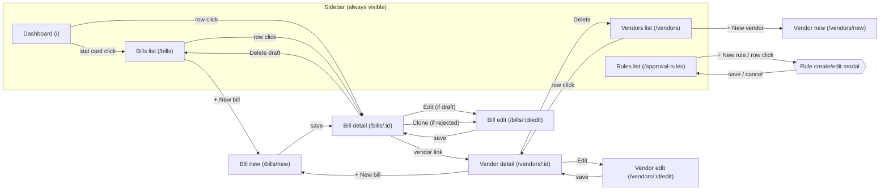

### 6.6.13 Things the frontend must NOT include

- No client-side caching beyond React Query defaults (5-minute stale time acceptable).
- No optimistic updates (§6.6.11).
- No keyboard shortcuts (§2.1 OQ-2 — accessibility baseline only).
- No drag-and-drop bill reordering.
- No animations beyond shadcn defaults (section transitions, modal fade).
- No dark mode toggle (§2.1 OQ-5 — light mode only).
- No user preferences persistence beyond the current-user ID (§6.6.1).
- No in-app notifications / toast feed / bell icon.
- No tour / onboarding flow.

## 6.7 Mock payment execution model

This section consolidates the mock payment contract. The underlying storage
(`Payment` entity), transition (T9), API (POST `/bills/:id/pay`), and UI (pay
modal) are all specified elsewhere. This section defines the behavior at the
moment a payment happens: reference generation, settlement-date surfacing,
data validation, and the confirmation receipt.

### 6.7.1 Principles

- **Always succeeds**: the system never simulates payment failure (§4.6). Rejection at pay time is reserved for **data integrity** failures (see §6.7.4), not simulated bank failures.
- **Synchronous**: no background job, no retry, no webhook. The HTTP response to `POST /bills/:id/pay` either succeeds with a completed `Payment` or fails outright.
- **Snapshot everything**: amount, payment method, and `payment_details` are all copied onto the `Payment` record at execution time (§6.2.3). The snapshot is authoritative for the audit trail; later vendor edits do not alter historical payments.
- **No real money**: no integration with any banking, card, or payment API. The system generates a plausible-looking reference string, records it, and shows it to the user.

### 6.7.2 Mock reference generation

`Payment.mock_reference` (§6.2.3) is generated server-side at T9 execution.
Format varies by method to feel realistic at a glance (Q71).

| Method | Reference format | Pattern / example |
|---|---|---|
| `ach` | `ACH-YYYYMMDD-<8char>` | `ACH-20260417-a1b2c3d4` — mimics NACHA originator trace numbers |
| `check` | `CHK-<6digit_seq>` | `CHK-104721` — mimics sequential check numbers |
| `wire` | `WIRE-<16hex>` | `WIRE-5f3d8b2c9e1a4d07` — mimics SWIFT message reference (MUR) |
| `card` | `CARD-<4digit>-<8char>` | `CARD-2648-a1b2c3d4` — mimics card-network transaction reference |

Generation rules:

- The `<8char>` and `<16hex>` segments use random lowercase alphanumeric / hex from `crypto.randomBytes`.
- The `<6digit_seq>` segment for checks is a **per-process monotonic counter** starting at `100000` and incremented on each check payment. On process restart the counter resets — acceptable for a local demo. It is **not** derived from DB state; collisions across restarts are possible but harmless in a local demo.
- `YYYYMMDD` is today's date in UTC.
- References are **not** required to be unique globally in the DB. The `Payment.mock_reference` column is not indexed as unique. In MVP usage a collision probability is negligible.

Pseudocode:

```
function generateMockReference(method):
    switch method:
        case ach:
            return `ACH-${yyyymmdd()}-${randomBase36(8)}`
        case check:
            return `CHK-${CHECK_SEQUENCE++}`  # process-local counter
        case wire:
            return `WIRE-${randomHex(16)}`
        case card:
            return `CARD-${randomDigits(4)}-${randomBase36(8)}`
```

### 6.7.3 Expected settlement date (Q73)

The UI surfaces an **estimated completion date** during the pay modal and in
the post-payment receipt. This is cosmetic only — it is NOT stored on the
`Payment` record and does NOT influence any state.

Offsets per method (from the payment initiation date):

| Method | Offset | Notes |
|---|---|---|
| `ach` | +2 **business days** | Excludes Saturdays and Sundays. No federal-holiday awareness in MVP |
| `check` | +7 **calendar days** | Mail + clearing. Simplest model |
| `wire` | Same calendar day | Wires settle same-day in the real world |
| `card` | Same calendar day | Card networks are near-real-time |

Business-day computation for ACH uses a simple rule: iterate forward 2 days,
skipping Saturday and Sunday. Implemented in `packages/web/src/lib/format.ts`
as a helper `estimatedSettlementDate(initiatedAt: Date, method): Date`. Same
helper is usable on the backend if needed for seed data realism.

UI surfaces:

- **Pay modal** (§6.6.6, Q72 → receipt modal below): a line reads
  *"Estimated completion: Apr 21, 2026 (ACH, 2 business days)"*.
- **Payment receipt modal** (below): same line.
- **Bill detail timeline** (§6.6.6): the `paid` event's tooltip can show the
  estimated date as secondary info. Optional — the primary display is enough.

### 6.7.4 Pay-time data validation (Q75)

Before creating a `Payment` row, the API re-validates the vendor's
`payment_details` against the zod schema for the current `payment_method`
(§6.2.6). If validation fails, return:

- **HTTP 409** `INVALID_PAYMENT_DETAILS`
- `detail`: human-readable explanation (e.g., *"Vendor 'Acme Legal' has invalid ACH details (routing_number must be 9 digits). Fix the vendor before paying."*)
- `field_issues`: list of offending `payment_details` fields, using the same shape as §6.5.2 validation errors

Rationale: the vendor create/edit form validates on save, so this branch
should be unreachable under normal use. However, for defense-in-depth and
audit-trail integrity, the pay endpoint refuses to snapshot broken data. The
failure mode is clean and user-recoverable (edit vendor → save → retry pay).

`INVALID_PAYMENT_DETAILS` is registered in the §6.3.6 error code table.

### 6.7.5 Payment receipt modal (Q72)

After the user clicks "Confirm payment" in the pay modal (§6.6.6) and the API
responds with success, the frontend **replaces the pay modal with a receipt
modal** rather than closing it. The user dismisses the receipt explicitly
with a "Done" button.

**Receipt modal content**:

```
┌──────────── Payment confirmed ──────────────────┐
│                                                 │
│              ✓  Payment successful              │
│                                                 │
│  Bill        INV-2041  —  Acme Legal            │
│  Amount      $5,200.00                          │
│  Method      ACH                                │
│  Reference   ACH-20260417-a1b2c3d4              │
│  Initiated   Apr 17, 2026 · 7:36 PM             │
│  Estimated   Apr 21, 2026 (2 business days)     │
│   completion                                    │
│                                                 │
│                                     [ Done ]    │
└─────────────────────────────────────────────────┘
```

Elements:

| Field | Source |
|---|---|
| Vendor name + invoice number | `GET /bills/:id` response |
| Amount | `payment.amount_cents` formatted as USD |
| Method | `payment.payment_method`, uppercased / humanized |
| Reference | `payment.mock_reference` |
| Initiated at | `payment.initiated_at`, formatted with time |
| Estimated completion | Computed via §6.7.3 |

Behaviors:

- The modal is **non-dismissable on outside click** (unlike most shadcn dialogs) — "Done" or ESC only. Reduces accidental dismiss after an irreversible action.
- Clicking "Done" closes the modal; the bill detail view behind it refreshes via React Query invalidation triggered by the pay mutation.
- A secondary text link beneath "Done" says *"Copy reference"* and copies `mock_reference` to the clipboard, using `navigator.clipboard.writeText`. Shows a transient "Copied" tooltip.

### 6.7.6 End-to-end payment sequence

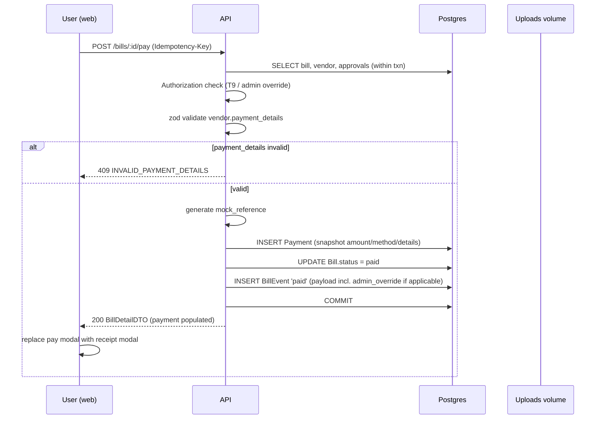

Note: attachments (`FS`) are not involved in the payment flow. They appear in
the diagram only because the sequence might be confused with a generic bill
flow; payment does not touch files.

### 6.7.7 Things the payment model must NOT do

- Must NOT call any external service (no Stripe, no Plaid, no bank API, no email).
- Must NOT simulate payment failure (no random 5% failure rate, no timeout simulation).
- Must NOT create any background job, cron, or delayed task to "settle" the payment later.
- Must NOT update `Payment.status` after creation; it is `completed` on insert and never changes in MVP.
- Must NOT track or display a running settlement progress (no "Pending → Processing → Completed" simulation).
- Must NOT allow pay against `rejected`, `draft`, `pending_approval`, or `paid` bills (state machine §6.3 already prevents this; repeated here for emphasis).
- Must NOT persist `Idempotency-Key` beyond process lifetime (§6.5.4).
- Must NOT support partial payments, payment scheduling, or ACH prenotes.

## 6.8 Demo seed data strategy

Seed data is the first thing the reviewer sees (§4.3 walkthrough step 2). Its
job is to make the dashboard, lists, and drill-downs feel populated and
plausible the moment `docker compose up` finishes — no manual data entry
required before the demo can start.

### 6.8.1 Principles

- **Populated, not overwhelming**: 4 users, 2 rules, 9 vendors, 20 bills (§4.6 scale boundary: ≤ 20).
- **Every dashboard stat card has data**: pending approval, awaiting payment, overdue, paid-last-30-days all non-empty.
- **Every status filter in `/bills` returns rows**: draft, pending_approval, approved, paid, rejected all have representatives.
- **Relative dates, not hardcoded**: all temporal values are computed as offsets from `now()` at seed time so the demo looks fresh whenever it runs (Q78).
- **Realistic personas**: vendor names and categories mirror what a real SMB pays (SaaS, utilities, legal, etc.) — Q83 in §2.1 default.
- **Deterministic IDs for users and rules only** (Q82); vendors and bills use random CUIDs.
- **Idempotent-by-emptiness**: the seed script runs only when the DB is empty (`SEED_ON_EMPTY=true`), so reviewer-created data survives restarts (Q81).

### 6.8.2 Users (4)

Deterministic IDs so the §4.3 walkthrough and §6.4.8 worked examples are
reproducible.

| `id` | `name` | `role` | `max_approval_amount_cents` | `email` |
|---|---|---|---|---|
| `user_alice` | Alice Submitter | `submitter` | `0` | `alice@acmewidgets.demo` |
| `user_bob` | Bob Approver-L1 | `approver` | `1_000_000` ($10,000) | `bob@acmewidgets.demo` |
| `user_carol` | Carol Approver-L2 | `approver` | `10_000_000` ($100,000) | `carol@acmewidgets.demo` |
| `user_dana` | Dana Admin | `admin` | `0` (override applies) | `dana@acmewidgets.demo` |

All `is_active = true`.

### 6.8.3 Approval rules (2)

Deterministic IDs. Matches §6.4.8 exactly.

| `id` | `name` | `min_amount_cents` | `approver_user_ids` | `is_active` |
|---|---|---|---|---|
| `rule_default` | Default (all bills) | `0` | `[user_bob, user_carol]` | `true` |
| `rule_high_value` | Bills ≥ $10,000 | `1_000_000` | `[user_carol]` | `true` |

### 6.8.4 Vendors (9)

Categories span typical SMB vendor types. All use random CUIDs at seed time.
The reviewer sees these names in vendor lists and bill rows.

| Name | Category | `payment_method` | `payment_details` (representative) | `is_active` |
|---|---|---|---|---|
| Sterling & Hayes Legal LLP | Legal | `ach` | routing `021000021`, account `...4567`, holder "Sterling & Hayes Legal LLP" | `true` |
| Linear Cloud Inc. | SaaS | `card` | Visa, last four `4242` | `true` |
| Coastal Power & Light | Utilities | `ach` | routing `044000037`, account `...8891`, holder "Coastal Power & Light Co" | `true` |
| Bluefin Creative Agency | Marketing / design | `ach` | routing `121000248`, account `...3304`, holder "Bluefin Creative LLC" | `true` |
| Quill Office Supply Co. | Office supplies | `ach` | routing `011000015`, account `...9012`, holder "Quill Office Supply Co" | `true` |
| Midwest Freight Services | Freight | `wire` | bank "First Midwest Bank", SWIFT `FMWBUS33`, IBAN `US29NWBK60161331926819` | `true` |
| Brickline Construction | Contractors | `check` | 420 Industrial Way, Trenton, NJ 08611 | `true` |
| Turnkey IT Solutions | Hardware / IT | `ach` | routing `061000104`, account `...6678`, holder "Turnkey IT Solutions LLC" | `true` |
| Precision Tools Inc. | Equipment | `ach` | routing `114000093`, account `...2215`, holder "Precision Tools Inc" | `true` |

**Card note**: Linear Cloud is the seeded `card`-method vendor (Q80 Option 1),
chosen so the dashboard and a paid bill (see PD3 below) exercise the card rail
out of the box. Reviewer-created card vendors behave identically — the vendor
create/edit form (§6.6.8) exposes `card` alongside `ach`, `check`, and `wire`.

**Routing numbers**: use real-looking 9-digit ABA routing number prefixes for
plausibility; no checksum validation (§6.2.6). Account numbers shown masked
in UI but stored full-digit.

### 6.8.5 Bills (20)

Distribution per Q77 Option 1: 4 draft · 4 pending_approval · 3 approved · 2 rejected · 7 paid = 20 total.

All date fields are computed as offsets from `now()` (the moment the seed
script runs). Amounts in integer cents throughout; shown as dollars here for
readability.

#### Drafts (4) — created by `user_alice`, never submitted

| `invoice_number` | Vendor | Amount | Issue date | Due date | Line items |
|---|---|---|---|---|---|
| `INV-D-001` | Linear Cloud Inc. | $480 | `now - 2d` | `now + 30d` | 1: "Linear Cloud Pro — April subscription" $480 |
| `INV-D-002` | Quill Office Supply Co. | $1,240 | `now - 1d` | `now + 15d` | 2: "Paper + toner" $890, "Ergonomic chair" $350 |
| `INV-D-003` | Bluefin Creative Agency | $3,500 | `now` | `now + 45d` | 1: "Website redesign — deposit" $3,500 |
| `INV-D-004` | Coastal Power & Light | $890 | `now - 3d` | `now + 20d` | 1: "Electricity — March 2026" $890 |

#### Pending approval (4) — submitted by `user_alice`

| `invoice_number` | Vendor | Amount | Submitted | Due | Approvals |
|---|---|---|---|---|---|
| `INV-P-001` | Sterling & Hayes Legal LLP | $1,200 | `now - 2d` | `now + 25d` | 1 row (rule_default), pending — eligible: Bob, Carol, Dana |
| `INV-P-002` | Midwest Freight Services | $14,500 | `now - 1d` | `now + 10d` | 2 rows (rule_default + rule_high_value), both pending — eligible: Carol, Dana (Bob filtered by limit) |
| `INV-P-003` | Turnkey IT Solutions | $8,750 | `now` (today) | `now + 8d` | 1 row (rule_default), pending |
| `INV-P-004` | Brickline Construction | $22,000 | `now - 3d` | `now + 60d` | 2 rows (rule_default + rule_high_value), both pending — eligible: Carol, Dana |

#### Approved (3) — at least one overdue, at least one upcoming

| `invoice_number` | Vendor | Amount | Submitted | Due | Approved by | Notes |
|---|---|---|---|---|---|---|
| `INV-A-001` | Precision Tools Inc. | $6,400 | `now - 18d` | `now - 15d` (overdue) | `user_bob` at `now - 16d` | **OVERDUE** — populates dashboard overdue table |
| `INV-A-002` | Bluefin Creative Agency | $2,300 | `now - 4d` | `now + 3d` (upcoming) | `user_bob` at `now` | Populates dashboard upcoming-7-days table |
| `INV-A-003` | Quill Office Supply Co. | $1,875 | `now - 5d` | `now + 20d` | `user_bob` at `now - 1d` | Normal |

#### Rejected (2) — rejection reasons must feel authentic

| `invoice_number` | Vendor | Amount | Submitted | Rejected by | Reason |
|---|---|---|---|---|---|
| `INV-R-001` | Bluefin Creative Agency | $450 | `now - 4d` | `user_bob` at `now - 3d` | "Duplicate of INV-1023" |
| `INV-R-002` | Midwest Freight Services | $15,000 | `now - 5d` | `user_carol` at `now - 4d` | "Missing purchase order reference. Please resubmit with PO." |

#### Paid (7) — all initiated in last 30 days for dashboard coverage

| `invoice_number` | Vendor | Amount | Paid on | Initiated by | Method (snapshotted) |
|---|---|---|---|---|---|
| `INV-PD-001` | Sterling & Hayes Legal LLP | $1,200 | `now - 15d` | `user_bob` | ACH |
| `INV-PD-002` | Coastal Power & Light | $495 | `now - 10d` | `user_bob` | ACH |
| `INV-PD-003` | Linear Cloud Inc. | $2,400 | `now - 5d` | `user_carol` | **CARD** |
| `INV-PD-004` | Quill Office Supply Co. | $780 | `now - 25d` | `user_bob` | ACH |
| `INV-PD-005` | Turnkey IT Solutions | $9,500 | `now - 2d` | `user_carol` | ACH |
| `INV-PD-006` | Bluefin Creative Agency | $1,100 | `now - 18d` | `user_bob` | ACH |
| `INV-PD-007` | Brickline Construction | $345 | `now - 7d` | `user_bob` | Check |

Notes on paid bills:
- Each has a `Payment` row with `mock_reference` generated per §6.7.2 (different per method).
- Each has a full audit trail: `created` → `submitted` → `approved` (per-approval + bill-level) → `paid` events.
- `INV-PD-003` exercises the `card` payment method so §6.6.6 bill detail card-method rendering is visible.
- `INV-PD-005` ($9,500) is just under Bob's $10,000 limit — he could have approved AND paid it; demonstrates the "single user approves then pays" flow.

### 6.8.6 Attachments (3)

One shipped sample PDF (Q79 Option 1), attached to 3 bills to expose the
attachment-viewer UI without requiring reviewer upload.

**Sample file**: `packages/api/prisma/seed-assets/sample-invoice.pdf` — a
single-page plausible invoice template (vendor letterhead, line items, totals,
"Remit to" section). Content is fabricated; should not reference real brands
or entities.

**Attached to**:

| Bill | Rationale for attachment |
|---|---|
| `INV-A-001` (Precision Tools — overdue approved) | Reviewer's first click after scanning dashboard; attachment immediately visible |
| `INV-PD-001` (Sterling Legal — paid) | Most recent high-value paid bill; demonstrates attachment persists through lifecycle |
| `INV-PD-005` (Turnkey IT — largest paid) | Confirms attachment on largest bill; reinforces audit-trail completeness |

Seed script behavior: for each attached bill, generate a unique
`stored_filename` (e.g., `{cuid}.pdf`), copy the source PDF to
`${UPLOAD_DIR}/${stored_filename}`, and create the `Attachment` row with
proper metadata (mime_type=`application/pdf`, size_bytes=actual file size,
uploaded_by_user_id=`user_alice`).

The three attachments point to **three distinct files on disk** (each a copy
of the sample), not the same file — matches the real-world expectation that
each upload is independent. Each file is ~40 KB so 3× is negligible.

### 6.8.7 Seed script structure

Location: `packages/api/prisma/seed.ts`. Invoked automatically by the `api`
container on startup when `SEED_ON_EMPTY=true` AND the DB has zero users.

**Top-level flow**:

1. **Empty-check**: count users. If > 0, exit 0 silently. Otherwise proceed.
2. **Users**: insert the 4 `user_*` rows.
3. **Approval rules**: insert the 2 `rule_*` rows.
4. **Vendors**: insert the 9 vendor rows (random CUIDs).
5. **Attachments prep**: copy the sample PDF to `${UPLOAD_DIR}` 3 times with new `stored_filename`s.
6. **Bills**: iterate through all 20 bills.
   - For each, in order, invoke the matching **service function** from the API package (not raw Prisma inserts) so the state transitions are produced authentically:
     - `create draft` → `createBill()` service
     - For drafts only: stop here.
     - For pending_approval: call `submitBill()` service which runs the rules engine (§6.4.2) and creates `BillApproval` rows.
     - For approved: submit, then call `approveBill()` as the designated approver (bypassing any self-approval check isn't needed since Alice creates all bills and doesn't approve her own).
     - For rejected: submit, then call `rejectBill()` on the appropriate `BillApproval` with the reason.
     - For paid: submit → approve → call `payBill()` as the designated payer.
   - **Date-field backdating**: after each service call, UPDATE the bill's `created_at`, `updated_at`, `submitted_at`, and the events' `occurred_at` to the prescribed relative timestamps from §6.8.5. This is the one place the seed script bypasses service invariants — timestamps are fictional by definition.
7. **Attachment linking**: for the 3 attached bills, insert `Attachment` rows after their `Bill` rows exist.
8. Print a summary: "Seeded 4 users, 2 rules, 9 vendors, 20 bills, 3 attachments."

**Reason for using service functions**: every `BillEvent`, `BillApproval`,
and `Payment` row in the seeded state is a real output of the state machine.
This means the demo is logically consistent: the same approval-engine code
that runs at submission-time produced the seed's `pending_approval` rows.
Bypassing the services and writing raw SQL is ~3× faster but risks
inconsistencies that break §6.4.8's worked example.

**Reason for backdating timestamps**: the alternative is to run the seed
script with simulated clock offsets (e.g., `node -e 'Date.now = () => ...'`),
which is fragile. Direct UPDATEs on the timestamp columns after service
invocation are surgical and explicit.

### 6.8.8 Reset & re-seed policy

The only reviewer-facing reset path is `make reset` (§6.1.4):

```
make reset
# Effect:
#   docker compose down -v       → wipes db_data and uploads volumes
#   docker compose up --build    → fresh DB; api container reseeds automatically
```

No other path re-seeds. If the reviewer creates a bill, approves it, and
restarts with `make down && make up` (no `-v`), their changes persist — the
DB is not empty, so the seed script is a no-op.

### 6.8.9 ID scheme summary

| Entity | ID scheme | Example |
|---|---|---|
| User (seeded) | Deterministic `user_<name>` | `user_alice`, `user_bob`, `user_carol`, `user_dana` |
| User (runtime) | (none — not creatable at runtime) | — |
| ApprovalRule (seeded) | Deterministic `rule_<slug>` | `rule_default`, `rule_high_value` |
| ApprovalRule (runtime) | Random CUID | `clxxxxx...` |
| Vendor, Bill, BillLineItem, Attachment, BillApproval, Payment, BillEvent | Always random CUID | `clxxxxx...` |

Determinism is limited to the entities that the walkthrough / spec references
by name. Other entities use CUIDs so seed and runtime are indistinguishable.

### 6.8.10 Known seed data constraints & trade-offs

- **All rejected bills were rejected >1 day before the demo**. If the reviewer wants to test the rejection flow fresh, they can submit one of the drafts and reject it. §4.3 step 12 does this.
- **No `cancelled` `BillApproval` rows are seeded** (because rejections cascade other approvals to `cancelled`; for seeded rejections `INV-R-001` is a single-rule rejection with no other rows to cancel, and `INV-R-002` produces one cancelled row from the default rule). The demo naturally exhibits `cancelled` when the reviewer rejects `INV-P-002` or `INV-P-004` during the walkthrough.
- **No `recalled` events are seeded**. The reviewer can exercise T8 recall on any draft→submitted bill they create.
- **The sample PDF is not a real invoice from a real vendor**. It's a template — avoid suggesting otherwise in the README or demo prose.

---

# 7. Acceptance Criteria

## 7.0 Preamble

This section specifies the observable functional behavior the implementation
must exhibit. Every criterion below is verifiable from outside the system —
via HTTP responses, DB state, or emitted events (§6.2.3 `BillEvent`).

**Scope boundaries**:
- Non-functional quality (`Q-1`..`Q-10`) is specified in §4.4 and not repeated here.
- Operational criteria (`O-1`..`O-7`) are specified in §4.5 and not repeated here.
- Feature-level capability checklist (`C-*` IDs) is in §4.2; §7 elaborates the checklist into behavioral scenarios.
- Error response shape and codes are specified in §6.3.6 + §6.4.6 + §6.7.4; §7 references codes by name.

**Format conventions**:
- **Gherkin-style scenarios** (Given / When / Then) for workflow-driven criteria (bill lifecycle, approvals, payments).
- **Simple assertions** for CRUD-style criteria (create vendor, list rules, etc.).
- Scenarios reference transition IDs (T1–T10 from §6.3) and capability IDs (C-* from §4.2) for traceability.
- `Seed state` assumed for all scenarios unless otherwise stated: §6.8 seed data is loaded.

---

## 7.1 Vendors (capability group C-V)

Simple assertions (CRUD):

### V-AC-1 — Create vendor (C-V1, C-V2)
- `POST /vendors` with valid body returns `201` and a `VendorDTO`.
- The body is validated against the §6.2.6 discriminated union for the chosen `payment_method` (accepts any of `ach`, `check`, `wire`, `card`).

### V-AC-2 — Payment-method-specific fields in UI (C-V2)
- In the vendor create form (`/vendors/new`), selecting a payment method hides the other methods' fields and shows only that method's required fields (per §6.2.6 table).

### V-AC-3 — List vendors (C-V3)
- `GET /vendors` returns all vendors (active and inactive) as an array.
- Vendor list UI (`/vendors`) renders one row per vendor with name, method, email, and active-status badge.

### V-AC-4 — Vendor detail page (C-V4)
- `GET /vendors/:id` returns the vendor with a `bills` array (sorted by `due_date` descending) in the UI view. (The API endpoint itself returns the vendor plus a separate fetch for bills — see §6.5.4.)
- Payment details in the detail view are masked except for the last 4 digits of `account_number` / `last_four` (display-only; full value still in API response).

### V-AC-5 — Edit vendor payment details (C-V5)
- `PATCH /vendors/:id` with updated `payment_details` returns `200` and the updated `VendorDTO`.
- Changing `payment_method` requires sending the new `payment_details` shape in the same request; otherwise `400 VALIDATION_ERROR`.

### V-AC-6 — Delete vendor blocked by bills

```
Scenario: Delete vendor with associated bills
  Given a vendor V with at least one Bill referencing V.id
  When any user sends DELETE /vendors/V.id
  Then the response is 409 with code "VENDOR_HAS_BILLS"
  And vendor V still exists in the database
```

### V-AC-7 — Delete vendor with no bills

```
Scenario: Delete vendor with no bills
  Given a vendor V exists with no Bill referencing V.id
  When any user sends DELETE /vendors/V.id
  Then the response is 204
  And the vendor row no longer exists in the database
```

---

## 7.2 Bills — draft lifecycle (capability group C-B)

### B-AC-1 — Create draft bill (C-B1, T1)

```
Scenario: Create a draft bill with valid inputs
  Given a valid active vendor V
  And a valid bill payload with >= 1 line item whose amounts sum to amount_cents
  When user Alice sends POST /bills with the payload (X-User-Id: user_alice)
  Then the response is 201 with a BillDetailDTO
  And the bill.status == "draft"
  And bill.created_by_user_id == "user_alice"
  And bill.submitted_at is null
  And a BillEvent of type "created" is emitted
  And the bill appears in GET /bills and GET /bills?status=draft
```

### B-AC-2 — Create bill with attachment (C-B2)

```
Scenario: Attach an uploaded file to a bill at creation
  Given the user has previously POSTed /uploads and received attachment_id X
  When the user POSTs /bills with attachment_id = X in the payload
  Then the response includes bill.attachment.id == X
  And the file is retrievable at GET /uploads/<attachment.stored_filename>
```

### B-AC-3 — Create bill rejects missing / malformed fields

- `POST /bills` with missing required fields → `400 VALIDATION_ERROR` with per-field `field_issues`.
- `POST /bills` where `sum(line_items.amount_cents) != amount_cents` → `400 VALIDATION_ERROR`.
- `POST /bills` with `due_date < issue_date` → `400 VALIDATION_ERROR`.
- `POST /bills` with an invoice number already used for the same vendor → `409 DUPLICATE_INVOICE_NUMBER`.

### B-AC-4 — Edit draft bill (C-B6, T2)

```
Scenario: Only the creator can edit a draft
  Given bill B in status "draft" created by user_alice
  When user_bob sends PATCH /bills/B.id with any valid body
  Then the response is 403 with code "NOT_BILL_CREATOR"

  When user_alice sends the same PATCH
  Then the response is 200 with an updated BillDetailDTO
  And a BillEvent of type "edited" is emitted with the changed_fields payload
```

### B-AC-5 — Cannot edit bill that has left draft (C-B6)

```
Scenario: Bill in pending_approval cannot be edited
  Given bill B is in status "pending_approval"
  When user_alice (creator) sends PATCH /bills/B.id
  Then the response is 409 with code "ILLEGAL_TRANSITION"
```

### B-AC-6 — Delete draft bill (T3)

```
Scenario: Only the creator can delete a draft
  Given bill B in status "draft" created by user_alice
  When user_bob sends DELETE /bills/B.id
  Then the response is 403 with code "NOT_BILL_CREATOR"

  When user_alice sends DELETE /bills/B.id
  Then the response is 204
  And bill B and its line items, attachment, and events no longer exist
  (no BillEvent is emitted for the deletion itself)
```

### B-AC-7 — List bills with status filter (C-B4)

- `GET /bills` returns all bills sorted by `due_date` ascending.
- `GET /bills?status=paid` returns only paid bills.
- `GET /bills?status=nonsense` returns `400 VALIDATION_ERROR` (invalid enum).
- Bills list UI renders an empty-state message when the filter yields zero rows (§6.6.4).

### B-AC-8 — Bill detail exposes full context (C-B5)

- `GET /bills/:id` returns a `BillDetailDTO` (§6.5.4) including:
  - vendor (joined)
  - line_items
  - attachment (if any)
  - approvals with `rule_name_snapshot`, `eligible_approver_user_ids`, and current status
  - events sorted by `occurred_at` ascending
  - payment (iff status == "paid")
  - rejection_reason (iff status == "rejected")

---

## 7.3 Approvals (capability group C-A)

### A-AC-1 — Submit produces approval snapshot (C-A1, T4)

```
Scenario: Submitting a draft runs the rules engine and snapshots approvals
  Given bill B in status "draft" with amount_cents = 150000 ($1,500)
  And rule_default is active with approver_user_ids = [user_bob, user_carol]
  And rule_high_value is active with min_amount_cents = 1000000 and approver_user_ids = [user_carol]
  When user_alice POSTs /bills/B.id/submit
  Then the response is 200 with B.status == "pending_approval"
  And B.submitted_at is set to ~now
  And exactly 1 BillApproval row exists for bill B
    And that row has rule_id == "rule_default"
    And rule_name_snapshot == "Default (all bills)"
    And eligible_approver_user_ids == ["user_bob", "user_carol", "user_dana"]  (admin union)
    And status == "pending"
  And a BillEvent of type "submitted" is emitted with payload.matched_rule_ids == ["rule_default"]
```

### A-AC-2 — Multi-rule match produces multiple approvals

```
Scenario: A bill matching two rules creates two BillApproval rows
  Given bill B with amount_cents = 1500000 ($15,000)
  When user_alice POSTs /bills/B.id/submit
  Then 2 BillApproval rows are created for bill B
    One with rule_id == "rule_default" and eligible_approver_user_ids == ["user_carol", "user_dana"]
      (user_bob excluded by per-regular-user limit filter; Dana via admin union)
    One with rule_id == "rule_high_value" and eligible_approver_user_ids == ["user_carol", "user_dana"]
```

### A-AC-3 — Submit fails when no rule matches

```
Scenario: Submit of a bill with no matching rule is rejected
  Given rule_default has been deactivated (somehow bypassing V6)
  And no other active rule has min_amount_cents <= bill.amount_cents
  When user_alice POSTs /bills/B.id/submit
  Then the response is 400 with code "SUBMISSION_PRECONDITION_FAILED"
  And field_issues[0].path == "preconditions"
  And field_issues[0].message mentions "no_matching_rule"
  And bill B remains in status "draft"
```

### A-AC-4 — Submit fails when pool is empty after limit filter

```
Scenario: Submit fails when no regular or admin user can approve a matching rule
  Given all admin users are deactivated
  And rule "high" is active, matches B, and its approver_user_ids only contains users whose max_approval_amount_cents < B.amount_cents
  When user_alice POSTs /bills/B.id/submit
  Then the response is 400 with code "SUBMISSION_PRECONDITION_FAILED"
  And field_issues[0].message mentions "no_eligible_approver_for_rule"
  And bill B remains in status "draft"
```

### A-AC-5 — Single approval; bill stays pending (T5)

```
Scenario: Approve one of two required rules; bill stays pending
  Given bill B is in status "pending_approval" with 2 BillApproval rows (both pending), one of which names rule_default
  When user_carol POSTs /bills/B.id/approve
  Then the response is 200
  And the BillApproval for rule_default now has status "approved", decided_by_user_id == "user_carol", decided_at ~ now
  And the other BillApproval is still "pending"
  And B.status remains "pending_approval"
  And a BillEvent "approved" is emitted with payload.rule_id == "rule_default", payload.approval_id == <id>, payload.from_status == "pending_approval", payload.to_status == "pending_approval", no admin_override
```

### A-AC-6 — One user decides all their eligible slots atomically (§6.4.5 Q52-sub B)

```
Scenario: A user eligible for both matching rules approves in one request
  Given bill B is in status "pending_approval" with 2 BillApproval rows
  And user_carol is in the eligible pool of both
  When user_carol POSTs /bills/B.id/approve once
  Then both BillApproval rows transition to "approved" in the same transaction
  And B.status transitions to "approved" (T6)
  And exactly 3 BillEvents are emitted in this call:
    - 2× "approved" per-approval (with non-null rule_id and approval_id)
    - 1× "approved" bill-level (rule_id == null, from_status == "pending_approval", to_status == "approved")
```

### A-AC-7 — Last approval transitions bill (T6)

```
Scenario: Approving the last pending approval transitions bill to approved
  Given bill B has 2 BillApproval rows: one already "approved" by user_carol, one pending under rule_default
  When user_bob POSTs /bills/B.id/approve
  Then the pending BillApproval transitions to "approved" under user_bob
  And B.status == "approved"
  And a bill-level "approved" event is emitted
```

### A-AC-8 — Reject fails the whole bill (T7)

```
Scenario: One rejection fails the bill and cascades other approvals
  Given bill B has 2 BillApproval rows A1 and A2, both "pending"
  When user_bob POSTs /approvals/A1.id/reject with body { "reason": "Duplicate" }
  Then A1.status == "rejected", decided_by_user_id == "user_bob", rejection_reason == "Duplicate"
  And A2.status == "cancelled", decided_by_user_id is null, rejection_reason is null
  And B.status == "rejected" with rejection_reason == "Duplicate"
  And exactly 1 BillEvent of type "rejected" is emitted (cascades are silent per §6.3.5 T7)
```

### A-AC-9 — Reject with null reason sets fallback bill.rejection_reason

```
Scenario: Null reason on rejection produces a system fallback
  Given bill B has a pending BillApproval A
  When user_bob POSTs /approvals/A.id/reject with body { "reason": null }
  Then A.rejection_reason is null
  And B.rejection_reason == "Rejected by Bob Approver-L1"  (§6.3.5 T7)
```

### A-AC-10 — Not-eligible user cannot approve

```
Scenario: User not in eligible pool cannot approve
  Given bill B has one BillApproval A1 with eligible_approver_user_ids == ["user_carol", "user_dana"]
  When user_bob POSTs /bills/B.id/approve
  Then the response is 403 with code "NOT_ELIGIBLE_APPROVER"
  And A1 is unchanged
```

### A-AC-11 — Self-approval forbidden for regular users

```
Scenario: Bill creator cannot approve their own bill (regular user)
  Given bill B is in "pending_approval", created_by_user_id == "user_bob"
  And user_bob is in eligible_approver_user_ids of one of B's BillApprovals
    (seed scripts never produce this, but a runtime rule could add it)
  When user_bob POSTs /bills/B.id/approve
  Then the response is 403 with code "SELF_APPROVAL_FORBIDDEN"
```

### A-AC-12 — Already-decided approval cannot be re-decided

```
Scenario: Reject on an already-decided approval returns 409
  Given bill B has one BillApproval A1, already approved by user_bob
  When user_carol POSTs /approvals/A1.id/reject
  Then the response is 409 with code "ALREADY_DECIDED"
  And A1 remains "approved" under user_bob
```

### A-AC-13 — Approval history visible in bill detail (C-A5)

- `GET /bills/:id` returns `approvals[]` with `rule_name_snapshot`, `decided_by_user_id`, `decided_at`, `rejection_reason` fields populated as expected.
- Bill detail UI renders one section per BillApproval showing: rule name, status, eligible users, deciding user (if decided), timestamp (if decided).

---

## 7.4 Approval rules (capability group C-R)

### R-AC-1 — List rules (C-R1)
- `GET /approval-rules` returns all rules as an array, including inactive.
- Each row includes `qualified_approvers` (§6.5.4) so the UI can flag rules where no regular approver qualifies.

### R-AC-2 — Create rule validation (C-R2, V1–V5)

- `POST /approval-rules` with empty `name` → `400 VALIDATION_ERROR` code `INVALID_NAME`.
- `POST /approval-rules` with `min_amount_cents = -100` → `400 VALIDATION_ERROR` code `INVALID_THRESHOLD`.
- `POST /approval-rules` with empty `approver_user_ids` → `400 VALIDATION_ERROR` code `EMPTY_APPROVER_POOL`.
- `POST /approval-rules` with an inactive or unknown user ID in `approver_user_ids` → `400 VALIDATION_ERROR` code `UNKNOWN_OR_INACTIVE_USER`.
- `POST /approval-rules` where no user in `approver_user_ids` has `max_approval_amount_cents >= min_amount_cents` → `400 VALIDATION_ERROR` code `NO_QUALIFIED_APPROVER`.

### R-AC-3 — Edit rule non-retroactive (C-R3, §6.4.7)

```
Scenario: Editing a rule does not change in-flight BillApproval rows
  Given bill B is in status "pending_approval" with a BillApproval A1 spawned by rule_default
  And A1.eligible_approver_user_ids == ["user_bob", "user_carol", "user_dana"]
  When an admin PATCHes /approval-rules/rule_default with { approver_user_ids: ["user_carol"] }
  Then the response is 200 (assuming V1–V5 pass)
  And A1.eligible_approver_user_ids remains == ["user_bob", "user_carol", "user_dana"] (unchanged)
  And a new submission of any bill AFTER this edit computes its eligible pool using the updated rule
```

### R-AC-4 — Default-rule invariant on update (V6)

```
Scenario: Cannot remove the last default rule via edit
  Given rule_default is the only active rule with min_amount_cents == 0
  When any user PATCHes /approval-rules/rule_default with { is_active: false }
  Then the response is 409 with code "DEFAULT_RULE_REQUIRED"
  And rule_default remains is_active == true
```

### R-AC-5 — Swap default rule via create-then-deactivate

```
Scenario: Create a replacement default before deactivating the current one
  Given rule_default is the only active rule with min_amount_cents == 0
  When a user creates a new active rule "new default" with min_amount_cents == 0
  And then PATCHes rule_default with { is_active: false }
  Then both requests succeed
  And new submissions match "new default" instead of rule_default
```

### R-AC-6 — Delete rule blocked by active references (V7)

```
Scenario: Cannot delete a rule referenced by any BillApproval
  Given rule R has >= 1 BillApproval row referencing it
  When any user DELETEs /approval-rules/R.id
  Then the response is 409 with code "RULE_IN_USE"
  And the response detail suggests deactivating instead
```

### R-AC-7 — Live preview (C-R4, §6.5.4 POST /approval-rules/preview)

- `POST /approval-rules/preview` with a rule payload returns `regular_approvers`, `admin_approvers`, `effective_eligible_user_ids`, and `warnings` (if any).
- No rule is persisted by this call.

---

## 7.5 Bill state transitions — non-approval cases (T8, T9, T10)

### SM-AC-1 — Recall (T8)

```
Scenario: Creator recalls a bill before any decision
  Given bill B is in "pending_approval" with 2 BillApproval rows, both "pending"
  When user_alice (creator) POSTs /bills/B.id/recall
  Then the response is 200
  And B.status == "draft"
  And B.submitted_at is null
  And both BillApproval rows have status "cancelled", decided_by_user_id null, decided_at ~ now
  And a BillEvent "recalled" is emitted with payload.cancelled_approval_count == 2
```

### SM-AC-2 — Recall blocked after any decision

```
Scenario: Recall fails if any approval has been decided
  Given bill B is in "pending_approval" with 2 BillApproval rows, one already "approved"
  When user_alice POSTs /bills/B.id/recall
  Then the response is 409 with code "CANNOT_RECALL_AFTER_DECISION"
  And B.status remains "pending_approval"
```

### SM-AC-3 — Clone (T10)

```
Scenario: Cloning a rejected bill creates a new draft
  Given bill B1 is in status "rejected" (created by user_alice, invoice_number "INV-100")
  When user_bob POSTs /bills/B1.id/clone
  Then the response is 201 with BillDetailDTO of a NEW bill B2
  And B2.id != B1.id
  And B2.status == "draft"
  And B2.created_by_user_id == "user_bob" (the cloner, not the original creator)
  And B2.vendor_id == B1.vendor_id
  And B2.amount_cents == B1.amount_cents
  And B2.line_items mirror B1.line_items
  And B2.invoice_number starts with "INV-100-CLONE-"
  And B2 has no attachment
  And a BillEvent "created" is emitted on B2 with payload.cloned_from_bill_id == B1.id
  And B1 is unchanged (no event emitted on B1)
```

### SM-AC-4 — Clone blocked on non-rejected bill

```
Scenario: Cannot clone a paid bill
  Given bill B is in status "paid"
  When any user POSTs /bills/B.id/clone
  Then the response is 409 with code "CAN_ONLY_CLONE_REJECTED"
```

### SM-AC-5 — Illegal state transitions

```
Scenario: State machine rejects any unauthorized (from, to) pair
  Given bill B in status <any non-"pending_approval">
  When any user POSTs /bills/B.id/approve
  Then the response is 409 with code "ILLEGAL_TRANSITION"
```
(Repeat analogously for /submit on non-draft, /recall on non-pending, /pay on non-approved, etc.)

---

## 7.6 Payments (capability group C-P)

### P-AC-1 — Pay an approved bill (T9, C-P1, C-P2)

```
Scenario: Qualified user pays an approved bill
  Given bill B is in status "approved" with amount_cents = 500000 ($5,000)
  And vendor V has payment_method "ach" with valid payment_details
  And user_bob has max_approval_amount_cents = 1000000
  When user_bob POSTs /bills/B.id/pay
  Then the response is 200 with BillDetailDTO
  And B.status == "paid"
  And a Payment row exists with:
    bill_id == B.id
    amount_cents == 500000
    payment_method == "ach"
    payment_details_snapshot equal to V.payment_details at call time
    status == "completed"
    mock_reference matches /^ACH-\d{8}-[0-9a-z]{8}$/
    initiated_by_user_id == "user_bob"
    initiated_at ~ now
  And a BillEvent "paid" is emitted with payload.payment_id, amount_cents, payment_method, mock_reference
```

### P-AC-2 — Pay unauthorized

```
Scenario: User below the bill amount cannot pay
  Given bill B with amount_cents = 1500000 ($15,000)
  And user_bob has max_approval_amount_cents = 1000000 and role "approver"
  When user_bob POSTs /bills/B.id/pay
  Then the response is 403 with code "INSUFFICIENT_PAY_AUTHORITY"
  And B.status remains "approved"
  And no Payment row is created
```

### P-AC-3 — Pay with invalid vendor payment_details (§6.7.4)

```
Scenario: Pay rejected when vendor's payment_details fail validation
  Given bill B is "approved" for vendor V
  And V.payment_details has been corrupted (e.g., routing_number = "")
  When any authorized user POSTs /bills/B.id/pay
  Then the response is 409 with code "INVALID_PAYMENT_DETAILS"
  And field_issues lists the failing payment_details fields
  And B.status remains "approved"
```

### P-AC-4 — Idempotency on pay (§6.5.4)

```
Scenario: Same Idempotency-Key on the same bill returns the same Payment
  Given bill B is "approved"
  When user_bob POSTs /bills/B.id/pay with Idempotency-Key "abc"
  And then user_bob POSTs /bills/B.id/pay with Idempotency-Key "abc"
  Then both responses are 200
  And both return BillDetailDTO referencing the same payment.id
  And only one Payment row exists for B
```

### P-AC-5 — Mock reference format per method (§6.7.2)

- After paying an `ach` bill, `Payment.mock_reference` matches `/^ACH-\d{8}-[0-9a-z]{8}$/`.
- After paying a `check` bill, `Payment.mock_reference` matches `/^CHK-\d{6}$/`.
- After paying a `wire` bill, `Payment.mock_reference` matches `/^WIRE-[0-9a-f]{16}$/`.
- After paying a `card` bill, `Payment.mock_reference` matches `/^CARD-\d{4}-[0-9a-z]{8}$/`.

### P-AC-6 — Payment audit event (C-P3)

- `GET /bills/:id` returns an event of type `paid` in the `events` array after payment.
- The event's payload includes `payment_id`, `amount_cents`, `payment_method`, and `mock_reference`.

---

## 7.7 Dashboard (capability group C-D)

### D-AC-1 — Status totals correct (C-D1)

```
Scenario: Dashboard totals reflect seeded state
  Given the database has the §6.8 seed data loaded
  When a user GETs /dashboard
  Then response.totals_by_status["pending_approval"].count == 4
  And response.totals_by_status["approved"].count == 3
  And response.totals_by_status["paid"].count == 7
  And response.totals_by_status["rejected"].count == 2
  And response.totals_by_status["draft"].count == 4
  And each corresponding sum_cents equals the actual sum of bill.amount_cents for that status
```

### D-AC-2 — Overdue list (C-D2)

```
Scenario: Overdue list contains only non-paid past-due bills
  Given bill B has due_date "now - 15 days" and status "approved"
  And bill B' is paid
  When a user GETs /dashboard
  Then response.overdue_bills contains B.id
  And response.overdue_bills does not contain any paid bill
  And response.overdue_bills is sorted by due_date ascending
```

### D-AC-3 — Upcoming list (C-D3)

```
Scenario: Upcoming list contains bills due in next 7 days
  Given bill B has due_date "now + 3 days" and status "approved"
  When a user GETs /dashboard
  Then response.upcoming_bills contains B.id
  And response.upcoming_bills does not contain any bill with due_date > today + 7 days
  And response.upcoming_bills does not contain any paid bill
```

### D-AC-4 — Paid last 30 days

- `GET /dashboard` returns `paid_last_30_days.count` and `paid_last_30_days.sum_cents` matching `Payment` rows where `initiated_at >= today - 30 days`.

### D-AC-5 — Stat card click navigation

- In the UI, clicking a stat card navigates to `/bills?status=<corresponding_status>` (per §6.6.3 mapping).

---

## 7.8 User switcher (capability group C-U)

### U-AC-1 — List users (C-U1)
- `GET /users` returns all 4 seeded users.
- User switcher UI dropdown renders one item per returned user with name + role + limit.

### U-AC-2 — Switching user updates perspective (C-U2)

```
Scenario: Switching user updates the "approvable" queue
  Given the reviewer is currently acting as user_alice
  When the reviewer selects user_bob in the switcher
  Then subsequent API calls include X-User-Id: user_bob
  And bills where user_bob is in at least one pending BillApproval.eligible_approver_user_ids
    become actionable (Approve / Reject buttons enabled) in the bill detail view
  And the stored value in localStorage["bill-pay.current-user-id"] == "user_bob"
```

### U-AC-3 — Role and limit visible (C-U3)
- The switcher button label always includes the current user's name and limit (e.g., `Bob Approver-L1 · Limit $10,000 ▾`).

---

## 7.9 Admin override (§6.3.4.1)

### AO-AC-1 — Admin approves bill where they are not in rule pool

```
Scenario: Admin approves outside the rule's approver list
  Given rule_default has approver_user_ids = [user_bob, user_carol] (admin not listed)
  And bill B is pending under rule_default
  And user_dana has role "admin" and max_approval_amount_cents = 0
  When user_dana POSTs /bills/B.id/approve
  Then the response is 200
  And the BillApproval transitions to "approved" by user_dana
  And the emitted "approved" event payload contains admin_override: true
```

### AO-AC-2 — Admin self-approves their own bill

```
Scenario: Admin approves their own bill
  Given bill B is in "pending_approval", created_by_user_id == "user_dana" (admin)
  When user_dana POSTs /bills/B.id/approve
  Then the response is 200 (no SELF_APPROVAL_FORBIDDEN)
  And the BillApproval transitions to approved
```

### AO-AC-3 — Admin pays above their limit

```
Scenario: Admin with limit $0 pays a $50,000 bill
  Given bill B is "approved" with amount_cents = 5000000 ($50,000)
  And user_dana has role "admin" and max_approval_amount_cents = 0
  When user_dana POSTs /bills/B.id/pay
  Then the response is 200
  And B.status == "paid"
  And the emitted "paid" event payload contains admin_override: true
```

### AO-AC-4 — Admin override does NOT apply to edit/recall/delete

```
Scenario: Admin cannot edit someone else's draft
  Given bill B in "draft" created by user_alice
  When user_dana (admin) PATCHes /bills/B.id
  Then the response is 403 with code "NOT_BILL_CREATOR"
```

### AO-AC-5 — Admin snapshot frozen at submission (§6.3.4.1)

```
Scenario: Admin added after submission gains no override on in-flight bills
  Given bill B was submitted while user_dana was the only admin
  And B's BillApprovals' eligible_approver_user_ids include user_dana
  When a new admin user_edgar is added runtime
    (NOTE: out of MVP scope, no create-user endpoint; this scenario is defensive)
  Then the existing BillApproval.eligible_approver_user_ids are unchanged (user_edgar is NOT present)
  And user_edgar's attempt to approve returns 403 "NOT_ELIGIBLE_APPROVER"
```

---

## 7.10 Cross-cutting

### X-AC-1 — Audit trail completeness (C-B5)

```
Scenario: Every state transition produces the expected BillEvent(s)
  Given bill B goes through the full happy path: create → submit → approve (both rules) → pay
  When a user GETs /bills/B.id
  Then response.events (sorted chronologically) contains:
    1. "created"
    2. "submitted"
    3. "approved" per-approval event(s) — one per BillApproval decided
    4. "approved" bill-level event
    5. "paid"
  And every event has occurred_at, actor_user_id, and a type-appropriate payload (§6.3.7)
```

### X-AC-2 — Currency formatting consistency (Q-4 in §4.4 — reference)

- Every UI render of a monetary value uses `$X,XXX.XX` format (tested by inspection during §4.3 walkthrough).

### X-AC-3 — Date formatting consistency (Q-5 in §4.4 — reference)

- Every UI render of a date uses `MMM D, YYYY` (e.g., "Apr 17, 2026").

### X-AC-4 — Unauthenticated request

```
Scenario: Missing X-User-Id header is rejected
  When any endpoint (other than /health) is called without X-User-Id
  Then the response is 401 with code "UNAUTHORIZED"
```

### X-AC-5 — Inactive user cannot act

```
Scenario: Inactive user is rejected at authorization
  Given user_bob.is_active == false
  When a request comes with X-User-Id: user_bob
  Then the response is 403 with code "USER_INACTIVE"
```

### X-AC-6 — Full demo walkthrough completes (§4.3)

The 14-step walkthrough in §4.3, executed against a freshly reset instance,
must complete end-to-end without errors, consolation of seed data, or manual
DB manipulation. This is the single highest-leverage integration criterion.

---

## 7.11 Criterion-to-source-section cross-reference

For traceability, each criterion's authoritative behavioral source:

| Criterion group | Sources |
|---|---|
| §7.1 Vendors | §4.2 C-V*, §6.2.6, §6.5.4 `/vendors` |
| §7.2 Bills (draft lifecycle) | §4.2 C-B*, §6.3 T1–T3, §6.5.4 `/bills` |
| §7.3 Approvals | §4.2 C-A*, §6.3 T4–T7, §6.4 (entire) |
| §7.4 Approval rules | §4.2 C-R*, §6.4.6 V1–V7, §6.4.7 |
| §7.5 Non-approval transitions | §6.3 T8 (recall), T9 (pay — but full pay criteria live in §7.6), T10 (clone) |
| §7.6 Payments | §4.2 C-P*, §6.3 T9, §6.7 |
| §7.7 Dashboard | §4.2 C-D*, §6.5.4 `/dashboard` |
| §7.8 User switcher | §4.2 C-U*, §6.1.6, §6.6.1 |
| §7.9 Admin override | §6.3.4.1, §6.4.3 admin union |
| §7.10 Cross-cutting | §6.2.3 BillEvent, §4.4, §4.5, §4.3 |

---

# 9. Risks & Mitigations

## 9.0 Preamble

This section inventories risks relevant to the implementation and demo of
this MVP. The risk profile is atypical for a product spec: the implementer is
an AI agent, the timebox is 4 hours, and the primary consumer is a reviewer
running the app locally. Accordingly, risks are grouped into four categories:

| Category | Focus |
|---|---|
| **Technical (T-R*)** | Subtle implementation mistakes, library footguns, schema mismatches |
| **Operational (O-R*)** | `docker compose up`, ports, volumes, reviewer-environment failures |
| **Business / eval (B-R*)** | Scope creep, scope omission, UX quality, misreading the eval criteria |
| **Process / completion (P-R*)** | Time-budget exhaustion, ordering of work, walkthrough verification |

Each risk has an ID, category, description, likelihood (L/M/H), impact (L/M/H),
and detection cues the agent should watch for. Mitigations (§9.2) follow for
every risk that is medium-or-higher in either likelihood or impact.

## 9.1 Risk Inventory

### Technical risks

| ID | Description | L | I | Detection cue |
|---|---|---|---|---|
| **T-R1** | Prisma schema complexity (11 entities, JSONB `payment_details`, `String[]` arrays, 6 enums). Agent may model some entities incorrectly or skip less-visible ones (e.g., `BillEvent`, `BillApproval`). | M | H | Running `prisma migrate dev` produces unexpected schema diff; seed fails on FK; §7 scenarios fail |
| **T-R2** | Approval engine semantics (admin union, per-user limit filter, snapshot, rejection cascade, one-click-decides-all-eligible) are subtle. Agent may implement a simpler variant that fails §7 A-AC-2, A-AC-6, A-AC-8. | H | H | A-AC-6 fails (one click only decides one slot); A-AC-8 fails (cascades are not marked `cancelled`); admin override missing from event payload |
| **T-R3** | State machine not enforced at API layer (illegal transitions slip through). Agent relies on UI to hide buttons instead of server-side guard. | M | H | Direct API call with Postman/curl succeeds when it should return 409; §7 SM-AC-5 fails |
| **T-R4** | File upload + Docker named volume: permissions, MIME validation, path handling. `multer` default config writes to container tmpfs; files lost on restart. | M | M | Uploaded file returns 404 on GET `/uploads/:filename` after a container restart |
| **T-R5** | RFC 7807 error format (§6.5.2) is not a standard Express pattern. Agent may default to `{ error: "..." }` or `{ message: "..." }`, failing both §6.5.2 and the frontend's error parsing. | M | M | Frontend shows "undefined" or the generic "Something went wrong" toast; test scenarios expecting `code` field fail |
| **T-R6** | Seed-script timestamp backdating (§6.8.7) done incorrectly: agent invokes service functions which emit events at `now()`, then forgets to update `occurred_at` on those events. Result: all "paid 15 days ago" bills show "paid just now" in timeline. | M | M | Dashboard shows all paid bills as very recent; reviewers notice seed data looks fresh-only |
| **T-R7** | shadcn/ui + Tailwind init gotchas: missing `content` paths in `tailwind.config.ts` → styles silently don't apply; PostCSS config missing → no styles at all. | M | M | UI renders unstyled HTML (clearly broken); only one subset of components styled |
| **T-R8** | Prisma generated types + monorepo path resolution: `@bill-pay/shared` imports fail in `api` or `web` due to pnpm workspace linking or tsconfig path mapping issues. | M | L | `tsc --noEmit` fails with "cannot find module"; dev servers hot-reload errors |

### Operational risks

| ID | Description | L | I | Detection cue |
|---|---|---|---|---|
| **O-R1** | Port conflicts on reviewer machine (3000 or 5432 already bound). | M | H | `docker compose up` fails with "address already in use" |
| **O-R2** | Seed script runs before migrations have created tables (race condition). | M | H | `api` container startup logs show "relation does not exist" |
| **O-R3** | Uploaded file volume permissions: container user `node` cannot write to `/app/uploads` because Docker created it as root. | M | M | `POST /uploads` returns 500 EACCES; only surfaces on first upload |
| **O-R4** | Vite dev server binds to `localhost` inside the container; reviewer cannot reach from host. | M | H | `http://localhost:3000` returns connection refused (only visible if agent forgets `--host 0.0.0.0`) |

### Business / eval risks

| ID | Description | L | I | Detection cue |
|---|---|---|---|---|
| **B-R1** | Agent over-engineers: adds OCR stub, email notifications, multi-tenancy, auth, etc. despite §3.2 / §4.6 cuts. Burns budget, reviewer sees messy scope. | H | H | Scope creep visible in repo (extra routes, extra models); §4.3 walkthrough partially broken due to unused feature taking time |
| **B-R2** | Agent under-engineers UX: ships functional app but skips empty states, loading feedback, currency/date formatting consistency. Scores poorly on UX-quality eval dimension. | M | H | §4.4 Q-1..Q-10 items fail; reviewer sees broken empty list views; inconsistent date formats across pages |
| **B-R3** | Agent misreads scope: builds something partially resembling the spec but misses the centerpiece (approval rules engine). Eval dimension "grok complex workflows" = 0. | L | H | Approval rules not visible/editable in UI; §4.3 steps 9 & 10 impossible |
| **B-R4** | Seed data looks implausible or empty on certain run dates (e.g., all "overdue" dates are in the future because date math is wrong). Dashboard looks broken on first impression. | M | M | Dashboard overdue card shows 0; reviewer's first impression is "empty product" |

### Process / completion risks

| ID | Description | L | I | Detection cue |
|---|---|---|---|---|
| **P-R1** | Agent implements bottom-up (data model → every endpoint → every screen → polish) and runs out of time before any single vertical slice is demo-ready. Result: 60% of every layer done, 0% demoable. | **H** | **H** | At hour 3, no screen fully renders a real flow end-to-end |
| **P-R2** | Agent does not run the §4.3 walkthrough before declaring done. Ships with a broken step (e.g., Pay button disabled because approver-limit check has off-by-one). | H | H | Reviewer hits a blocking error on first use |
| **P-R3** | README rushed at the end (or not written). Reviewer cannot understand what was built or why. Fails §4.5 O-4. | M | H | README is < 200 words, has no setup instructions, or no "what we skipped" section |
| **P-R4** | 4-hour budget exhausted. Core flows partially done; submission feels rushed. | H | H | Git history shows hasty commits in final 30 min; known bugs not fixed; polish missing |

### Risk likelihood/impact heat-map summary

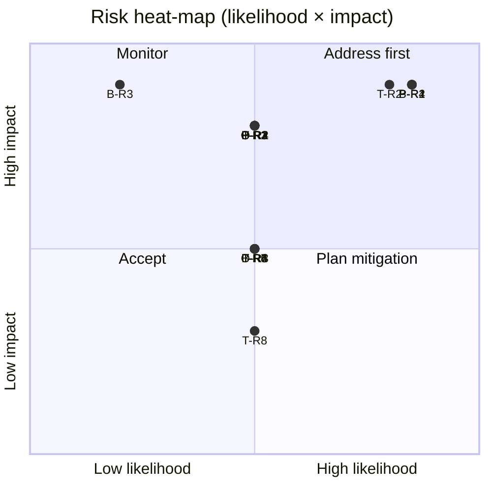

## 9.2 Proposed Solutions for Risks

Covers every risk that is **medium or higher** in either likelihood or impact
(per template guidance). Effort is in minutes: L (<15), M (15–60), H (>60).
Trade-off column included only for significant mitigations (Q93).

### Technical mitigations

| ID | Preventive mitigation | Detective cue / check | Effort | Trade-off |
|---|---|---|---|---|
| T-R1 | Follow §6.2 data model tables verbatim. Copy field names, types, nullability, and cascade rules directly into `schema.prisma`. Do not paraphrase or "improve" field names. | Run `prisma migrate dev` immediately after `schema.prisma` is written; compare migration SQL to §6.2 expectations. Run seed immediately after migration — if it fails, the schema is wrong. | L | — |
| T-R2 | Implement the approval engine in `packages/api/src/services/approval-engine.ts` as a literal translation of §6.4.2 and §6.4.5 pseudocode. Keep function names identical to pseudocode. Do NOT refactor during initial pass. | Write `A-AC-2` and `A-AC-6` scenarios as adhoc manual tests first (simple `curl` calls against seed state). If they fail, fix BEFORE continuing to frontend. | M | **Eats ~20 min of budget** to explicitly verify engine correctness; justified because B-R3 depends on this. |
| T-R3 | Enforce state-machine transitions with a central service in `packages/api/src/services/bill-state.ts` that every mutation endpoint calls. No endpoint may `UPDATE Bill.status` without going through this service. | Any `Bill.status` SQL update visible in API code outside `bill-state.ts` is a smell. Grep for `bill.status =` after implementation. | L | — |
| T-R4 | In `docker-compose.yml`, declare `uploads` as a named volume and mount it in the `api` service. In `multer` config, set `dest` to `process.env.UPLOAD_DIR`. In Dockerfile, pre-create the dir with correct ownership. | First attachment upload during demo: retrieve via `GET /uploads/:name` and confirm file serves. Restart container and retry — must still work. | L | — |
| T-R5 | Create `packages/api/src/middleware/error-handler.ts` that converts all thrown errors into RFC 7807 shape (§6.5.2). Use it as the last Express middleware. Every route handler throws typed errors from a shared set. | Inspect a failing request's response body from browser devtools during first test — must include `type`, `title`, `status`, `code` fields. | M | **Eats ~20 min** to wire a shared error taxonomy. Alternative (ad-hoc errors) saves time but breaks frontend error display and §7 assertions. |
| T-R6 | In seed script (§6.8.7), after each service call, execute an explicit `UPDATE` on the bill and its events to set `created_at`, `updated_at`, `submitted_at`, and `occurred_at` to the target timestamps. Wrap in a helper `backdate(billId, timestamps)` to avoid repetition. | After seeding, `GET /dashboard` should show non-zero `paid_last_30_days` AND some bills with `submitted_at` spanning 1–5 days ago. If all events are stamped with today's seed run time, the helper is missing. | L | — |
| T-R7 | Follow the shadcn/ui CLI init steps exactly: `npx shadcn-ui init`, accept defaults, verify `tailwind.config.ts` has the correct `content` globs for `packages/web/src/**/*.{ts,tsx}` AND `packages/web/src/components/ui/**/*.{ts,tsx}`. Install needed components via `npx shadcn-ui add <name>` one at a time. | First page renders in browser: if typography and spacing look like unstyled HTML, Tailwind is not loaded. Check devtools "Styles" pane for missing Tailwind classes. | L | — |
| T-R8 | In `tsconfig.base.json`, set `paths: { "@bill-pay/shared": ["./packages/shared/src/index.ts"] }`. In each `package.json`, include `"@bill-pay/shared": "workspace:*"`. Run `pnpm install` once at root. | `pnpm --filter api typecheck` must succeed after install. If it fails with "cannot find module", re-check pnpm-workspace.yaml paths. | L | — |

### Operational mitigations

| ID | Preventive mitigation | Detective cue / check | Effort | Trade-off |
|---|---|---|---|---|
| O-R1 | Document port requirements in README (O-4). In `docker-compose.yml`, use environment variables (`${WEB_PORT:-3000}`) so a reviewer can override without editing files. | Test `docker compose up` succeeds on a clean machine. If port conflict, the error is immediately surfaced at startup. | L | — |
| O-R2 | In the `api` service's entrypoint script, run `prisma migrate deploy` **before** the seed script, and seed only after migrate returns 0. Use `pg_isready` or a healthcheck + `depends_on: db: condition: service_healthy` in compose. | `api` container logs show migration output preceding seed output on first run. | L | — |
| O-R3 | In the `api` Dockerfile, create `/app/uploads` with `RUN mkdir -p /app/uploads && chown -R node:node /app/uploads`. Run the process as `node`, not `root`. | First attachment upload returns 201, not 500. | L | — |
| O-R4 | In `packages/web/package.json`, the dev script is `vite --host 0.0.0.0`. In `docker-compose.yml`, map `"3000:3000"`. | `http://localhost:3000` loads in browser from host machine, not just inside the container. | L | — |

### Business / eval mitigations

| ID | Preventive mitigation | Detective cue / check | Effort | Trade-off |
|---|---|---|---|---|
| B-R1 | Before starting implementation, read §3.2 (cuts table), §4.6 (behavioral boundaries), and §6.1.8 (NOT list) AND §6.6.13 (frontend NOT list). Return to these when tempted to add a feature. Any feature not traceable to a §4.2 capability is scope creep. | After every major commit, scan `git diff` for new routes, models, or dependencies not listed in §6.1.1. If present, revert. | L | — |
| B-R2 | Treat §4.4 Q-1..Q-10 and §6.6.10 (empty states table) as a checklist. Before submission, walk every screen; every list must have the specified empty state; every currency string must be `$X,XXX.XX`. | Before declaring done: open every route in a browser and confirm no blank screen and no `NaN`/`undefined` text. | L | — |
| B-R3 | Implement §6.4 approval engine BEFORE any UI polish. Verify §7 A-AC-* scenarios pass against the API before touching CSS. | §4.3 walkthrough step 5 ("Rule evaluation visible") must show the rule name and eligible users on the bill detail page. If the page shows "Pending approval" without specifying who, the engine is not wired into the UI. | L | — |
| B-R4 | In seed script (§6.8.5), compute dates relative to `now()` at seed run. Unit-verify at least one `overdue_bills` row exists and one `upcoming_bills` row exists by logging counts at the end of seed. | After `docker compose up`, immediately open `/` in a browser; if overdue and upcoming tables are empty, the relative-date math is wrong. | L | — |

### Process / completion mitigations

| ID | Preventive mitigation | Detective cue / check | Effort | Trade-off |
|---|---|---|---|---|
| P-R1 | Implement **vertical slices in §11 order**: each work item delivers a demoable capability. If behind budget, complete the current slice and stop — never leave vertical layers half-done across slices. | At the end of each hour, one more walkthrough step (§4.3) should be completable end-to-end. If hour 2 ends with no working approval flow, adjust scope. | — | — |
| P-R2 | Reserve the last 20 minutes of budget (hour 3:40 onward) to run §4.3 walkthrough start-to-finish in the browser. Fix any broken step before submission. | During walkthrough: each step completes without errors in browser devtools console. | L | — |
| P-R3 | Draft the README structure (headers only) as the first task of hour 0, before any code. Fill sections incrementally as features are completed, not in a final rush. | At hour 3:30: README must already have content for every section from O-4. Only polish/links remain. | L | — |
| P-R4 | Follow §11's hour-by-hour plan. If a work item runs >20 min over estimate, cut scope from subsequent items (§11 defines the "drop first" order). Never attempt all work items and hope to make it. | At hour 2:00 checkpoint: vendors + bills create + bill detail view must all be functional (first 3 work items). If not, reassess. | L | — |

## 9.3 Risk Solutions in Implementation Plan

**Decision (Q94): Option C — critical risks only** are included as first-class
work items in §11. Other mitigations remain in §9.2 as documentation and are
trusted to the implementer's judgment.

Critical risks that §11 must reflect as work items or cross-cutting constraints:

| Risk | How it shows up in §11 |
|---|---|
| **T-R2** — approval engine semantics | Centerpiece of §11's data-model-and-engine work item; its mitigation (literal pseudocode translation + manual §7 A-AC-2 / A-AC-6 verification) is a sub-step within that item |
| **B-R1** — over-engineering | Stated as a cross-cutting constraint on every §11 work item ("no feature without §4.2 traceability"); not a standalone item |
| **P-R1** — vertical-slice ordering | The organizing principle of §11 — every work item IS a vertical slice, by construction |
| **P-R2** — walkthrough dry-run | Explicit work item in §11's final time block ("Walkthrough verification + fix pass") |
| **P-R4** — budget discipline | Explicit hourly checkpoint items in §11's timeline |

Making every mitigation a work item would bloat §11 and reduce focus.
Documenting them in §9 and referencing them from §11 where needed preserves
the spec's navigability.

---

# 11. Work Organization

## 11.0 Preamble

This section organizes the implementation into **9 atomic work items across
5 tasks**, with explicit time budgets totaling 240 minutes (4 hours). Every
work item is a **vertical slice** (P-R1) — it delivers one demoable capability
end-to-end, not horizontal layers across features. This is the single
highest-leverage design decision in §11: it guarantees that if the budget is
cut short at any hour boundary, everything built so far works.

**Conventions**:

- **WI-NN** = work item identifier, referenced from §7 acceptance criteria.
- **T-N** = task identifier (grouping of work items).
- **Priority** = P0 (must ship) / P1 (important, cuttable under stress) / P2 (polish, cut first).
- **Time estimate** = median single-agent execution time. Does not include debug time beyond normal flow; real execution should include a ~10% pad.
- **Done-when checklist** = 2–4 observable verifications referencing §7 criteria. A work item is not complete until every done-when is true.
- **Cross-cutting constraints** apply to every item; see §11.6.

All diagrams below are Mermaid.

## 11.1 Task Dependency Diagram

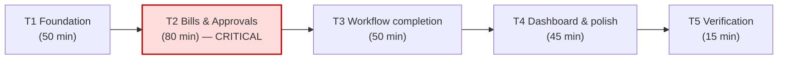

**Critical path**: T1 → T2 → T3 → T4 → T5 (all tasks are on the critical path
for single-agent execution). **T2 is the highest-risk task** because it
contains the approval engine (T-R2 high/high) and the state machine (T-R3
medium/high) — if T2 exceeds budget, all subsequent tasks compress.

**Parallelizable opportunities** (Q97): none within a single agent. If a
second agent were available, the splits are documented in §11.8.

## 11.2 Per-task work item diagrams

### Task T1 — Foundation (50 min)

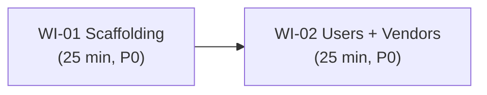

### Task T2 — Bills & Approvals (80 min) — CRITICAL

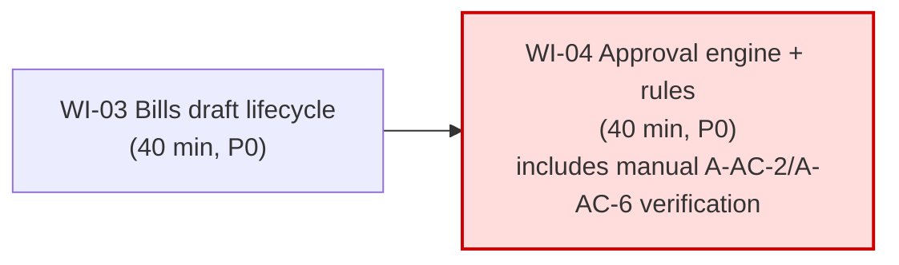

### Task T3 — Workflow completion (50 min)

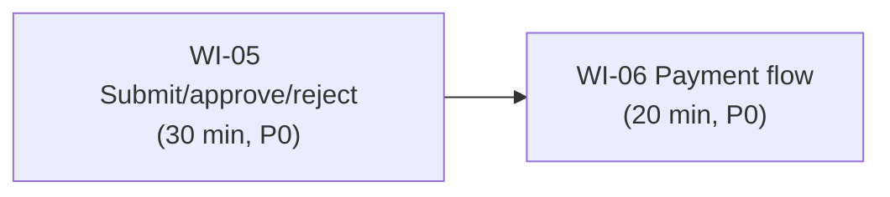

### Task T4 — Dashboard & polish (45 min)

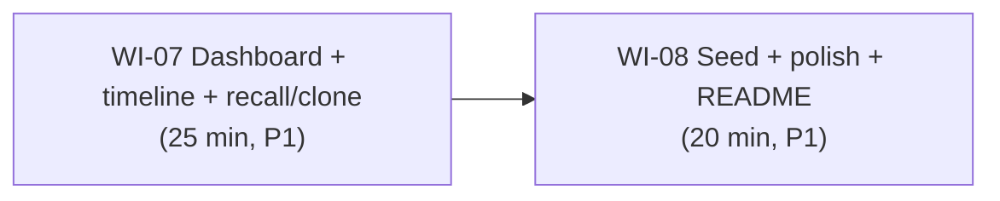

### Task T5 — Verification (15 min)

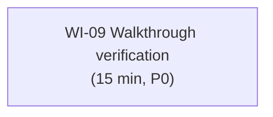

## 11.3 General diagram — all work items

```mermaid
flowchart TD
    WI01["WI-01 Scaffolding<br/>25m · P0"]
    WI02["WI-02 Users + Vendors<br/>25m · P0"]
    WI03["WI-03 Bills draft lifecycle<br/>40m · P0"]
    WI04["WI-04 Approval engine + rules<br/>40m · P0"]
    WI05["WI-05 Submit/Approve/Reject<br/>30m · P0"]
    WI06["WI-06 Payment flow<br/>20m · P0"]
    WI07["WI-07 Dashboard + secondary<br/>25m · P1"]
    WI08["WI-08 Seed + polish + README<br/>20m · P1"]
    WI09["WI-09 Walkthrough verification<br/>15m · P0"]

    WI01 --> WI02 --> WI03 --> WI04 --> WI05 --> WI06 --> WI07 --> WI08 --> WI09

    subgraph "Critical path (all items)"
        WI01
        WI02
        WI03
        WI04
        WI05
        WI06
        WI07
        WI08
        WI09
    end

    classDef p0 fill:#fee,stroke:#c00
    classDef p1 fill:#ffe,stroke:#cc0
    class WI01,WI02,WI03,WI04,WI05,WI06,WI09 p0
    class WI07,WI08 p1
```

Total: 240 minutes. Every work item depends on the one before it for this
single-agent plan.

## 11.4 Work item definitions

Each item lists: **deliverables**, **sub-steps** (rough order), **done-when
checklist**, and references.

### WI-01 — Scaffolding (25 min, P0, no prereqs)

**Deliverables**:
- Repo structure per §6.1.2
- `docker-compose.yml` with db, api, web services (§6.1.5)
- Root `package.json` + `pnpm-workspace.yaml` (§6.1.3)
- `packages/shared/src/enums.ts` + zod schemas skeleton (§6.1.1, §6.1.2)
- `packages/api` Express app skeleton with `current-user.ts` + `error-handler.ts` middleware (§6.1.6, §6.5.2)
- `packages/web` Vite + React + Tailwind + shadcn/ui init with base layout, sidebar, user switcher stub (§6.6.1)
- `.env.example` with all variables from §6.1.5 (O-3)
- `Makefile` with targets from §6.1.4 (O-5)
- `README.md` with headers only per §4.5 O-4 (P-R3 mitigation)

**Sub-steps**:
1. `pnpm init`, set up workspaces, tsconfig.base.json
2. Docker Compose skeleton + `.env.example`
3. Express app skeleton — `/health` endpoint
4. Vite + React + Tailwind + shadcn CLI init; base layout shell
5. Prisma init (empty schema for now)
6. README skeleton

**Done when**:
- `docker compose up` starts all three services and the browser at `http://localhost:3000` renders the base layout (empty sidebar, user switcher dropdown with no users yet)
- `http://localhost:4000/health` returns `{ "status": "ok" }`
- `docker compose logs` shows no errors
- README.md has placeholder sections for "What this product does", "Prioritized workflows", "What was left out", "Setup", "Architecture & data model"

### WI-02 — Users + Vendors vertical slice (25 min, P0, depends on WI-01)

**Deliverables**:
- Prisma schema for `User`, `Vendor` (§6.2.3) + first migration
- Seed of 4 users from §6.8.2 (baked into first seed pass to validate scaffolding)
- `GET /users`, `GET /users/me`, `/vendors` CRUD endpoints (§6.5.4)
- User switcher wired (§6.6.1) — localStorage persistence, X-User-Id header injection
- Vendors list + create/edit form + detail pages (§6.6.7, §6.6.8) — payment-method-specific sub-forms for all four methods (`ach`, `check`, `wire`, `card`)

**Sub-steps**:
1. Prisma `User` + `Vendor` models; migrate
2. Seed 4 users only (rules + vendors come in WI-04 / WI-08)
3. Express routes for users + vendors, with zod validation
4. User switcher component; list → dropdown → localStorage → fetch client
5. Vendors list page + empty state
6. Vendor create/edit form with method-dependent fields
7. Vendor detail page

**Done when**:
- Switching users in the UI changes `X-User-Id` header on subsequent requests (verifiable in devtools Network tab) — §7 U-AC-2
- Creating a vendor through the form persists and appears in the list — §7 V-AC-1
- Selecting `card` as payment method in the UI reveals the card sub-form (card_brand + last_four) and persists a `card`-method vendor — §6.6.8, §7 V-AC-1
- Deleting a vendor with no bills returns 204 (manually curl) — §7 V-AC-7

### WI-03 — Bills draft lifecycle (40 min, P0, depends on WI-02)

**Deliverables**:
- Prisma schema additions: `Bill`, `BillLineItem`, `Attachment`, `BillEvent` (§6.2.3) + migration
- API endpoints: `POST /bills`, `GET /bills`, `GET /bills/:id`, `PATCH /bills/:id`, `DELETE /bills/:id` (§6.5.4) — draft-only flow for now (no submit yet)
- API endpoints: `POST /uploads`, `GET /uploads/:filename` with multer and named volume (§6.5.4, §6.1.5) — T-R4 mitigation
- Bills list page with status filter tabs (all/draft initially) — §6.6.4
- Bill create/edit form with line items + attachment upload — §6.6.5
- Bill detail page, read-only metadata + line items + attachment viewer — §6.6.6 left column only (approvals + actions panels come in WI-05)
- `BillEvent` table wired: `created` and `edited` events emitted

**Sub-steps**:
1. Prisma models + migration
2. Uploads endpoint (multer + named volume) — verify persistence across container restart
3. Bills CRUD endpoints
4. zod schemas for bill create/patch
5. Bills list UI + filter
6. Bill create form (vendor combobox, dynamic line items, attachment dropzone)
7. Bill edit form (same component, preloaded)
8. Bill detail read-only view
9. Attachment viewer (PDF iframe)
10. Draft delete confirmation modal

**Done when**:
- Can create a draft bill through the UI that persists and renders in the bills list — §7 B-AC-1
- Can attach a PDF; retrieving it after `docker compose restart` still serves the file — §7 B-AC-2 + T-R4 detection
- Non-creator cannot PATCH or DELETE the draft (verified with user switcher) — §7 B-AC-4 / B-AC-6
- `GET /bills/:id` returns `events[]` with a `created` event — §7 B-AC-8

### WI-04 — Approval engine + rules (40 min, P0, depends on WI-03) — CRITICAL

**Deliverables**:
- Prisma schema additions: `ApprovalRule`, `BillApproval` (§6.2.3) + migration
- Enum additions: `ApprovalStatus` (incl. `cancelled`), `BillEventType` (incl. `recalled`) per §6.2.2 final-review updates
- `packages/api/src/services/approval-engine.ts` — literal translation of §6.4.2 and §6.4.3 pseudocode (T-R2 mitigation)
- `packages/api/src/services/bill-state.ts` — central state-machine guard (§6.3 transitions) (T-R3 mitigation)
- `GET /approval-rules`, `POST`, `PATCH`, `DELETE`, `POST /preview` endpoints — §6.5.4
- Seed of 2 rules (`rule_default` + `rule_high_value`) per §6.8.3
- Rules list page (`/approval-rules`) with inline `is_active` switch — §6.6.9
- Rule modal editor with live preview (debounced `POST /preview`) — §6.6.9
- Default-rule invariant enforcement (V6) — §6.4.4
- Manual verification checkpoint (T-R2 mitigation — see done-when below)

**Sub-steps**:
1. Prisma models + migration
2. `approval-engine.ts` with `evaluateRules` + `computeEligiblePool` matching §6.4.2/§6.4.3 pseudocode literally
3. `bill-state.ts` state machine guard (§6.3 allowed transitions table)
4. Rules CRUD endpoints + V1–V7 validation
5. Seed rules
6. Rules list UI with is_active toggle
7. Rule modal editor + live preview panel
8. **Manual verification checkpoint**: use `curl` against seed to confirm §7 A-AC-2 (two BillApproval rows for a $15k bill) — see §9.2 T-R2 mitigation

**Done when**:
- `POST /approval-rules/preview` returns correct eligible pool for seed scenario — §7 R-AC-7
- Creating a rule with no qualified regular approver returns 400 `NO_QUALIFIED_APPROVER` — §7 R-AC-2
- Deactivating the last `min_amount_cents=0` rule returns 409 `DEFAULT_RULE_REQUIRED` — §7 R-AC-4
- Rule edit mutation does NOT change existing `BillApproval.eligible_approver_user_ids` (manually inspect DB after edit) — §7 R-AC-3
- **Manual curl check**: `POST /bills/:new_bill_id/submit` for a $15,000 bill produces 2 `BillApproval` rows; both eligible pools equal `[user_carol, user_dana]` — §7 A-AC-2

### WI-05 — Submit / approve / reject flows (30 min, P0, depends on WI-04)

**Deliverables**:
- `POST /bills/:id/submit` endpoint using `approval-engine.ts` + `bill-state.ts` — §6.3 T4
- `POST /bills/:id/approve` endpoint implementing the "decide all eligible" pattern — §6.4.5 (T-R2 manual verification point 2)
- `POST /approvals/:id/reject` endpoint with cascade-to-cancelled — §6.3 T7
- Event emission for `submitted`, `approved` (both variants), `rejected` — §6.3.7
- Bill detail UI right column: status badge + approvals panel + actions section — §6.6.6
- Action modals: Approve / Reject (reason textarea) — §6.6.6
- Submit button + "Save and submit" combo — §6.6.5 footer

**Done when**:
- Carol approving a bill with 2 matching rules decides both slots in one click; bill moves to `approved` — §7 A-AC-6 (critical)
- Bob rejecting a bill with 2 pending approvals moves one to `rejected` and the other to `cancelled`; bill moves to `rejected` — §7 A-AC-8
- Dana (admin) approving a bill she's not in the rule's approver_user_ids produces an event with `admin_override: true` — §7 AO-AC-1
- Alice cannot approve her own bill (SELF_APPROVAL_FORBIDDEN); Dana can if admin — §7 A-AC-11 + AO-AC-2
- §4.3 walkthrough steps 4–6 and 8–11 pass end-to-end

### WI-06 — Payment flow (20 min, P0, depends on WI-05)

**Deliverables**:
- Prisma `Payment` model + migration
- `POST /bills/:id/pay` endpoint with idempotency key + admin override + payment_details zod validation — §6.5.4, §6.7.4
- Mock reference generator per method (§6.7.2)
- Estimated settlement date helper (§6.7.3) in `packages/web/src/lib/format.ts`
- Pay confirmation modal — §6.6.6
- Payment receipt modal (replaces pay modal after success) — §6.7.5
- Copy-reference button with clipboard integration — §6.7.5

**Done when**:
- Paying an ACH bill produces a `Payment` row with `mock_reference` matching `/^ACH-\d{8}-[0-9a-z]{8}$/` — §7 P-AC-5
- Payment receipt modal shows the reference and is non-dismissable on outside click — §6.7.5
- Second identical pay request with same `Idempotency-Key` returns the same `payment.id` (no duplicate row) — §7 P-AC-4
- User with insufficient limit gets 403 `INSUFFICIENT_PAY_AUTHORITY` — §7 P-AC-2
- Admin paying above their limit produces `admin_override: true` in event payload — §7 AO-AC-3

### WI-07 — Dashboard + secondary actions (25 min, P1, depends on WI-06)

**Deliverables**:
- `GET /dashboard` endpoint with aggregates — §6.5.4
- Dashboard page with stat cards (clickable) + overdue + upcoming tables — §6.6.3
- Audit timeline UI in bill detail right column — §6.6.6
- `POST /bills/:id/recall` endpoint + Recall button/modal — §6.3 T8
- `POST /bills/:id/clone` endpoint + Clone button — §6.3 T10
- Timeline event icons + admin-override badge — §6.6.6

**Done when**:
- Dashboard stat cards show correct counts matching the DB — §7 D-AC-1
- Overdue list contains only non-paid past-due bills, sorted asc — §7 D-AC-2
- Clicking "Pending approval" card navigates to `/bills?status=pending_approval` — §7 D-AC-5
- Recalling a bill with all approvals pending moves to `draft`; recalling with any decided returns 409 — §7 SM-AC-1 / SM-AC-2
- Cloning a rejected bill creates a new draft with `-CLONE-` suffix and event `created` with `cloned_from_bill_id` — §7 SM-AC-3
- Timeline shows distinct per-approval and bill-level `approved` events — §6.3.7

### WI-08 — Seed + polish + README (20 min, P1, depends on WI-07)

**Deliverables**:
- `packages/api/prisma/seed.ts` fully implementing §6.8 (users, rules, vendors, 20 bills with service calls + backdating)
- `backdate(billId, timestamps)` helper — T-R6 mitigation
- Sample invoice PDF at `packages/api/prisma/seed-assets/sample-invoice.pdf`; 3 copies seeded with unique `stored_filename`s
- Empty-state copy audit per §6.6.10
- Currency / date formatting helper consistency — §4.4 Q-4 / Q-5
- README content fleshed out per §4.5 O-4: "What this is", "Prioritized workflows", "What we left out (and why)" (cite §3.2 cuts), setup instructions, architecture summary

**Done when**:
- `make reset` wipes volumes and reseeds; dashboard immediately shows overdue + upcoming + paid-last-30-days all non-empty — §7 D-AC-1 / §9.2 B-R4 detection
- Every list view has the specified empty-state copy when emptied — §4.4 Q-6
- README is >500 words and has all 5 required sections — §4.5 O-4
- `git status` shows no committed secrets, node_modules, or build artifacts — §4.5 O-7

### WI-09 — Walkthrough verification (15 min, P0, depends on WI-08)

**Deliverables**:
- Full §4.3 walkthrough executed against a reseeded instance
- Any failing step fixed in-place
- Final README tweaks
- Clean git history (`git rebase -i` to squash any WIP commits)
- Final commit with "Feature complete" message

**Done when**:
- All 14 steps in §4.3 complete without browser console errors — §7 X-AC-6, §4.4 Q-3
- `npm run build` (or `pnpm build`) passes for all packages — §4.4 Q-1
- `git log --oneline` is coherent and contains no `WIP`/`asdf` commits — §4.5 O-6

## 11.5 Hour-by-hour timeline & checkpoints

Budget discipline per §9.3 P-R4 mitigation. Hourly checkpoints allow the
implementer to reassess scope mid-build.

| Clock | Work items in progress | Checkpoint |
|---|---|---|
| 0:00–0:25 | WI-01 | — |
| 0:25–0:50 | WI-02 | **Hour 0 check (0:50)**: `docker compose up` → user switcher cycles through 4 users, vendors list + create works. If not, re-evaluate scaffolding before continuing. |
| 0:50–1:30 | WI-03 | — |
| 1:30–2:10 | WI-04 | **Hour 2 check (2:00)**: manual curl of §7 A-AC-2 (two BillApproval rows for $15k bill) **must pass**. If it fails, approval engine is the bug — fix NOW, not later (§9.2 T-R2). |
| 2:10–2:40 | WI-05 | — |
| 2:40–3:00 | WI-06 | **Hour 3 check (3:00)**: §4.3 walkthrough steps 1–7 (create → approve small → pay) must be executable in the browser end-to-end. If not, stop WI-07 and fix. |
| 3:00–3:25 | WI-07 | — |
| 3:25–3:45 | WI-08 | — |
| 3:45–4:00 | WI-09 | **Final check (3:45)**: all §4.3 steps execute cleanly; README complete. |

## 11.6 Cut order (Q100 Option 3)

Two-tier cut order based on overrun severity.

### Minor overrun (10–20 minutes over budget) — cut polish only

In priority order (cut first → cut last):

1. **WI-07 icons on timeline events** — use plain text instead of lucide icons.
2. **WI-07 attachment viewer embellishments** — just show "Download" link, drop inline iframe.
3. **WI-06 copy-reference clipboard button** — drop the copy affordance; user reads the reference.
4. **WI-07 estimated-completion date line in pay modal / receipt** — drop §6.7.3 entirely; still show mock_reference.
5. **WI-08 empty-state copy polish** — use default shadcn "No data" instead of curated copy.
6. **WI-08 README architecture section** — compress to one paragraph.

Total saveable via polish cuts: ~15 min.

### Major overrun (>30 minutes over budget) — cut features in this order

1. **WI-07 Clone (T10)** — rejected bills no longer cloneable; user creates new bill manually. Drops §7 SM-AC-3, SM-AC-4. Saves ~7 min.
2. **WI-07 Recall (T8)** — submitted bills can no longer be recalled. Drops §7 SM-AC-1, SM-AC-2. Saves ~7 min.
3. **WI-07 Dashboard overdue/upcoming tables** — dashboard shrinks to stat cards only. Drops §7 D-AC-2, D-AC-3 (tables), keeps D-AC-1 (tiles). Saves ~10 min.
4. **WI-06 Payment receipt modal** — replace with a success toast; still record Payment row correctly. Drops §6.7.5, keeps §7 P-AC-1 pass. Saves ~8 min.
5. **WI-08 Seed attachments (all 3)** — no pre-seeded attachments; reviewer uploads during demo if wanted. Drops §6.8.6 seed, but §7 B-AC-2 still passes if reviewer uploads. Saves ~5 min.

**Never cut** (bill-pay is broken without these):
- WI-01 (scaffolding — no app otherwise)
- WI-02 (users + vendors — no demo otherwise)
- WI-03 (bills draft lifecycle — nothing to approve)
- WI-04 (approval engine — the entire centerpiece)
- WI-05 (submit/approve/reject — the main workflow)
- WI-06 payment endpoint (keep the endpoint even if receipt modal is cut)
- WI-09 (walkthrough verification — submitting unverified is a dealbreaker)

The cut order makes the final submission decision deterministic at 3:30: if
the timeline shows >30 min of overrun, the implementer follows the list above
top-down and stops cutting as soon as the budget is feasible.

## 11.7 Cross-cutting constraints (from §9.3)

These apply to every work item, not any single one:

| Constraint | Source | Where enforced |
|---|---|---|
| No feature without §4.2 traceability | §9 B-R1 | Every sub-step in §11.4; `git diff` check after each commit |
| Implement vertical slices, not horizontal layers | §9 P-R1 | §11.1 task ordering; every WI is a vertical slice |
| Follow hourly checkpoints | §9 P-R4 | §11.5 checkpoints |
| Walkthrough dry-run before submission | §9 P-R2 | WI-09 |
| Approval engine is literal pseudocode translation | §9 T-R2 | WI-04 sub-step 2 + manual verification |
| No dependency outside §6.1.1 list | §9 B-R1 + §6.1.1 | Every `npm install` / `pnpm add` must match the §6.1.1 table |
| README is incremental, not end-of-build | §9 P-R3 | WI-01 scaffolds README; every WI that ships a feature adds a note to the relevant section |

## 11.8 Parallelism opportunities (Q97 — documented, not used)

Documented in case a second agent is available later. A single-agent execution
must follow §11.3 strictly serial.

| Segment | Could run in parallel |
|---|---|
| WI-02 backend vs. frontend | Users/vendors API (backend) and their UI (frontend) are ~equal in effort; a second agent could take UI while the first does API |
| WI-03 bills frontend vs. WI-04 rules backend | After WI-03 API is done, WI-04 can start while WI-03 frontend is still being polished |
| WI-04 rules UI vs. WI-05 backend | Rules list/modal (frontend) can be built in parallel with submit/approve/reject endpoints |
| WI-07 dashboard vs. WI-08 seed | Both only need completed service layer; independent |

Cross-service database migrations remain serial (Prisma migrations are not
parallel-safe). All parallelism is within-phase at the feature level.
